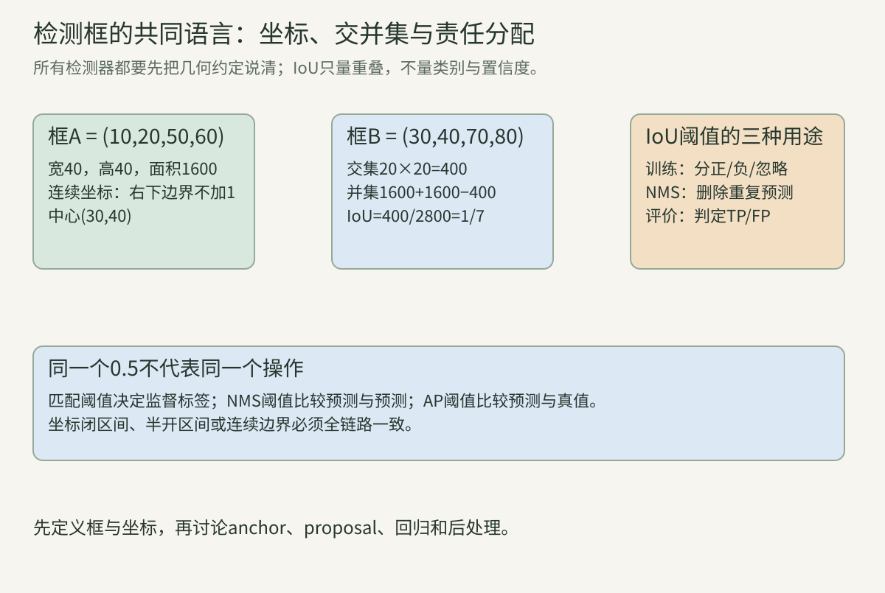
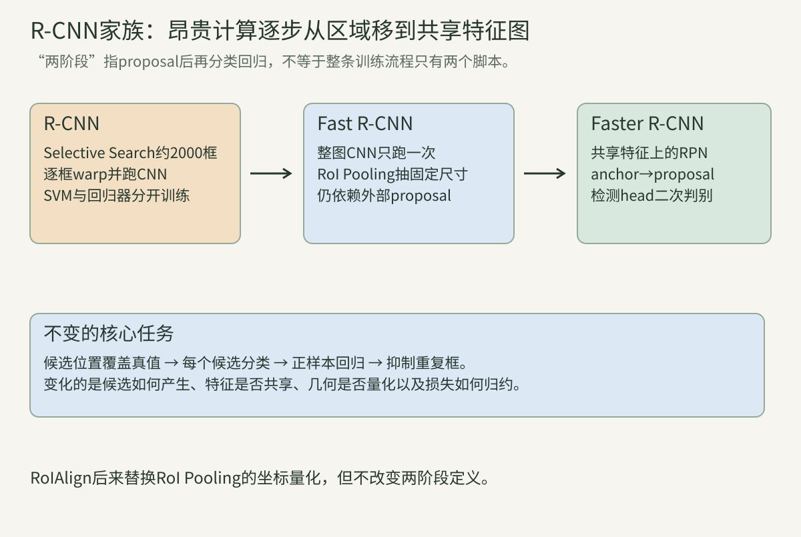
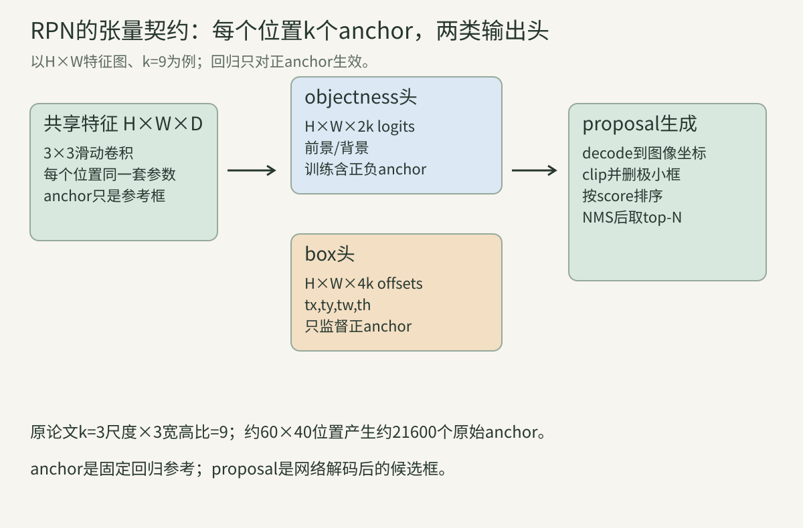
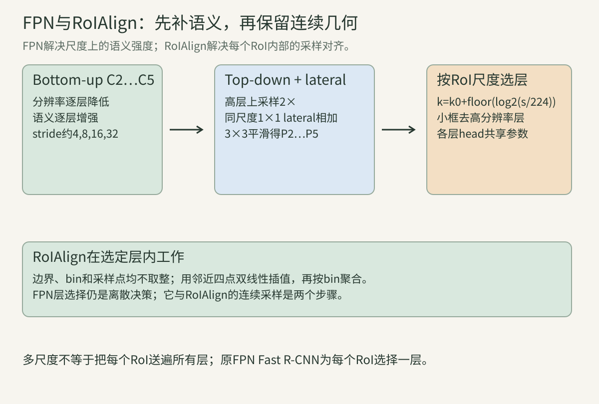
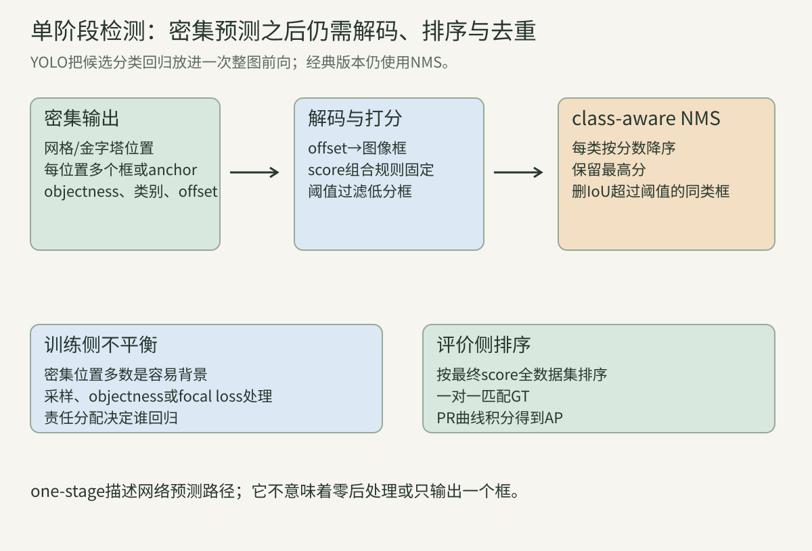

> 目标检测不只回答“图里有什么”，还要回答“在哪里、出现几次、每个预测该由谁负责”。因此，同一张图会产生数量可变的框，而监督又是无序的真值集合。本讲先把坐标、IoU、匹配和去重变成可手算的共同语言，再沿R-CNN家族看计算如何从约2000个裁剪区域移到共享特征图，最后沿YOLO与RetinaNet看密集单阶段检测如何处理责任分配和前景—背景失衡。

记图像宽高为$W,H$，类别数为$C$，真值框集合为$G$，预测框集合为$D$。除非另行说明，框采用连续边界$(x_1,y_1,x_2,y_2)$，宽高为$x_2-x_1,y_2-y_1$；这与某些旧代码的整数闭区间“加1”约定不同，不能混用。

## 一、检测先修：框、重叠、匹配与分数

### 1. 检测输出是一个可变长集合

分类器输出一个固定$C$维向量；检测器输出若干条$(b,s,c)$：框$b$、分数$s$和类别$c$。同一物体附近可能产生许多高度重叠的预测，同一图也可能没有任何目标。

因此训练要解决“哪个预测学习哪个真值”，推理要解决“哪些预测是同一实例的重复”，评价还要解决“一条真值最多匹配一条预测”。这三种匹配都可能用IoU，但对象与规则不同。

### 2. 连续框与像素索引是两套约定

连续框面积为：

$$A(b)=\max(0,x_2-x_1)\max(0,y_2-y_1).$$

若数组切片采用半开区间`image[y1:y2, x1:x2]`，它与上式天然一致。旧VOC代码常把整数端点视作都包含，面积写$(x_2-x_1+1)(y_2-y_1+1)$。两者都能自洽，混在同一管线才会产生偏差。

### 算例A：一个“加1”能差多少？

框$(0,0,10,10)$按连续边界面积是100；按整数闭区间是121。大框差异较小，小框相对误差很大，所以小目标评估尤其要锁定约定。

### 3. IoU把交集面积除以并集面积

两框交集左上取逐坐标最大，右下取逐坐标最小：

$$w_I=\max(0,\min(x_2^a,x_2^b)-\max(x_1^a,x_1^b)),$$

$$h_I=\max(0,\min(y_2^a,y_2^b)-\max(y_1^a,y_1^b)),$$

$$IoU(a,b)=\frac{w_Ih_I}{A(a)+A(b)-w_Ih_I}.$$

IoU无量纲、范围$[0,1]$，对共同缩放不变；它不判断类别，也不读取置信度。

### 算例B：手算两个等大框的IoU

$a=(10,20,50,60)$、$b=(30,40,70,80)$均为$40\times40$。交集$20\times20=400$，并集$1600+1600-400=2800$，所以$IoU=1/7\approx0.143$。

### 4. 框在resize与padding后必须可逆映射

若原图按比例$r$缩放后在左、上补$p_x,p_y$，则：

$$x'=rx+p_x,\qquad y'=ry+p_y.$$

映回原图用$x=(x'-p_x)/r$。若宽高被非等比拉伸，则x、y各有独立比例。模型框、真值框和可视化若不在同一坐标系，IoU没有意义。

### 算例C：letterbox框映回原图

原图$640\times480$等比缩到$640\times640$输入，图像内容仍为$640\times480$并上下各补80。输入框$(160,200,480,440)$映回原图为$(160,120,480,360)$；若忘记减padding，整框会向下错80像素。

### 5. 分类分数、objectness与最终排序分数不是同一个量

objectness可表示“该候选包含任意物体”的概率，类别头可表示条件概率$P(c\mid object)$。一种常见最终分数是：

$$s_c=P(object)P(c\mid object).$$

但不同模型可能直接预测每类独立前景概率，或用logit相加。阈值、NMS和AP必须使用实现定义的最终分数，不能凭名称猜乘法。

### 6. 责任分配把无序真值变成可训练标签

候选可能是proposal、anchor、网格点或query。匹配器为它们指定正样本、负样本和忽略样本；只有正样本通常承担框回归。若一个真值没有任何正候选，它就没有定位梯度。

匹配规则既是工程细节，也是学习问题的定义：阈值匹配、最高IoU兜底、中心区域、动态代价和一对一匈牙利匹配会产生不同监督。

### 算例D：最高IoU兜底为什么必要？

某小物体与全部anchor的最大IoU只有0.62，而正阈值为0.7。若只用阈值，它没有正样本；Faster R-CNN把“与某真值IoU最高的anchor”也标正，使至少一个anchor学习该物体。

### 7. “两阶段”按预测路径划分

两阶段检测器先产生少量类别无关proposal，再对每个proposal分类并精修框。单阶段检测器直接在密集位置同时输出类别和框。这里的“阶段”不是训练脚本数，也不是backbone层数。

Faster R-CNN虽然可交替训练多个步骤，仍是两阶段；经典YOLO虽然推理后还有NMS，仍是单阶段，因为NMS不是第二个可学习的逐proposal分类器。

### 8. 检测管线有四个可分别失败的环节

第一是覆盖：候选能否与真值高IoU重叠；第二是识别：候选类别是否正确；第三是定位：回归能否精修；第四是去重与排序：重复框和低质量框能否排在后面。

只看最终AP无法定位故障。应配合proposal recall、分类混淆、不同IoU下AP、不同尺寸AP和每图预测数分析。

## 二、R-CNN：把候选区域交给CNN

### 9. Selective Search先给出类别无关候选

原R-CNN对每图运行Selective Search快速模式，产生约2000个region proposals。它从超像素出发，按颜色、纹理、大小和填充等相似性逐步合并区域。

proposal只表达“这里可能有物体”，不带最终类别。其上限由recall决定：若没有候选覆盖某真值，后续再强的CNN也无法找回。

### 10. 每个proposal被扩上下文并warp到固定输入

R-CNN把proposal的紧框扩出上下文，然后仿射warp到CNN要求的固定尺寸。不同长宽比被强制拉伸，因此几何会变形；原论文用上下文边界缓解边缘信息丢失。

这里的warp发生在像素上，而非共享特征图上。约2000个区域要分别完成裁剪和CNN前向。

### 算例E：重复卷积从哪里来？

两个高度重叠proposal覆盖同一辆车90%的像素。R-CNN仍对两份warp图各跑一次卷积，重叠区域的低层边缘被重复计算。2000框不是2000张独立图，却近似支付2000次backbone成本。

### 11. CNN先提4096维特征，线性SVM再分类

原系统先在ImageNet分类预训练CNN，再用检测proposal微调；随后冻结特征，为每类训练一个线性SVM。测试时形成约$2000\times4096$特征矩阵，与$4096\times C$权重相乘。

这个历史流程说明“CNN检测器”早期仍是分段优化：softmax微调用一套标签策略，SVM又用另一套hard negative策略。

### 12. 迁移学习让小检测数据集可用深层特征

分类预训练学习通用边缘、纹理和部件；检测微调把表征适配到背景、局部裁剪和类别定位。原论文的核心证据之一，是有监督预训练后再做任务特定微调显著优于仅用有限检测数据训练。

这不是说分类特征天然会定位。proposal、微调标签和框回归共同把分类backbone改造成检测系统。

### 13. 微调与SVM的正负定义曾不一致

R-CNN微调时，与某真值IoU至少0.5的proposal为该类正样本；SVM训练则只把真值框作正样本，并将与该类真值IoU低于0.3者作负样本，中间区域忽略。

这种不一致增加流程复杂度。Fast R-CNN后来直接用softmax分类头与框回归联合训练，去掉SVM阶段。

### 14. 框回归预测相对proposal的四个变换

设proposal中心宽高为$(x_a,y_a,w_a,h_a)$，真值为$(x^*,y^*,w^*,h^*)$：

$$t_x^*=\frac{x^*-x_a}{w_a},\quad t_y^*=\frac{y^*-y_a}{h_a},$$

$$t_w^*=\log\frac{w^*}{w_a},\quad t_h^*=\log\frac{h^*}{h_a}.$$

网络预测$t$后解码为$x=x_a+t_xw_a$、$w=w_a\exp(t_w)$。中心偏移除以anchor尺度，宽高比用对数，使不同绝对尺寸更可比。

### 算例F：框编码与解码

proposal中心$(50,50)$、宽高$(40,20)$，真值中心$(54,48)$、宽高$(60,10)$。目标为$(0.1,-0.1,\log1.5,\log0.5)$。把这四项代回解码，正好恢复真值。

### 15. 类别特定回归为每类学习一套修正

早期R-CNN和Fast R-CNN可输出$4C$个回归数，训练时只选择真值类对应四项。例如“人”的细长形状与“汽车”的横向形状可学不同先验。

现代实现也常用类别无关的4维回归以节省参数并改善稀有类共享。两者是接口选择，不能把一个checkpoint的head维度按另一方案解释。

### 16. R-CNN的主要瓶颈是计算、存储与分段训练

每框CNN前向很慢；将每个proposal的特征缓存到磁盘占空间；微调、SVM和回归器分别训练，超参和标签策略难统一。Selective Search本身也在CPU上耗时。

R-CNN的历史价值在于证明“region proposal + 深层CNN特征”有效。Fast/Faster R-CNN主要沿着共享计算和端到端化修复这些瓶颈。

## 三、Fast R-CNN：一次整图卷积，多次区域读取

### 17. Backbone只对整图运行一次

Fast R-CNN输入整图和一组RoI。整图经过卷积得到共享feature map；每个RoI映射到该feature map，再抽取固定尺寸特征送入全连接层。

重叠RoI共享卷积结果，消除了R-CNN最昂贵的重复计算。但proposal仍来自外部Selective Search，尚未学习化。

### 18. RoI Pooling把任意矩形变成固定$H_o\times W_o$

先把RoI边界映射到feature坐标并量化，再将量化后的矩形切成$H_o\times W_o$个bin，每个bin逐通道max pooling。若输入feature有D通道，输出shape固定为$H_o\times W_o\times D$。

这使后续全连接层能接收不同大小的RoI，也允许梯度只回到每个bin的max位置。

### 算例G：7×7输出不是把RoI缩放成7×7像素

一个feature RoI宽14、高21，分成7×7 bins时理想bin为2×3个feature单元。每个输出值是该bin同通道的最大值；它不是对原图做一次7×7像素采样。

### 19. 两次取整会产生空间错位

RoI Pooling先量化边界，又量化bin边界。原图上小于feature stride的平移可能映成完全相同的RoI，或者跨过取整点后突然跳一个feature单元。

框分类对这种误差有一定容忍，像素级mask和关键点更敏感。RoIAlign后来保留浮点边界并用双线性插值消除硬量化。

### 20. 两个兄弟head共同使用RoI特征

分类head输出$C+1$类softmax，额外一类为背景；回归head输出$4C$或4项。单个RoI的多任务损失写作：

$$L(p,u,t^u,v)=L_{cls}(p,u)+\lambda [u\ge1]L_{loc}(t^u,v).$$

$u=0$为背景，指示函数使背景RoI没有框回归目标。

### 算例H：背景样本为何不能回归？

背景RoI没有对应物体，因而不存在唯一真值框$v$。若强迫它回归最近真值，模型会把纯背景移动成物体，改变了proposal分类任务。正确做法是分类有梯度、定位项为0。

### 21. Smooth L1在零点附近是二次函数

Fast R-CNN定义：

$$smooth_{L1}(z)=\begin{cases}0.5z^2,&|z|<1\\|z|-0.5,&\text{otherwise}\end{cases}.$$

小误差区像L2一样平滑，大误差区梯度幅值封顶为1，比纯L2不易被离群框支配。四个坐标的定位损失相加；实现若引入beta，拐点和缩放会改变。

### 22. 分层采样控制前景—背景比例

原Fast R-CNN每个mini-batch取2张图、共128个RoI，每图64个；25%从IoU至少0.5的前景proposal抽取，背景从$[0.1,0.5)$抽取。

同图RoI共享feature map，所以只用2张图节省前向；代价是RoI高度相关。这里的25%是采样上限/目标，不保证每张图真有足够前景。

### 算例I：一个batch的损失分母

若128个RoI中32个前景、96个背景，分类损失平均128项；定位仅32个前景产生非零项。若实现把定位和分类都简单除128，定位相对权重与“除正样本数”方案不同，必须记录归约。

### 23. 共享feature map让梯度从所有RoI汇合

一个像素附近的feature单元可能被多个RoI Pooling bin选为最大值，它收到这些RoI梯度之和。网络由此联合学习“整图特征应怎样服务多个候选”。

但max pooling只把每个bin梯度给最大位置，且量化丢失亚像素几何。更密集采样和双线性插值会形成不同Jacobian。

### 24. Fast R-CNN仍被外部proposal限制

论文显著加速了region-wise分类，但Selective Search不能与CNN一起反传，也成为测试耗时瓶颈。若proposal漏掉目标，Fast head无法补回。

Faster R-CNN的关键不是把Fast R-CNN再堆深，而是在同一共享feature map上学习一个Region Proposal Network。

## 四、Faster R-CNN：用RPN学习候选区域

### 25. RPN是一个滑动的小网络

共享backbone输出$H\times W\times D$。RPN在每个空间位置应用共享3×3卷积，再接objectness和box regression两个1×1头。

“滑动”表示同一组参数用于所有位置。它不是把原图裁成$H\times W$张图，也不为每个anchor单独保存一个网络。

### 26. Anchor是固定参考框，不是预测结果

每个feature位置预先放置k个不同尺度/宽高比的框。原论文使用3尺度$128^2,256^2,512^2$与3种宽高比，故$k=9$。

anchor由网格和配置生成，不读取图像内容；RPN预测其objectness和相对偏移。解码后的框才叫proposal。

### 算例J：RPN输出shape

feature map为$60\times40$、k=9。共有$60\times40\times9=21600$个anchor。二分类softmax形式输出$60\times40\times18$ logits；回归输出$60\times40\times36$。用单objectness logit实现时分类通道会变为9，但语义可等价。

### 27. 正、负、忽略anchor由IoU规则产生

原Faster R-CNN把每个真值IoU最高的anchor，以及与任一真值IoU大于0.7的anchor标正；非正且与所有真值IoU小于0.3者标负；其余忽略。

最高IoU规则保证每个真值尽量有正anchor。边界处跨图anchor在原训练中被忽略，现代实现可能clip或改变政策。

### 28. RPN回归沿用中心—对数宽高编码

对anchor $a$和proposal预测框：

$$t_x=(x-x_a)/w_a,\quad t_y=(y-y_a)/h_a,$$

$$t_w=\log(w/w_a),\quad t_h=\log(h/h_a).$$

训练目标把预测框换成匹配真值。不同库还会乘bbox weights；若编码时乘、解码时没除，就无法恢复框。

### 算例K：平移对尺度的归一化

两个anchor中心都右移16像素。宽32的anchor目标$t_x=0.5$，宽256的anchor目标$t_x=0.0625$。同一绝对偏移对小框更严重，归一化正确表达了这一点。

### 29. RPN损失同时训练objectness和定位

$$L=\frac1{N_{cls}}\sum_iL_{cls}(p_i,p_i^*)+\lambda\frac1{N_{reg}}\sum_i p_i^*L_{reg}(t_i,t_i^*).$$

$p_i^*\in\{0,1\}$，因此负anchor只参加分类。原论文$N_{cls}=256$，$N_{reg}$约为anchor位置数，并用$\lambda$平衡；现代实现常按有效或正样本重新归约。

### 30. Anchor采样防止海量背景主导

原RPN每图随机取256个anchor，正负最多1:1；若正样本不足128，用负样本补齐。忽略anchor不进入分类分母。

这与Fast R-CNN的RoI采样属于不同阶段：RPN训练“是否为物体”，第二阶段训练具体$C+1$类与再次回归。

### 算例L：正样本不足时的batch

某图只有37个正anchor，则保留37正、抽219负，共256。不是复制正anchor凑到128。若把正损失额外放大，应作为新的权重策略记录。

### 31. Proposal生成是一条确定的解码管线

从全部anchor解码框，裁剪到图像，删掉过小框，按objectness取pre-NMS top-k，执行NMS，再取post-NMS top-k。训练和测试可用不同top-k。

顺序会影响结果：若先只留很少的top-k，再做NMS，重复框会挤掉其他物体；若对未clip的框算面积，边界框过滤也会变化。

### 32. RPN中的NMS比较proposal与proposal

原论文RPN proposal NMS阈值0.7，目标是减少同一物体周围的重复候选。它不查看类别，因为RPN只分前景/背景。

第二阶段还会按具体类别再做检测NMS。两处都叫NMS，但输入分数、类别信息、阈值和top-k可不同。

### 33. 共享卷积让proposal适配检测特征

RPN和Fast R-CNN使用同一backbone feature。原论文讨论交替训练、近似联合训练等共享方式；现代自动微分实现通常联合优化，但RoI坐标等离散步骤仍不对框坐标反传。

共享并不表示两个head参数相同。RPN学类别无关objectness，RoI head学具体类别与精修框。

### 算例M：两阶段为何能拒绝RPN前景？

RPN可能把纹理强的窗户判为objectness 0.9并生成proposal。第二阶段看更丰富RoI特征后可把它判为背景。proposal追求高recall，最终head负责更精确分类；两者目标不完全相同。

### 34. Anchor配置同时决定覆盖和计算

更多尺度、比例和位置提高覆盖机会，也增加分类/回归输出、匹配成本和正负失衡。stride过粗时，小物体中心附近缺少高IoU anchor；尺度不合时回归目标过大。

因此“换一组anchor”不是无成本增强。应先统计真值对anchor的最大IoU与尺寸分布，再决定是否扩充。

## 五、RoIAlign与FPN：保几何，也补高分辨率语义

### 35. RoIAlign保留浮点RoI边界

Mask R-CNN提出RoIAlign：不量化RoI边界、bin边界或采样点。每个采样点在feature map上取浮点坐标，通过邻近四个网格点双线性插值，再对bin内样本max或average聚合。

它首先为mask对齐而设计，也能改善框检测。名字里的Align指坐标对齐，不是特征对比学习。

### 36. 双线性插值是四个邻点的加权和

采样点$(x,y)$落在整数邻点$(x_0,y_0)$、$(x_1,y_1)$之间。设$\delta_x=x-x_0,\delta_y=y-y_0$：

$$v=(1-\delta_x)(1-\delta_y)v_{00}+\delta_x(1-\delta_y)v_{10}$$

$$\quad +(1-\delta_x)\delta_yv_{01}+\delta_x\delta_yv_{11}.$$

四权重非负且和为1，故插值值位于邻点值的凸包内。

### 算例N：中心点的双线性插值

四邻值为1、3、5、7，采样在正中心，四权重均0.25，插值为4。若点距左侧25%、距上侧75%，权重为0.1875、0.0625、0.5625、0.1875，结果为4.5。

### 37. `aligned`半像素约定必须与实现一致

不同库对像素中心是整数还是半整数有不同历史约定；一些RoIAlign接口提供`aligned=True`，会对坐标作半像素平移。它不等价于论文里一句“不要量化”就能自动确定所有细节。

训练、导出和部署若半像素约定不一致，会出现系统性小位移。验证应使用人工feature map和已知浮点RoI，而不只看最终AP。

### 38. FPN从backbone天然层级构造语义金字塔

bottom-up的$C_2,C_3,C_4,C_5$分辨率逐级降低、语义逐级增强。直接用浅层检测小物体虽分辨率高，却语义弱；只用深层则小物体只剩少数单元。

FPN以$C_5$为顶层，逐级上采样，并与对应bottom-up层的lateral投影相加，得到各尺度都较强的语义特征。

### 39. Lateral 1×1先统一通道，3×3再平滑

每个$C_l$先经1×1卷积变成统一通道数；更高层特征上采样2倍后逐元素相加。相加结果再经3×3卷积生成$P_l$，减轻上采样混叠。

这是逐层递归：$P_2$收到从$C_5$经多次top-down传来的语义，也保留$C_2$的高分辨率定位信息。

### 算例O：FPN各层shape

输入$800\times1024$，若stride为4、8、16、32，则$P_2$到$P_5$空间约为$200\times256$、$100\times128$、$50\times64$、$25\times32$，通道都可为256。总元素需把四层相加，不能只报$P_5$成本。

### 40. RoI按尺度分配到一个FPN层

原FPN用：

$$k=k_0+\left\lfloor\log_2\left(\frac{\sqrt{wh}}{224}\right)\right\rfloor,$$

再把k裁到可用层范围。若$k_0=4$，尺度$224$去$P_4$，112去$P_3$，448去$P_5$。这里$w,h$是输入图坐标下RoI宽高。

### 41. FPN的RPN在每层使用单一基础尺度

原FPN把$P_2$到$P_6$分别配给面积尺度$32^2$到$512^2$的anchor，每层再用3种宽高比，共15种“层级×比例”组合。所有层共享RPN head参数。

这与原Faster R-CNN在单一feature map的每个位置放3个尺度不同。尺度由层级承担后，每层无需再重复全部尺度。

### 算例P：小框为何去高分辨率层？

一个$32\times32$目标在stride32的$P_5$大约只覆盖$1\times1$单元；在stride4的$P_2$覆盖$8\times8$。后者保留更多边界位置，但也占更多内存并含更多背景位置。

### 42. 多尺度语义来自top-down与lateral共同作用

只有bottom-up层级时，高分辨率层语义弱；只有top-down上采样而没有lateral时，精细位置无法从浅层注入。FPN原论文分别移除二者做消融，说明完整组合更好。

这类结论是特定检测器和数据上的实验结果。应用到新backbone时仍应验证层定义、归一化和融合方式。

### 43. FPN增加的不是零成本

1×1 lateral、上采样、逐元素加法、3×3平滑、每层head和更多激活都消耗显存与计算。论文所说“边际成本”是相对重复跑图像金字塔而言。

高分辨率$P_2$常是主要激活开销。真实延迟还受小卷积kernel、内存带宽、RoI数量和NMS影响。

### 44. FPN、RoIAlign和RPN解决三个正交问题

FPN为不同尺度提供语义强的feature；RoIAlign从某层连续采样固定shape特征；RPN产生类别无关proposal。它们可组合，但不能互相替代。

例如只有FPN没有RPN，仍可做RetinaNet式密集检测；有RPN没有RoIAlign，仍是原Faster R-CNN式RoI Pooling。

## 六、YOLO：把检测改写为整图密集回归

### 45. 单阶段模型直接在规则位置预测

密集检测器在feature网格的每个位置输出若干候选框与类别分数，不先生成一批proposal再逐个送入独立可学习head。一次整图forward共享全局上下文与卷积计算。

“一次看图”不代表只产生一个框，也不代表没有解码、阈值过滤和NMS。经典YOLO仍需这些确定性后处理。

### 46. YOLO v1按物体中心分配网格责任

输入被概念上分成$S\times S$网格；某物体中心落在哪个cell，就由该cell负责该物体。每cell预测B个框及confidence，但只预测一组C维条件类别概率。

原论文VOC设置$S=7,B=2,C=20$，输出shape为$7\times7\times(2\times5+20)=7\times7\times30$。

### 算例Q：中心规则与覆盖区域不同

一个大物体覆盖多个cell，但中心只落在一个cell，因此只有该cell承担监督。邻近cell即使看到大面积物体，也不是该真值的负责cell。这与“框必须完全位于cell内”无关。

### 47. v1框参数和confidence各有明确语义

$x,y$表示框中心相对cell边界的偏移；$w,h$相对整图归一化。训练目标对宽高使用平方根，减小大框绝对误差的支配。

confidence定义为$P(object)\times IoU_{pred}^{truth}$；测试时再乘条件类别概率，得到类特定分数。

### 48. 一个真值只让cell内一个预测器负责

在负责cell的B个预测框中，当前与真值IoU最高者负责回归该物体。这个选择会随预测改变，促使不同预测器专门化到不同形状。

非负责框主要接受no-object confidence惩罚。定位和分类项只在有物体/负责条件下启用。

### 算例R：为何同cell多个框仍难处理多个物体？

v1虽每cell有B=2个框，但只有一组类别分布，责任规则围绕中心落入cell的物体建立。若两个物体中心落在同一cell，标签接口无法完整表达两种独立类别，这是网格设计的结构性限制。

### 49. v1损失对不同项使用不同权重

定位项权重$\lambda_{coord}=5$；无物体confidence项权重$\lambda_{noobj}=0.5$，缓解空cell数量远多于有物体cell的问题。宽高使用$\sqrt w,\sqrt h$误差。

这仍是启发式平方误差组合。各项的开关、分母和权重共同决定梯度，不能只写一个“YOLO loss”名称。

### 50. YOLO v1的全局推理既带来速度也带来限制

整图一次预测能使用上下文，且不必为每个proposal重复分类。但粗网格、每cell表达容量和训练目标使它对成群小物体困难；论文误差分析也指出定位错误较多。

速度数字依赖当时硬件、输入尺寸、batch与是否计入后处理，不能直接和现代检测器横比。

### 51. YOLOv2引入anchor并解耦类别与objectness

YOLOv2改为卷积式anchor预测，为每个anchor分别输出objectness和类别。它用训练框宽高做dimension clustering，以$1-IoU$为距离，选择更贴近数据分布的先验框。

聚类只看宽高而非位置；普通欧氏距离会偏向大框，IoU距离更关心形状覆盖。

### 算例S：为什么$1-IoU$可聚类宽高？

把两个框中心对齐后，仅按宽高计算IoU。$100\times100$与$110\times90$高度相似，而$100\times100$与$200\times200$的IoU仅0.25。距离分别较小与0.75，能按形状尺度分组。

### 52. Direct location prediction把中心约束在cell附近

YOLOv2采用：

$$b_x=\sigma(t_x)+c_x,\quad b_y=\sigma(t_y)+c_y,$$

$$b_w=p_w\exp(t_w),\quad b_h=p_h\exp(t_h).$$

$(c_x,c_y)$是cell偏移，$(p_w,p_h)$是anchor尺寸。sigmoid把中心偏移限制在0到1，避免训练初期无约束中心跑到遥远位置。

### 53. YOLOv2用多尺度训练适配不同输入

全卷积网络可周期性改变训练分辨率，论文在若干32倍数尺寸间切换，使同一权重在速度与精度间选择。更大输入带来更多网格位置与更细小目标表示，也增加计算。

多尺度训练不保证任意尺寸都等价。stride整除、预处理、anchor尺度和部署kernel仍要匹配。

### 54. YOLOv3在三个尺度预测并用独立logistic分类

YOLOv3借鉴FPN式上采样与特征融合，在三个尺度输出框；每框预测objectness和类别。类别不再用互斥softmax，而用独立logistic分类器与binary cross-entropy，以允许多标签。

每尺度分配若干anchor，一个真值由与其形状最匹配的anchor负责。YOLOv3论文称其为增量改进；后续众多“YOLO”版本的作者、训练配方和代码库并不自动属于同一原始谱系。

## 七、密集不平衡、NMS与AP

### 55. 单阶段检测的困难之一是海量容易背景

密集检测可评估约$10^4$到$10^5$个位置，而前景很少。即使单个容易负样本损失很小，总和也可能淹没稀少正样本，训练低效并偏向背景。

两阶段系统通过proposal筛选和固定正负采样削弱这个问题；单阶段系统可用hard negative mining、采样或重加权损失。

### 56. Focal Loss连续压低容易样本

令$p_t$为真实标签概率，二分类交叉熵为$-\log p_t$。Focal Loss为：

$$FL(p_t)=-\alpha_t(1-p_t)^\gamma\log p_t.$$

$\gamma=0$退化为加权交叉熵；$p_t\to1$时调制因子趋近0。RetinaNet用FPN、anchor、两个共享子网和Focal Loss证明一阶段模型可缩小当时的精度差距。

### 算例T：容易负样本被压低多少？

$\gamma=2$时，正确概率$p_t=0.9$的调制因子为0.01；$p_t=0.6$时为0.16。忽略$\alpha$，前者相对CE缩小100倍，后者约6.25倍。Focal Loss聚焦困难样本，但不自动修复错误标注。

### 57. Greedy NMS按分数依次保留并删除

对同一类别候选按分数降序：取最高分加入结果，删除与它IoU超过阈值的剩余框；重复直到为空或达到top-k。复杂度朴素为$O(n^2)$，实际先做分数阈值和pre-top-k。

class-aware NMS只在同类内抑制；class-agnostic NMS跨类抑制。前者可能保留同位置不同类别框，后者可能误删真实重叠的异类物体。

### 58. NMS阈值控制重复与误删的折中

低阈值更激进，减少重复但可能删掉拥挤场景中的不同实例；高阈值保留相邻实例，也留下更多重复。Soft-NMS不直接删除，而按重叠衰减分数。

NMS阈值不是评价IoU阈值。调NMS时应同时看拥挤类别、每图预测数、延迟和AP，而非只凭单张可视化。

### 59. AP来自全数据集排序后的precision–recall曲线

对某类别按分数排序所有预测；每条预测与同图尚未匹配的同类真值匹配。IoU达到评价阈值则为TP，否则为FP；同一真值的第二个重复预测是FP。

$$Precision=\frac{TP}{TP+FP},\qquad Recall=\frac{TP}{N_{gt}}.$$

AP对PR曲线积分。VOC不同年份与COCO的插值规则不同；COCO主AP还平均IoU 0.50到0.95，不能只写“mAP”而不写协议。

### 60. 检测结论必须锁定数据、尺度与后处理

可比实验需固定训练数据、类别映射、输入resize、增强、backbone预训练、训练步数、匹配器、score定义、NMS、max detections和评价脚本。吞吐还需固定batch、精度、预热和是否包含预处理/NMS。

本章的历史论文解释关键范式，不代表早期默认参数是现代最优。[下一讲DETR](../vision-22-detr/)会用固定query集合和匈牙利一对一匹配重新定义责任分配，并尝试去掉anchor与NMS。

## 八、四段标准库程序：把检测接口逐项跑通

以下程序只用Python标准库，重点检查数学契约，而非调用某个框架的现成算子。站点验证脚本会实际执行所有代码块和断言。

### 程序一：连续框IoU与class-aware NMS

~~~python
def area(b):
    return max(0.0, b[2]-b[0]) * max(0.0, b[3]-b[1])

def iou(a, b):
    ix1, iy1 = max(a[0], b[0]), max(a[1], b[1])
    ix2, iy2 = min(a[2], b[2]), min(a[3], b[3])
    inter = max(0.0, ix2-ix1) * max(0.0, iy2-iy1)
    union = area(a) + area(b) - inter
    return inter / union if union > 0 else 0.0

def class_aware_nms(dets, threshold):
    # det = (score, class_id, box)
    kept = []
    for cls in sorted({d[1] for d in dets}):
        remain = sorted((d for d in dets if d[1] == cls), reverse=True)
        while remain:
            best = remain.pop(0)
            kept.append(best)
            remain = [d for d in remain if iou(best[2], d[2]) <= threshold]
    return sorted(kept, reverse=True)

a = (10, 20, 50, 60)
b = (30, 40, 70, 80)
assert abs(iou(a, b) - 1/7) < 1e-12
dets = [
    (0.95, 0, (0, 0, 10, 10)),
    (0.90, 0, (1, 1, 11, 11)),  # 与第一框同类且高度重叠
    (0.85, 1, (1, 1, 11, 11)),  # 不同类，class-aware NMS保留
    (0.70, 0, (20, 20, 30, 30)),
]
kept = class_aware_nms(dets, 0.5)
assert len(kept) == 3
assert [round(x[0], 2) for x in kept] == [0.95, 0.85, 0.70]
print("IoU(A,B)=", round(iou(a, b), 6))
print("kept scores=", [x[0] for x in kept])
~~~

程序应输出$0.142857$并保留三个框。分数0.90的同类重复框被0.95框抑制，不同类0.85框不受影响。

### 程序二：Anchor框编码、解码与Smooth L1

~~~python
import math

def encode(anchor, target):
    xa, ya, wa, ha = anchor
    x, y, w, h = target
    return ((x-xa)/wa, (y-ya)/ha, math.log(w/wa), math.log(h/ha))

def decode(anchor, delta):
    xa, ya, wa, ha = anchor
    tx, ty, tw, th = delta
    return (xa + tx*wa, ya + ty*ha, wa*math.exp(tw), ha*math.exp(th))

def smooth_l1(z):
    return 0.5*z*z if abs(z) < 1.0 else abs(z)-0.5

anchor = (50.0, 50.0, 40.0, 20.0)
target = (54.0, 48.0, 60.0, 10.0)
delta = encode(anchor, target)
restored = decode(anchor, delta)
assert max(abs(a-b) for a, b in zip(target, restored)) < 1e-12
assert abs(smooth_l1(0.2)-0.02) < 1e-12
assert abs(smooth_l1(2.0)-1.5) < 1e-12
print("delta=", tuple(round(x, 6) for x in delta))
print("restored=", tuple(round(x, 6) for x in restored))
print("smoothL1(0.2,2)=", smooth_l1(0.2), smooth_l1(2.0))
~~~

输出delta约为$(0.1,-0.1,0.405465,-0.693147)$，解码严格恢复目标。断言还核对了Smooth L1在拐点两侧的定义。

### 程序三：双线性采样与取整池化不是同一算子

~~~python
import math

feature = [[1.0, 3.0],
           [5.0, 7.0]]

def bilinear(grid, x, y):
    h, w = len(grid), len(grid[0])
    x = min(max(x, 0.0), w-1.0)
    y = min(max(y, 0.0), h-1.0)
    x0, y0 = int(math.floor(x)), int(math.floor(y))
    x1, y1 = min(x0+1, w-1), min(y0+1, h-1)
    dx, dy = x-x0, y-y0
    return ((1-dx)*(1-dy)*grid[y0][x0] +
            dx*(1-dy)*grid[y0][x1] +
            (1-dx)*dy*grid[y1][x0] +
            dx*dy*grid[y1][x1])

center = bilinear(feature, 0.5, 0.5)
off_center = bilinear(feature, 0.25, 0.75)
rounded_lookup = feature[round(0.75)][round(0.25)]
assert abs(center-4.0) < 1e-12
assert abs(off_center-4.5) < 1e-12
assert rounded_lookup == 5.0 and rounded_lookup != off_center
print("bilinear center=", center)
print("bilinear off-center=", off_center, "rounded lookup=", rounded_lookup)
~~~

程序展示浮点采样点连续移动时输出连续变化；先把坐标取整会直接跳到值5。真实RoIAlign还需定义每bin采样点数和聚合方式。

### 程序四：FPN层选择、Focal Loss与AP匹配

~~~python
import math

def fpn_level(w, h, k0=4, lo=2, hi=5):
    raw = k0 + math.floor(math.log2(math.sqrt(w*h)/224.0))
    return min(hi, max(lo, raw))

def focal(pt, gamma=2.0, alpha=1.0):
    return -alpha * (1-pt)**gamma * math.log(pt)

def interpolated_ap(scores_and_tp, num_gt):
    ranked = sorted(scores_and_tp, reverse=True)
    tp = fp = 0
    points = []
    for _, is_tp in ranked:
        tp += int(is_tp)
        fp += int(not is_tp)
        points.append((tp/num_gt, tp/(tp+fp)))
    # 所有召回变化点上的precision envelope积分
    recalls = [0.0] + [r for r, _ in points] + [1.0]
    precisions = [0.0] + [p for _, p in points] + [0.0]
    for i in range(len(precisions)-2, -1, -1):
        precisions[i] = max(precisions[i], precisions[i+1])
    ap = 0.0
    for i in range(1, len(recalls)):
        if recalls[i] != recalls[i-1]:
            ap += (recalls[i]-recalls[i-1]) * precisions[i]
    return ap

assert [fpn_level(s, s) for s in (56,112,224,448)] == [2,3,4,5]
assert abs((focal(0.9)/(-math.log(0.9)))-0.01) < 1e-12
# 两个GT；排序为TP、FP、TP，precision envelope得到1/2*1 + 1/2*2/3
ap = interpolated_ap([(0.9, True), (0.8, False), (0.7, True)], 2)
assert abs(ap - 5/6) < 1e-12
print("levels=", [fpn_level(s, s) for s in (56,112,224,448)])
print("focal modulation at pt=.9=", round((1-.9)**2, 4))
print("toy AP=", round(ap, 6))
~~~

程序输出层级$[2,3,4,5]$、容易样本调制因子0.01和toy AP 0.833333。这里实现的是precision envelope积分，用来讲排序和重复预测；正式结果应调用数据集官方评价器。

## 九、练习与详解

### 练习1：为什么IoU为0不能判断两个框相距多远？
**解析：** 所有不相交框的交集都为0，无论边缘相隔1像素还是1000像素，IoU都为0。若要让无交框也有距离梯度，需要GIoU/DIoU等扩展或中心距离项。

### 练习2：两个框共同放大2倍，IoU怎样变？
**解析：** 交集和各自面积都乘4，并集也乘4，因此比值不变。共同平移同样不改变IoU，只要坐标系和裁剪政策一致。

### 练习3：训练IoU阈值、NMS阈值、AP IoU阈值能共用一个含义吗？
**解析：** 不能。训练阈值比较候选与真值并产生监督；NMS比较预测与预测并去重；评价阈值比较预测与尚未匹配真值并判TP/FP。

### 练习4：proposal recall为零的真值能由第二阶段救回吗？
**解析：** 不能。第二阶段只处理已有proposal，最多在局部做回归。候选集合若完全漏掉目标，就没有对应RoI供分类和定位。

### 练习5：R-CNN为什么不能只缓存最终类别分数？
**解析：** 训练每类SVM和框回归器需要proposal特征，且更换分类器需重新打分。缓存4096维特征避免重跑CNN，却造成大量磁盘占用。

### 练习6：框宽高为何用对数比而非直接差？
**解析：** 对数把乘性尺度变化变成加性量，并具有相对尺度意义：从20到40和从100到200都对应$\log2$。解码用指数保证宽高为正。

### 练习7：类别特定回归输出shape是多少？
**解析：** C个前景类时通常为$4C$，背景没有需要使用的回归分支。若实现也分配背景四项，它们通常不参与损失与推理。

### 练习8：Fast R-CNN为何仍不是端到端proposal学习？
**解析：** CNN分类回归可联合训练，但候选仍由Selective Search产生，proposal算法不接收检测loss梯度。Faster R-CNN才用RPN学习候选。

### 练习9：RoI Pooling输出7×7是否表示每格只取一个输入点？
**解析：** 不表示。每个bin覆盖一片量化feature区域，并逐通道max pooling；区域大小由RoI尺寸决定。RoIAlign才显式定义浮点采样点。

### 练习10：背景RoI为什么有分类梯度却没有回归梯度？
**解析：** 它有明确标签“背景”，可训练分类；但没有唯一目标物体框，无法定义有意义的回归终点。

### 练习11：RPN的anchor和proposal有什么区别？
**解析：** anchor是预定义参考框，位置和形状在forward前可知；proposal是RPN对anchor预测偏移后解码、clip、筛选和NMS得到的图像相关候选。

### 练习12：某真值与所有anchor IoU都低于0.7，一定没有正anchor吗？
**解析：** 原Faster R-CNN不一定。与该真值IoU最高的anchor也会标正，作为兜底；具体实现还需检查并列最高与边界anchor政策。

### 练习13：RPN有21600个anchor，为何训练不平均全部分类损失？
**解析：** 容易负样本数量压倒正样本。原论文抽256个、正负最多1:1，以控制梯度和计算；其他方法可用focal loss等重加权。

### 练习14：RPN的正anchor和Fast R-CNN的前景RoI是同一集合吗？
**解析：** 不是。前者是固定anchor按RPN规则匹配；后者是RPN输出proposal按第二阶段规则采样。坐标、IoU分布和类别标签均不同。

### 练习15：提高RPN NMS阈值一定提高最终AP吗？
**解析：** 不一定。它可能提高proposal多样性或保留更多相邻物体，也可能让重复proposal占满top-k并增加第二阶段成本。需看proposal recall和最终AP。

### 练习16：RoIAlign为何不能由普通最近邻采样替代？
**解析：** 最近邻对坐标变化是分段常数，仍有跳变；双线性插值随位置连续变化，并按四邻权重分配梯度，更能保留浮点几何。

### 练习17：RoIAlign是否让所有尺度框都在同一feature层处理？
**解析：** 不会。FPN先按RoI尺度选一层，RoIAlign再在该层内采样。层选择是离散的，层内坐标保留浮点。

### 练习18：FPN只上采样$C_5$而不接lateral会怎样？
**解析：** 高层语义能传播，但上采样不能凭空恢复浅层精细位置。lateral把对应分辨率的bottom-up定位信息注入，原论文消融显示缺失会变差。

### 练习19：为何$32\times32$小物体更适合$P_2$？
**解析：** stride4时约覆盖8×8单元，而stride32时约1×1。更多空间样本便于表达边界和中心；代价是高分辨率特征成本与背景位置增多。

### 练习20：YOLO v1的两个框是否允许同cell表达两个独立类别？
**解析：** 接口上很受限。B个框共享cell的一组条件类别概率，且责任按中心落入cell的物体分配；两个中心落在同cell是其已知困难。

### 练习21：YOLO v1 confidence与纯objectness相同吗？
**解析：** 原定义为$P(object)\times IoU$，既含是否有物体，也编码定位质量。后续YOLO版本的objectness训练定义不同，不能把v1公式直接套用。

### 练习22：YOLOv2为何对中心偏移用sigmoid？
**解析：** 把中心限制在所属cell的0到1偏移范围，使责任与空间位置更稳定，避免无约束回归在训练初期把框中心移到远处。

### 练习23：dimension clustering能自动决定anchor数量吗？
**解析：** 不能。仍需预先选择k，并比较平均IoU、recall、head成本和数据规模。k-means只在给定k时寻找形状中心。

### 练习24：YOLOv3为何不用softmax类别头？
**解析：** 独立logistic允许一个框拥有多个标签，而softmax强制类别互斥。是否需要多标签还由数据标注与损失实现决定。

### 练习25：Focal Loss会放大困难样本的绝对损失吗？
**解析：** 标准调制因子$(1-p_t)^\gamma\le1$主要是把容易样本压得更多；“聚焦”来自相对贡献改变。再乘$\alpha_t$可调整类别权重。

### 练习26：同一真值的第二个高质量预测为何是FP？
**解析：** 评价采用一对一匹配。第一条高分预测已占用该真值，后续重复即使IoU很高也不能再增加recall，只会降低precision。

### 练习27：AP50更高能否说明边界更准？
**解析：** 不能单独说明。框只需达到0.5即可作TP；应同时看AP75或COCO跨0.50:0.95平均AP，以及定位误差分析。

### 练习28：四段程序通过后还没有证明什么？
**解析：** 它们没有训练检测器、复现VOC/COCO精度、验证GPU算子、拥挤场景NMS或真实部署速度。程序只核对坐标、归约、插值、匹配与toy数值。

## 十、来源、版本与下一讲

本讲按原论文重建历史接口，并把后来常用的实现选择明确标出。R-CNN的约2000个Selective Search候选、SVM与框回归；Fast R-CNN的RoI Pooling、多任务损失与2图/128 RoI采样；Faster R-CNN的9 anchors、0.7/0.3标签和256 anchor采样；FPN的top-down/lateral与层级公式；RoIAlign的无量化双线性采样；YOLO v1-v3与RetinaNet的定义均已对照论文。没有运行VOC/COCO训练或借论文指标声称本站实现达到相同精度。

下一讲[第22讲](../vision-22-detr/)进入DETR及其改进：集合预测、匈牙利匹配、object queries、双部图损失、慢收敛原因、Deformable DETR与DINO检测器。返回[课程总览](../vision-00-overview/)；[第10讲](../vision-10-structured-tasks/)补目标检测任务定义；[第20讲](../vision-20-dinov2-dinov3/)补自监督视觉特征。

### 原论文

- [Girshick等：R-CNN](https://arxiv.org/abs/1311.2524)，CVPR 2014。
- [Girshick：Fast R-CNN](https://arxiv.org/abs/1504.08083)，ICCV 2015。
- [Ren等：Faster R-CNN](https://arxiv.org/abs/1506.01497)，NeurIPS 2015。
- [Lin等：Feature Pyramid Networks](https://arxiv.org/abs/1612.03144)，CVPR 2017。
- [He等：Mask R-CNN](https://arxiv.org/abs/1703.06870)，ICCV 2017；本讲引用其中RoIAlign。
- [Redmon等：YOLO](https://arxiv.org/abs/1506.02640)，CVPR 2016。
- [Redmon与Farhadi：YOLO9000 / YOLOv2](https://arxiv.org/abs/1612.08242)，CVPR 2017。
- [Redmon与Farhadi：YOLOv3](https://arxiv.org/abs/1804.02767)，2018技术报告。
- [Lin等：Focal Loss / RetinaNet](https://arxiv.org/abs/1708.02002)，ICCV 2017。

资料核对日期：2026-10-08。早期论文的速度与精度数值受当时硬件、数据划分和评价协议影响，本章只在解释相应实验时使用，不把它们当作当前模型排行榜。
