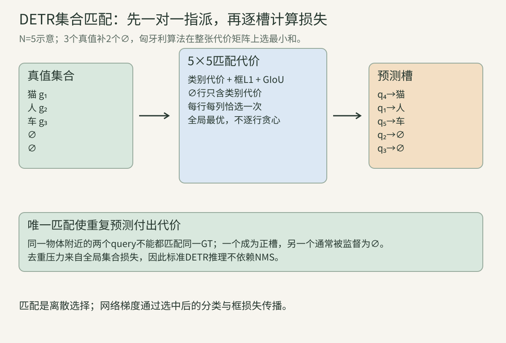
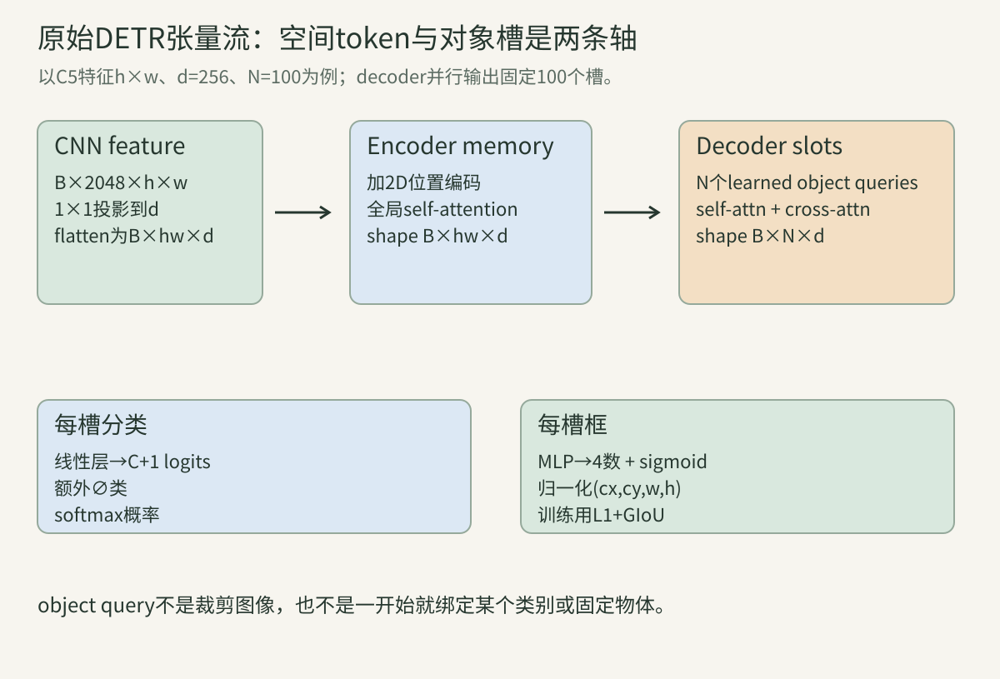
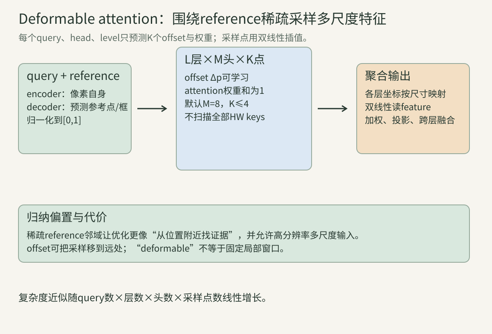
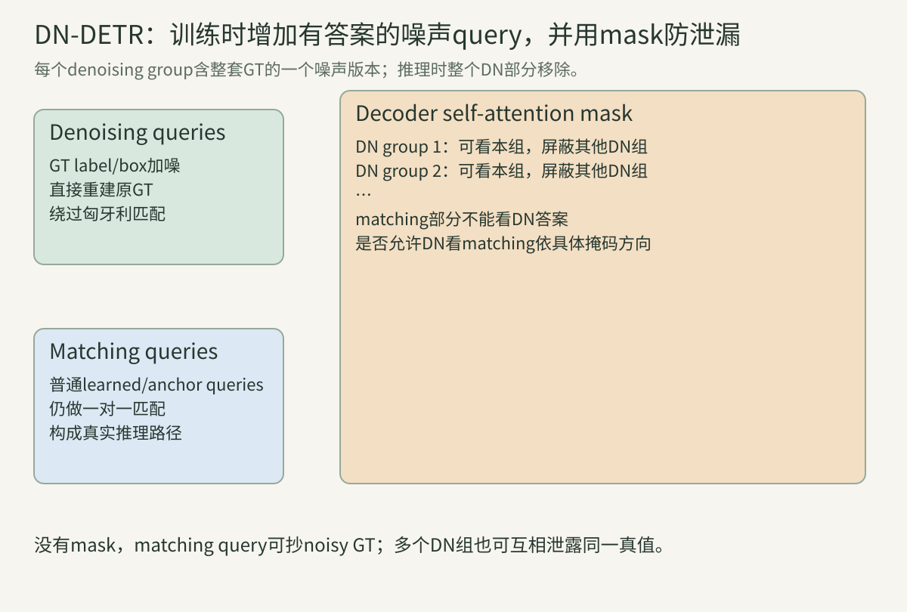
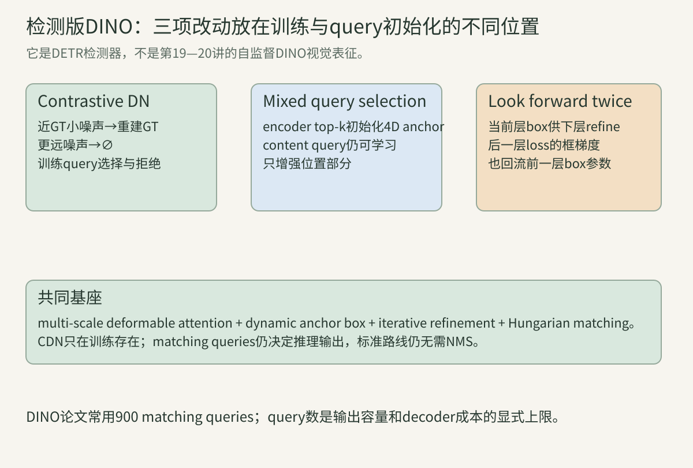

> 第21讲的anchor检测器先密集地产生许多重叠框，再用NMS删重。DETR换了问题定义：模型直接输出一个无序、固定容量的预测集合；训练时用匈牙利算法让每个真值只匹配一个预测槽，未匹配槽学习“无物体”。于是去重不再是推理末端的补丁，而成为集合损失的一部分。本讲先手算这种离散指派，再进入Transformer张量、稀疏可变形采样和去噪query。

记一张图有$M$个真值，模型有$N$个预测槽且$N\ge M$。真值为$y_i=(c_i,b_i)$，其中$c_i$是类别、$b_i=(c_x,c_y,w,h)\in[0,1]^4$；预测槽$j$输出类别分布$\hat p_j$与框$\hat b_j$。无物体类别写作$\varnothing$。

## 一、从框列表到无序集合

### 1. 检测答案没有天然顺序

同一张图的“人、猫、车”写成任何顺序都表示同一个检测集合。若直接令第一个预测回归标注文件第一行，模型会被标注排列影响，而排列不含视觉语义。

集合损失应对预测置换不变：交换两个输出槽，只要也改变匹配关系，最终最优损失不应变化。

### 2. 固定N个槽用$\varnothing$补齐可变目标数

Transformer decoder需要固定或批内统一shape。DETR令模型总是输出N个槽；若图中只有M个物体，就把真值集合补$N-M$个$\varnothing$。

原始DETR常用N=100，因此一张有7个物体的图会有7个正匹配和93个无物体槽。N是容量上限，不是模型保证会输出100个前景。

### 算例A：补齐后的集合

真值为猫、车两个物体，N=5，则训练集合可写成“猫、车、$\varnothing$、$\varnothing$、$\varnothing$”。其中三个$\varnothing$彼此不可区分；匈牙利匹配只需决定两个实物体占哪两个预测槽。

### 3. 逐槽固定监督会制造标签冲突

训练早期query尚未专门化，今天槽3最接近猫，下一张图槽8最接近猫。硬规定“槽0永远是猫”既不适用于多实例，也会把位置和类别混为固定索引。

DETR让每张图根据当前预测重新匹配，使query能逐步形成空间/对象分工，而不要求人工赋予槽语义。

### 4. 两两代价形成$N\times N$矩阵

把M个实物体和$N-M$个$\varnothing$作为行，把N个预测槽作为列。实物体行的代价含类别与框；$\varnothing$行只需类别代价，因为空槽没有真值框。

匹配要从每行、每列各取一个元素，使总和最小。这是线性指派问题，而不是对每个真值独立选最近预测。

### 算例B：贪心为何可能输给全局匹配？

两真值、两预测的代价矩阵为$[[1,2],[1.1,100]]$。逐行贪心先给真值1选预测1，总成本$1+100=101$；全局选择真值1→预测2、真值2→预测1，总成本$2+1.1=3.1$。

### 5. 匈牙利算法寻找最小总代价置换

最优置换写作：

$$\hat\sigma=\arg\min_{\sigma\in S_N}\sum_{i=1}^{N}\mathcal L_{match}(y_i,\hat y_{\sigma(i)}).$$

$S_N$是N个索引的所有排列。实际匈牙利算法是多项式时间，不枚举$N!$；本讲程序只对小N穷举以显式展示定义。

### 6. 匹配类别项使用目标类概率

对实物体$c_i\ne\varnothing$，原DETR匹配代价用$-\hat p_j(c_i)$，而最终分类损失用负对数似然$-\log\hat p_j(c_i)$。论文指出前者与后者对匹配的单调倾向一致，但数值尺度不同。

现代实现也可能用focal-style分类代价。必须分别检查matcher与criterion，不能看到训练CE就推断匹配也用CE。

### 7. 框L1同时约束中心与尺寸

$$\|b_i-\hat b_j\|_1=|c_x-\hat c_x|+|c_y-\hat c_y|+|w-\hat w|+|h-\hat h|.$$

坐标归一化到$[0,1]$后，不同输入尺寸可共用尺度。L1能区分完全不重叠框的距离，但对大框/小框同样的归一化偏移一视同仁。

### 8. GIoU为不重叠框提供几何信号

设C为包住两框的最小闭包框：

$$GIoU=IoU-\frac{|C\setminus(A\cup B)|}{|C|},\qquad L_{GIoU}=1-GIoU.$$

不重叠时IoU恒为0，GIoU仍随两框间空隙变化。DETR组合L1与GIoU，兼顾坐标距离和尺度不变重叠。

### 算例C：不重叠框的GIoU

A=$(0,0,1,1)$、B=$(2,0,3,1)$，交集0、并集2、闭包面积3，故$GIoU=0-(3-2)/3=-1/3$，损失$4/3$。若B再远，闭包空隙更大，GIoU更低。

### 9. 匹配代价与最终损失是两个对象

匹配先用权重$\lambda_{class},\lambda_{L1},\lambda_{giou}$决定离散指派；固定$\hat\sigma$后，再计算Hungarian loss：

$$\mathcal L=\sum_i[-\log\hat p_{\hat\sigma(i)}(c_i)+\mathbf1_{c_i\ne\varnothing}\mathcal L_{box}(b_i,\hat b_{\hat\sigma(i)})].$$

两处权重可相同但不必然。改变matcher权重可能跳到另一排列，效果不是简单连续缩放梯度。

### 算例D：微小代价变化导致指派跳变

两种置换总成本分别3.00与3.01；把某一框L1权重略增后变为3.02与3.01，最优置换整体翻转。匹配步骤离散，边界附近会出现训练不稳定，这是后续DN-DETR关注的原因之一。

### 10. 一对一匹配把重复框变成无物体错误

一个真值只能占一个预测槽。两个query都围住同一猫时，其中一个匹配猫，另一个不能再次匹配猫，往往匹配$\varnothing$并接受“无物体”分类梯度。

因此标准DETR直接学习唯一预测，推理通常无需NMS。这个结论依赖一对一训练和模型已收敛，不表示任意set predictor天然没有重复。

### 11. $\varnothing$分类权重需要下调

空槽远多于物体槽。原DETR在分类损失中把$\varnothing$类权重乘较小的`eos_coef`，避免93个空槽压过7个物体槽。

`eos`借自序列结束符命名，但这里表示no-object。权重太低会产生过多前景，太高会让模型倾向全空。

### 算例E：空类为何仍不能删掉？

若7个正槽有权重1，93个空槽权重0.1，则总名义权重为$7+9.3=16.3$。空类仍占过半监督，负责校准输出数量；完全删掉会让未匹配槽没有拒绝目标的信号。

### 12. Cardinality误差只用于监控数量

原DETR记录预测非空数量与真值数量的L1差作为cardinality error，帮助观察模型是否过报/漏报。官方实现将其作为日志指标，不反传。

看到loss字典中的`cardinality_error`不应自动加进总损失；要查看weight_dict是否给了非零权重。

## 二、原始DETR的张量与Transformer路径

### 13. CNN backbone把图像压成二维feature map

ResNet输出最后阶段feature $f\in\mathbb R^{B\times C_b\times H'\times W'}$，典型stride32。1×1卷积把$C_b$投影到Transformer宽度$d=256$。

原始高分辨率输入若短边800，feature仍有数百个空间位置；每个位置将成为encoder token。

### 14. Flatten只重排空间轴，不做池化

将$B\times d\times H'\times W'$重排为$B\times S\times d$，其中$S=H'W'$。mask也展平为$B\times S$，标记padding位置。

flatten保留每个网格单元，只是把二维位置映成序列索引。若忽略padding mask，batch中补边区域会参加attention。

### 算例F：800×1066输入有多少encoder token？

按stride32并取实现实际padding/卷积结果，近似$25\times34=850$个token。单层全局encoder self-attention的score项约$850^2=722500$每头；换stride16会使token约4倍、score项约16倍。

### 15. 二维正弦位置编码告诉模型token来自哪里

纯attention对输入置换等变，不知道flatten前的行列。DETR为每个有效位置产生x/y正弦余弦编码，加到encoder attention的query/key。

位置编码与内容feature同为d维；padding累计坐标与归一化策略也是实现接口。它不是ViT固定训练网格的单个可学习表。

### 16. Encoder让每个空间位置聚合全图上下文

多层encoder由self-attention与FFN组成。一个位置可读取远处对象和背景，形成全局memory $E\in\mathbb R^{B\times S\times d}$。

全局关系有助于避免重复和利用场景上下文，但$O(S^2)$使高分辨率多尺度feature昂贵，原始DETR因此主要用低分辨率单层feature。

### 17. Object query是N个可学习位置嵌入

原始DETR用$Q\in\mathbb R^{N\times d}$，常见N=100。query不是从图像裁出的proposal，也不是类别词；它为每个输出槽提供可学习身份/位置先验。

同一组query跨所有图共享。某query可能学出偏好区域或框尺寸，但其语义由训练涌现，不保证“query 17永远检测人”。

### 18. Decoder self-attention让槽之间协商

N个decoder槽先相互attention，可以比较各自正在解释的对象并降低重复。若去掉这条交互，每个槽更像独立检测器，唯一性只能由集合损失间接塑造。

self-attention成本$O(N^2)$；N从100增至900时score项增加81倍，虽然cross-attention和FFN也影响真实开销。

### 算例G：query数是容量也是成本

一张图若有120个可见实例而N=100，最多输出100个非空槽，recall有结构上限。把N改200解除容量瓶颈，却增加decoder self-attention和分类空槽负担。

### 19. Decoder cross-attention从图像memory读取证据

每个槽以decoder内容和object query作为query，对S个encoder memory位置计算attention。原始DETR每个query都可读取全图所有位置。

早期训练时query尚不知该看哪里，cross-attention需从近乎均匀或杂乱分布中学习尖锐定位，构成慢收敛来源之一。

### 20. 每层最终输出由共享类型的两个head产生

分类线性层输出$C+1$ logits；三层MLP输出4个数，经sigmoid成为归一化$(c_x,c_y,w,h)$。推理再转换为角点并映射回原图。

sigmoid保证范围，但接近0或1会饱和。框head没有anchor解码公式，原始DETR直接预测绝对归一化框。

### 21. 辅助decoder损失给中间层直接监督

若只监督最后一层，早期decoder层要通过很深路径收到集合信号。DETR在每个decoder层后接同类预测head并计算Hungarian loss，形成auxiliary losses。

官方实现对每层输出分别重新匹配，而不是把最后一层的置换强制复用。各层预测不同，独立matching能给当前层更合适的目标。

### 算例H：三层能否共用一次matching？

第一层槽2最接近猫，第三层经交互后槽7最接近猫。若全用第三层匹配，第一层被迫让槽7学一个当前很远的框；独立匹配则第一层槽2、第三层槽7各自获得局部合理监督。

### 22. AdamW与backbone较小学习率是训练配方的一部分

原论文使用AdamW，Transformer约$10^{-4}$学习率，预训练backbone约$10^{-5}$，并施加weight decay与梯度裁剪。CNN已有有用表征，过大学习率会破坏它；新Transformer需更快适配。

端到端表示模块可联合反传，不等于所有参数必须相同学习率。比较检测架构时要锁定优化器和schedule。

### 23. 推理按非空概率排序，不执行标准NMS

每槽取softmax后最高的前景类别与分数，丢掉$\varnothing$，按分数选top-k或阈值过滤。框从归一化中心宽高转回原图角点。

若部署又加NMS，可能提高某些未充分收敛模型的结果，但这改变了“端到端无NMS”的评价协议，必须报告。

### 24. 原始DETR的两个突出弱点是慢收敛与小目标

论文基线常训练300 epochs，与Faster R-CNN长schedule比较时用500 epochs；小目标AP也明显弱。原因不只是“Transformer需要更多数据”。

低分辨率单尺度feature损失小物体细节；全局cross-attention缺少初始位置先验，query需慢慢学会在哪里看；训练早期匹配还会频繁变化。

### 算例I：为什么直接加高分辨率会变贵？

encoder token从850增至3400时，全局self-attention score项从约72万增至1156万，正好16倍。若再拼多尺度token，所有位置两两交互，显存和计算迅速增长。

## 三、Deformable DETR：围绕参考点稀疏读图

### 25. 全局attention对高分辨率检测过于昂贵

原始encoder self-attention在S个空间token间成本含$O(S^2d)$；decoder cross-attention含$O(NSd)$。小目标需要更大S，恰与全局计算冲突。

Deformable DETR把每个query读取的key从全部位置改成每头每层少量K个采样点，使主要采样聚合项随S近线性增长。

### 26. Reference point给每个query一个空间起点

对query q，为每个attention head m给出归一化reference point $p_q\in[0,1]^2$。网络从query预测K个二维offset与K个权重。

reference不是最终框；它是“从哪里附近开始找”的坐标先验。offset可跨较大距离，因此稀疏采样不是硬局部窗口。

### 27. 单尺度可变形注意力是稀疏加权采样

$$DeformAttn(z_q,p_q,x)=\sum_{m=1}^{M}W_m\left[\sum_{k=1}^{K}A_{mqk}\,W'_m x(p_q+\Delta p_{mqk})\right].$$

每头的$A_{mqk}$经softmax满足和为1；$Delta p$是连续坐标，$x(\cdot)$用双线性插值。默认常见M=8、K=4，远少于全部HW位置。

### 算例J：采样数与全局key数

单尺度feature有1000个位置，8头全局cross-attention每query评估8000个head-key分数；K=4的deformable版本评估32个采样权重，数量比为0.004。线性投影和插值仍有成本，不能把它直接当作端到端加速倍数。

### 28. 连续offset依靠双线性插值可微

采样点不必落在整数feature格。其值由四邻点加权，梯度既回到feature值，也通过插值权重回到offset坐标。

若用最近邻取整，offset在大部分区域移动不改变读取值，坐标梯度几乎处处为0；模型难以学习精确采样位置。

### 29. 多尺度版本在L个feature level共同采样

$$MSDeformAttn=\sum_{m=1}^{M}W_m\left[\sum_{l=1}^{L}\sum_{k=1}^{K}A_{mlqk}W'_m x_l(\phi_l(p_q)+\Delta p_{mlqk})\right].$$

$\phi_l$把归一化参考点映到第l层坐标。注意力权重通常在L×K点上归一化，使query可在高分辨率找小目标边缘、在低分辨率取语义。

### 算例K：四层、八头、每层四点

每query总采样值数为$L\times M\times K=4\times8\times4=128$。它不是总共4点，也不是每层仅4个与head无关的共享点；shape必须明确到level、head、point三轴。

### 30. Encoder中每个像素以自身为reference

多尺度encoder的query就是各level每个空间位置，其reference由该位置的归一化坐标与level标识生成。它从所有level的少量相关点聚合信息。

这样输出仍保持多尺度feature maps的分辨率和数量，但跨尺度交换不需要构造全部token两两attention矩阵。

### 31. Decoder reference由object query预测

decoder初始reference point从object query经线性层和sigmoid得到。cross-attention围绕它采样图像feature，检测head预测相对reference的框。

相比原始DETR“每个query先看全图再找对象”，这给出了显式空间起点，降低cross-attention优化难度。

### 算例L：归一化reference如何映射不同层？

$p=(0.25,0.5)$在$80\times100$层对应$(25,40)$附近，在$20\times25$层对应$(6.25,10)$附近。它们指向同一输入相对位置，不是同一个整数feature索引。

### 32. Iterative refinement逐层更新参考框

第d层预测相对当前reference的box delta，得到新框，并把新中心或4D框作为第d+1层reference。后一层只需修正残差，而不是每次从零预测绝对框。

常见实现以inverse-sigmoid空间相加：$b^{d}=\sigma(\Delta^d+\sigma^{-1}(r^{d-1}))$，避免直接在线性坐标加偏移越界。

### 33. Two-stage Deformable DETR从encoder选择proposal

encoder每个多尺度位置先产生类别和框proposal，选top scoring候选初始化decoder query/reference；decoder再迭代精修，论文称two-stage变体。

它仍用集合损失并通常无NMS。“two-stage”在这里表示encoder proposals→decoder refinement，不应与Faster R-CNN的RPN→RoI head完全等同。

### 算例M：one-stage与two-stage query初始化

one-stage Deformable DETR的reference由跨图共享learned query预测；two-stage版本的reference来自当前图encoder top-k proposals。后者更贴图像内容，但top-k也引入选择与更多encoder head计算。

### 34. 稀疏采样带来新超参数与算子依赖

level数、head数、每层采样点K、offset初始化、reference格式和CUDA实现都会影响结果。K太小可能漏证据，太大增加成本且趋近稠密。

论文在50 epochs获得比原始DETR更快收敛并改善小目标，这是其协议下的实证；复现还需核对自定义`MSDeformAttn`算子和feature尺度。

## 四、从空间query到去噪训练

### 35. Conditional DETR把内容query与空间query分开

原始DETR cross-attention要同时从query学类别内容和空间位置。Conditional DETR从decoder embedding预测reference point及条件空间query，让cross-attention更聚焦参考点附近的空间带。

论文报告更快收敛；核心启示是给query显式空间结构，而非只增加decoder层。

### 36. DAB-DETR用4D动态anchor box表示位置query

DAB-DETR把query的位置部分显式写成$(x,y,w,h)$动态anchor；内容部分仍是d维embedding。宽高不仅是最终输出，也调制cross-attention的空间范围。

“anchor”在此为可迭代的query状态，不是第21讲预铺满网格、经IoU阈值分正负的手工anchor集合。

### 算例N：点reference缺少哪两维？

两个物体中心相同，一个$20\times20$、一个$200\times200$。2D reference只有中心，无法直接表达应关注的范围；4D动态框的w/h可调制宽窄attention并给下一层尺度先验。

### 37. 动态anchor逐层接近最终框

第一层从初始anchor读feature并预测修正，第二层使用更新后anchor再读，更像粗到细优化。每层可有独立box head，以适应不同refinement阶段。

可视化中anchor变准不等于每层都匹配同一query身份；辅助loss和matching政策仍决定监督。

### 38. Stop-gradient与look-forward决定跨层梯度

迭代框作为下一层reference时，实现常对更新后的reference停止梯度，以稳定训练。于是下一层loss通过feature路径影响前层表示，但不通过reference坐标直接更新前层box head。

DINO的look forward twice会重新设计这条box梯度路径。必须区分“前向使用上一层框”和“后向是否穿过上一层框”。

### 算例O：相同前向值可有不同梯度

$r_2=\sigma(\Delta_1+invSigmoid(r_1))$在两种实现中数值完全相同；若对$r_2$做detach，第二层box loss对$\Delta_1$的直接导数为0，否则非0。只看可视化框无法判断训练图。

### 39. 匹配不稳定让query难学一致目标

训练相邻epoch中，一个真值可能在query 7与query 42之间切换。若query刚学会靠近某物体，下次却因微小代价变化被监督为$\varnothing$，梯度方向会冲突。

DN-DETR把这种现象称为bipartite graph matching instability的一部分，并增加不经过matching的简单重建任务。

### 40. 去噪query从带噪GT直接学习还原

训练时把真值label和box加噪，编码成额外decoder queries；这些query与原真值有已知对应关系，直接监督恢复原label/box，无需匈牙利指派。

同时保留普通matching queries与Hungarian loss，所以DN不是用teacher forcing替代真实检测，而是增加一条较容易的辅助学习路径。

### 41. Box noise包含中心平移与尺度扰动

DN-DETR按原框宽高缩放中心噪声，并扰动w/h。小噪声使noisy box仍在真值附近，任务是从“不错的anchor”精修到GT。

若噪声为0，模型可能直接复制输入框；若过大，已知对应仍在数学上存在，却不再提供易学的局部修正课程。

### 算例P：相对噪声为何比固定像素公平？

给所有框中心加10像素，小框宽20相当于移动半个框，大框宽400仅2.5%。按$\Delta x\propto w$采样，二者受到相似相对难度，并可在归一化坐标中处理。

### 42. Label noise防止decoder只复制类别嵌入

若DN query直接携带正确label embedding，分类head可跳过图像证据把标签抄到输出。DN-DETR以一定概率把label换成其他类，要求模型结合图像和box恢复原类。

label noise与输入图像类别噪声不同：GT监督保持正确，只扰动训练query的提示。

### 43. 多个DN group提高每图辅助样本数

一个group包含该图全部M个GT各一个噪声版本；P个group产生$P\times M$个DN queries。不同图目标数不同，batch中需padding并mask无效DN槽。

DN query数量随M变化，matching query数量N固定。拼接后的decoder序列长度决定self-attention成本。

### 44. Attention mask阻止答案泄漏

matching queries不能读取DN queries，否则能从带噪GT直接获知物体位置；不同DN groups也要相互隔离，否则同一GT的多个噪声版本可互相平均得到答案。

mask是有方向的矩阵：query行能否读取key列要按实现确认。说“两个部分隔离”不足以复现具体可见性。

### 算例Q：2组、每组3个GT、4个matching queries

总序列长$2\times3+4=10$。matching部分的4行对前6个DN列应屏蔽；group1的3行屏蔽group2的3列，反之亦然。同组内可见，matching彼此可见。

### 45. DN分支只在训练时存在

推理没有GT，无法构造noisy GT query，因此删除整个DN部分，只保留matching queries。若训练时matching依赖DN信息，推理就出现分布断裂，这正是mask必要性。

所以DN可改善训练而不增加推理query数；训练显存和速度仍因额外queries上升。

## 五、检测版DINO：去噪、query选择与跨层框梯度

### 46. 检测版DINO与自监督DINO不是同一模型

本章DINO展开为“DETR with Improved deNoising anchOr boxes”，是目标检测器；第19讲DINO是无标签自蒸馏视觉表征，第20讲DINOv2/v3延续该路线。

两者缩写相同、作者团队和训练目标不同。检索论文、加载权重和写实验表时必须带上下文。

### 47. DINO以Deformable DETR与动态anchor为基座

它保留多尺度deformable attention、4D anchor query、迭代框refinement和Hungarian matching，再加入contrastive denoising、mixed query selection、look forward twice。

因此把DINO概括成“DETR加噪声”会漏掉其空间query与多尺度基座；把它当成新的NMS模型也不对。

### 48. Contrastive DN把近噪声框当正样本

每个GT生成较小噪声范围内的positive DN query，目标是恢复原类别和框。这继承DN-DETR的“已知对应、绕过matching”思路。

正样本教模型从邻近anchor收敛到物体，但单独正DN并没有明确教会它拒绝稍远的相似anchor。

### 49. 较远噪声框作为hard negative学习$\varnothing$

DINO再生成噪声幅度位于内外范围之间的negative DN query，监督为no-object。正负anchor都围绕同一GT，形成对比式局部决策边界。

“negative”不是另一类别物体，也不计算框重建；其主要分类目标是$\varnothing$。过远背景太容易，难以训练精细拒绝。

### 算例R：同一GT的正负DN对

GT中心0.5、宽0.2。正DN中心偏到0.52并回归0.5；负DN偏到0.68，虽仍与GT有空间关系，却学习$\varnothing$。这迫使decoder区分“可精修anchor”和“应拒绝anchor”。

### 50. CDN仍需group mask防止互抄

每个CDN group含正、负queries；多个group增加样本。matching部分不能读取它们，不同group也应隔离。

若负query能直接看到成对正query及其GT提示，它可通过序列结构猜标签，模型学到训练快捷方式而非图像拒绝能力。

### 51. Mixed query selection只从encoder选位置部分

two-stage Deformable DETR可从encoder top-k同时初始化content与position；DINO的mixed策略只用encoder候选框初始化4D positional queries，content queries仍是learned embeddings。

这样位置依赖当前图的高质量proposal，内容保持跨图可学习身份，避免encoder局部feature同时限制两部分。

### 算例S：pure与mixed selection的区别

若encoder位置A得分最高，pure selection把A的feature和box都送入decoder；mixed selection只取A的box，配上learned content query。两者初始anchor相同，decoder内容向量不同。

### 52. Look forward twice让后一层框损失监督前层框

普通迭代refinement前向把第d层框交给d+1层，但常对reference detach。DINO既用当前层box loss监督当前预测，又让下一层框预测相关损失通过前层box路径提供额外梯度，故称look forward twice。

这不是多跑两次推理，也不是test-time refinement循环；它改变训练计算图中相邻decoder层的box监督。

### 53. 更多matching queries增加候选覆盖也增加成本

DINO常用900 queries，而原DETR常用100，许多中间方法用300。更多queries增加匹配候选与密集场景容量，但decoder self-attention、分类空槽和Hungarian矩阵都更大。

论文设置还可能把300 queries乘3 patterns形成类似900容量。比较参数时要写实际decoder序列长度，而非只写基础query数。

### 算例T：100与900 query的self-attention项数

每层每头score项从$100^2=10,000$增至$900^2=810,000$，是81倍。Deformable cross-attention虽保持稀疏，query-query self-attention仍随N平方增长。

### 54. DINO的最终训练损失仍分matching与DN两部分

matching queries经Hungarian指派，计算分类、L1和GIoU；CDN queries有已知正负目标，直接计算DN分类与正样本框损失；各decoder层还有auxiliary监督。

损失字典的后缀常区分layer和DN分支。错误汇总可能重复计权、漏掉aux层或把负DN加框损失。

## 六、怎样判断“端到端”结论成立

### 55. 无NMS来自训练定义，不只是推理代码删除一行

一对一matching、query self-attention、空类监督和足够训练共同塑造唯一输出。若改为one-to-many匹配，让多个query同时学同一GT，推理重复可能回归，需要额外去重或专门分组机制。

因此“DETR-like”不自动等于严格NMS-free；要检查训练matcher和官方评价路径。

### 56. 重复率与空类校准应单独诊断

可统计每个GT附近高IoU高分预测数、未匹配query的前景分数分布、top-k随阈值变化和有/无NMS差异。只看AP可能掩盖大量重复被max detections截断。

若加NMS后AP显著提高，说明模型的集合唯一性或分数校准尚未学好，而不是NMS“免费增强”。

### 57. 小目标改进要区分feature分辨率与matching

Deformable DETR同时引入多尺度高分辨率feature、稀疏attention和reference points。小目标提升不能仅归因于“attention更强”。

消融应比较单/多尺度、全局/稀疏采样、是否iterative refinement，并在相同backbone、训练schedule下看APs。

### 58. 收敛速度必须按相同训练预算定义

“10倍更快收敛”通常比较达到某AP所需epochs，仍受batch、总图像次数、增强、学习率和硬件影响。epoch相同但每epoch数据或queries不同也不等价。

应同时报告wall-clock、GPU-hours、峰值显存和最终AP；自定义CUDA算子还会改变真实吞吐。

### 59. 实现复现要锁定五个易漂移接口

一是matcher分类代价形式；二是box坐标与L1/GIoU权重；三是$\varnothing$权重；四是aux layers是否独立matching；五是reference更新的detach和inverse-sigmoid位置。

DN/DINO再增加noise范围、group padding、attention mask方向、正负DN构造和query selection。任一处不同都可能仍能运行，却不再是论文算法。

### 60. DETR把检测变成可扩展的对象级接口

固定对象槽可附加mask、关键点、轨迹、关系、文本grounding和3D状态；匈牙利匹配统一了无序输出监督。后续Mask2Former、Grounding DINO、视频跟踪与端到端驾驶都借用这种query接口。

代价是固定容量、离散matching、query计算和训练稳定性。后续方法的方向多在更好初始化、更有效一对多训练、更稀疏query和更强开放词汇对齐之间权衡。

## 七、四段标准库程序：匹配、几何、采样与DN mask

### 程序一：穷举小型线性指派并反证逐行贪心

~~~python
import itertools

def assignment(cost):
    n = len(cost)
    best_perm, best_cost = None, float("inf")
    for perm in itertools.permutations(range(n)):
        total = sum(cost[i][perm[i]] for i in range(n))
        if total < best_cost:
            best_perm, best_cost = perm, total
    return best_perm, best_cost

cost = [[1.0, 2.0],
        [1.1, 100.0]]
perm, total = assignment(cost)
greedy = cost[0][0] + cost[1][1]
assert perm == (1, 0)
assert abs(total - 3.1) < 1e-12
assert greedy == 101.0 and total < greedy

# 同时交换预测列，只会交换最优置换，总损失不变。
swapped = [[row[1], row[0]] for row in cost]
perm2, total2 = assignment(swapped)
assert abs(total2-total) < 1e-12
print("optimal permutation=", perm, "cost=", total)
print("row-greedy cost=", greedy, "swapped optimum=", perm2, total2)
~~~

真实N=100不枚举$100!$，而用Hungarian solver。这个小程序只把“一对一全局最优”和置换不变性显式化。

### 程序二：L1、IoU、GIoU与匹配代价

~~~python
def area(b):
    return max(0.0, b[2]-b[0]) * max(0.0, b[3]-b[1])

def iou_giou(a, b):
    ix1, iy1 = max(a[0],b[0]), max(a[1],b[1])
    ix2, iy2 = min(a[2],b[2]), min(a[3],b[3])
    inter = max(0.0,ix2-ix1)*max(0.0,iy2-iy1)
    union = area(a)+area(b)-inter
    iou = inter/union if union else 0.0
    cx1, cy1 = min(a[0],b[0]), min(a[1],b[1])
    cx2, cy2 = max(a[2],b[2]), max(a[3],b[3])
    cover = max(0.0,cx2-cx1)*max(0.0,cy2-cy1)
    giou = iou - (cover-union)/cover if cover else iou
    return iou, giou

def xyxy_to_cxcywh(b):
    return ((b[0]+b[2])/2, (b[1]+b[3])/2, b[2]-b[0], b[3]-b[1])

def match_cost(gt, pred, class_prob, wc=1, wl1=5, wg=2):
    x, y = xyxy_to_cxcywh(gt), xyxy_to_cxcywh(pred)
    l1 = sum(abs(a-b) for a,b in zip(x,y))
    _, giou = iou_giou(gt,pred)
    return -wc*class_prob + wl1*l1 + wg*(1-giou)

a, b = (0,0,1,1), (2,0,3,1)
iou, giou = iou_giou(a,b)
assert iou == 0.0 and abs(giou + 1/3) < 1e-12
c = match_cost(a,b,0.8)
assert abs(c - (-0.8 + 5*2 + 2*(4/3))) < 1e-12
print("IoU=", iou, "GIoU=", round(giou,6), "cost=", round(c,6))
~~~

两框不相交时IoU同为0，GIoU和L1仍区分距离。程序中的权重是教学示例，复现实验应读取具体配置。

### 程序三：多尺度可变形采样的轴与双线性值

~~~python
import math

levels = [
    [[0.0, 1.0], [2.0, 3.0]],
    [[10.0, 14.0], [18.0, 22.0]],
]

def bilinear(grid, xn, yn):
    h, w = len(grid), len(grid[0])
    x, y = xn*(w-1), yn*(h-1)
    x0, y0 = int(math.floor(x)), int(math.floor(y))
    x1, y1 = min(x0+1,w-1), min(y0+1,h-1)
    dx, dy = x-x0, y-y0
    return ((1-dx)*(1-dy)*grid[y0][x0] +
            dx*(1-dy)*grid[y0][x1] +
            (1-dx)*dy*grid[y1][x0] + dx*dy*grid[y1][x1])

# 一头、两层、每层两个采样点；四个权重跨L×K归一化。
points = [[(0.5,0.5),(0.0,0.0)], [(0.5,0.5),(1.0,1.0)]]
weights = [[0.1,0.2],[0.3,0.4]]
assert abs(sum(map(sum,weights))-1.0) < 1e-12
values = [[bilinear(levels[l],*p) for p in points[l]] for l in range(2)]
out = sum(weights[l][k]*values[l][k] for l in range(2) for k in range(2))
assert values == [[1.5,0.0],[16.0,22.0]]
assert abs(out-13.75) < 1e-12
print("sample values=", values, "weighted output=", out)
~~~

这里两层shape恰好相同只为手算；真实多尺度层shape不同，归一化reference经各层尺寸映射后再加对应offset。

### 程序四：构造DN分组mask并核对迭代框更新

~~~python
import math

def dn_mask(groups, gt_per_group, matching):
    dn = groups*gt_per_group
    n = dn+matching
    blocked = [[False]*n for _ in range(n)]
    # matching query不能读DN keys
    for q in range(dn,n):
        for k in range(dn): blocked[q][k] = True
    # DN query屏蔽其他DN groups
    for q in range(dn):
        gq = q//gt_per_group
        for k in range(dn):
            if k//gt_per_group != gq: blocked[q][k] = True
    return blocked

mask = dn_mask(groups=2, gt_per_group=3, matching=4)
assert len(mask) == 10
assert all(mask[q][k] for q in range(6,10) for k in range(6))
assert all(mask[q][k] for q in range(3) for k in range(3,6))
assert not mask[0][1] and not mask[6][7]

def sigmoid(x): return 1/(1+math.exp(-x))
def logit(p): return math.log(p/(1-p))
def refine(reference, delta): return tuple(sigmoid(logit(r)+d) for r,d in zip(reference,delta))

r0=(0.5,0.5,0.2,0.4)
r1=refine(r0,(0.2,-0.2,math.log(2),0.0))
assert abs(r1[0]-sigmoid(0.2)) < 1e-12
assert 0 < min(r1) and max(r1) < 1
print("mask shape=", len(mask), "x", len(mask[0]))
print("refined box=", tuple(round(x,6) for x in r1))
~~~

mask断言验证了matching→DN与跨DN组屏蔽。refinement展示inverse-sigmoid空间相加；宽度不会简单从0.2变0.4，因为logit更新不是旧式anchor的指数宽高解码。

## 八、练习与详解

### 练习1：为什么标注文件顺序不能直接监督query顺序？
**解析：** 实例集合没有语义顺序，文件行序可能随导出工具改变。固定逐槽监督会让同一图仅因排列不同产生不同梯度；集合matching消除这种任意性。

### 练习2：N=100、图中12个GT时有多少$\varnothing$？
**解析：** 补88个。匈牙利指派后12个槽匹配实物体，剩余88个槽监督为空；前提是所有GT都进入训练且N足够。

### 练习3：逐个GT选最低代价预测为何不行？
**解析：** 两个GT可能选中同一预测，破坏一对一；即使排除已用预测，贪心顺序也可能错过全局更低组合，算例B给出反例。

### 练习4：Hungarian matching本身能反向传播吗？
**解析：** 离散置换选择通常不求导。选定匹配后，分类、L1与GIoU损失对相应预测反传；代价变化跨越边界时匹配会跳变。

### 练习5：为何同时使用L1和GIoU？
**解析：** L1在不重叠时仍度量坐标距离；GIoU强调框的相对覆盖和形状，且对共同尺度更稳。两者处理不同几何缺陷。

### 练习6：重复框为何会收到相反监督？
**解析：** 同一GT只能匹配其中一个query；另一个未匹配query被分配$\varnothing$，分类头被要求压低前景分数，由此形成去重压力。

### 练习7：把`eos_coef`设为0会怎样？
**解析：** 未匹配query没有空类分类惩罚，模型可让大量槽预测前景而不付代价，输出数量失控。一对一匹配本身不会惩罚所有未选重复。

### 练习8：Cardinality error默认参与训练吗？
**解析：** 原官方实现主要用于日志，weight dict没有其训练权重。它帮助观察计数，不应仅因名为error就加入总loss。

### 练习9：object query是图像patch吗？
**解析：** 原始DETR中不是。它是跨图共享的learned embedding，通过cross-attention读取encoder图像memory；Deformable/DINO变体才引入更显式的图像相关reference或proposal。

### 练习10：query数比图中物体数多是否浪费？
**解析：** 多余槽提供未知目标数的容量并学习空类，但增加decoder、matching与空类损失成本。过少会有硬recall上限，过多则需更好校准和算力。

### 练习11：辅助decoder层能否固定复用最后层匹配？
**解析：** 可以设计，但原DETR常对各层独立matching。复用会强制早期层跟随末层query身份，独立匹配更贴合各层当前预测。

### 练习12：标准DETR为何不需要NMS？
**解析：** 一对一集合损失把未选重复监督为空，query间self-attention还能协商。无NMS是训练目标与架构共同结果，不只是省略后处理。

### 练习13：原始DETR小目标弱只因query太少吗？
**解析：** 不是。低分辨率单尺度feature和高分辨率全局attention成本是核心因素；query容量只在实例数接近N时构成上限。

### 练习14：Deformable attention的K=4是全模型只看4点吗？
**解析：** 不是。通常是每个query、每个head、每个feature level各4点；总数还乘M和L，各层各query又不同。

### 练习15：稀疏offset只能在reference附近吗？
**解析：** offset是可学习连续值，可移到较远位置；reference提供起点归纳偏置而非硬窗口。实现可能对坐标做归一化或边界处理。

### 练习16：为什么双线性插值对offset学习重要？
**解析：** 输出随坐标连续变化，loss可对offset传梯度；最近邻取整是分段常数，绝大多数位置没有有用坐标梯度。

### 练习17：多尺度deformable attention还需要传统FPN top-down吗？
**解析：** 原论文从backbone多层与额外下采样层构造统一通道feature，并由attention跨尺度交换，不依赖标准FPN top-down；其他实现仍可组合FPN。

### 练习18：4D动态anchor与Faster R-CNN anchor相同吗？
**解析：** 不同。DAB的anchor是少量query的位置状态，逐层更新；Faster R-CNN在密集网格预铺大量固定参考框，用IoU阈值分正负并生成proposal。

### 练习19：前向使用上一层框是否证明下一层loss会更新上一层box head？
**解析：** 不证明。若reference被detach，数值用于下一层但该坐标路径梯度为0。必须检查stop-gradient和look-forward实现。

### 练习20：DN query为何不参与Hungarian matching？
**解析：** 它由某个GT加噪而来，已知应还原哪个GT；直接监督正是它提供稳定、容易任务的原因。普通matching queries仍做Hungarian训练真实推理路径。

### 练习21：DN为何要扰动label？
**解析：** 防止分类head从query携带的正确label embedding直接抄答案，迫使其读取图像与box上下文恢复真实类。

### 练习22：为何matching query不能看DN query？
**解析：** DN query编码了带噪GT，是训练时答案提示。matching若读取它，会依赖推理时不存在的信息，造成泄漏和训练—推理分布差。

### 练习23：CDN的negative query是否回归GT框？
**解析：** 其核心目标是预测$\varnothing$，教模型拒绝离GT较远anchor；正DN query才承担恢复原框。具体损失应核对实现配置。

### 练习24：Mixed query selection的“mixed”混合什么？
**解析：** 位置部分来自当前图encoder top-k proposal，内容部分保留learned queries；并非混合正负DN，也不是混合两种backbone。

### 练习25：DINO为何能同时有dynamic anchor和NMS-free？
**解析：** dynamic anchor只是query空间状态；最终matching queries仍用一对一Hungarian集合损失学习唯一输出，不沿用密集anchor检测器的多正样本+NMS逻辑。

### 练习26：900 queries一定比300好吗？
**解析：** 不一定。它提高容量和候选覆盖，也显著增大self-attention、空类与matching成本。效果依赖DN、数据密度、训练预算和实现优化。

### 练习27：如何证实模型真正不依赖NMS？
**解析：** 按官方无NMS路径评价，并统计重复率；再做有/无NMS对照。若NMS带来明显收益，应报告并分析一对一训练或校准不足。

### 练习28：四个程序通过后还没有证明什么？
**解析：** 未训练COCO检测器、复现AP/收敛速度、验证Hungarian库、CUDA deformable算子、DN泄漏或DINO梯度图。程序只核对小规模数学与shape契约。

## 九、来源、版本与下一讲

本文程序已运行核对小型全局指派、GIoU/匹配代价、跨层稀疏采样、DN attention mask和inverse-sigmoid框更新。它们是教学验证，不构成COCO复现、GPU性能测试或官方算子等价性证明。

下一讲第23讲进入FCN、U-Net、DeepLab与Mask2Former，讨论从逐像素分类到mask分类、实例/语义/全景分割，以及query如何从框集合扩展到mask集合。返回[课程总览](../vision-00-overview/)；[第21讲](../vision-21-rcnn-fpn-yolo/)补anchor、FPN和NMS；[第11讲](../vision-11-attention-transformer/)补attention基础。

### 原论文与作者实现

- [Carion等：End-to-End Object Detection with Transformers](https://arxiv.org/abs/2005.12872)，ECCV 2020；[作者实现](https://github.com/facebookresearch/detr)用于核对matcher、criterion、aux loss与张量接口。
- [Zhu等：Deformable DETR](https://arxiv.org/abs/2010.04159)，ICLR 2021；[作者实现](https://github.com/fundamentalvision/Deformable-DETR)用于核对多尺度采样、reference、iterative refinement与two-stage接口。
- [Meng等：Conditional DETR](https://arxiv.org/abs/2108.06152)，ICCV 2021。
- [Liu等：DAB-DETR](https://arxiv.org/abs/2201.12329)，ICLR 2022；区分4D dynamic anchors与密集anchor。
- [Li等：DN-DETR](https://arxiv.org/abs/2203.01305)，CVPR 2022；核对box/label noise、DN groups与attention mask。
- [Zhang等：DINO](https://arxiv.org/abs/2203.03605)，ICLR 2023；[作者实现](https://github.com/IDEA-Research/DINO)用于核对CDN、mixed query selection与look forward twice。

资料核对日期：2026-10-09。检测版DINO与自监督DINO/DINOv2/DINOv3在全文中始终分开；论文AP和收敛速度仅属于各自数据、硬件与训练协议。
