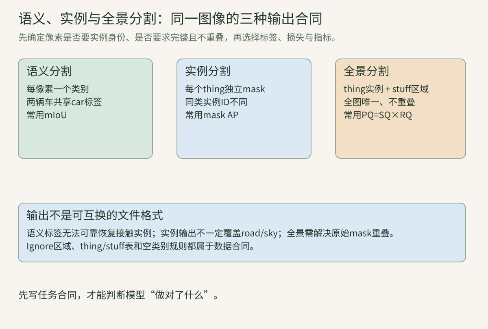
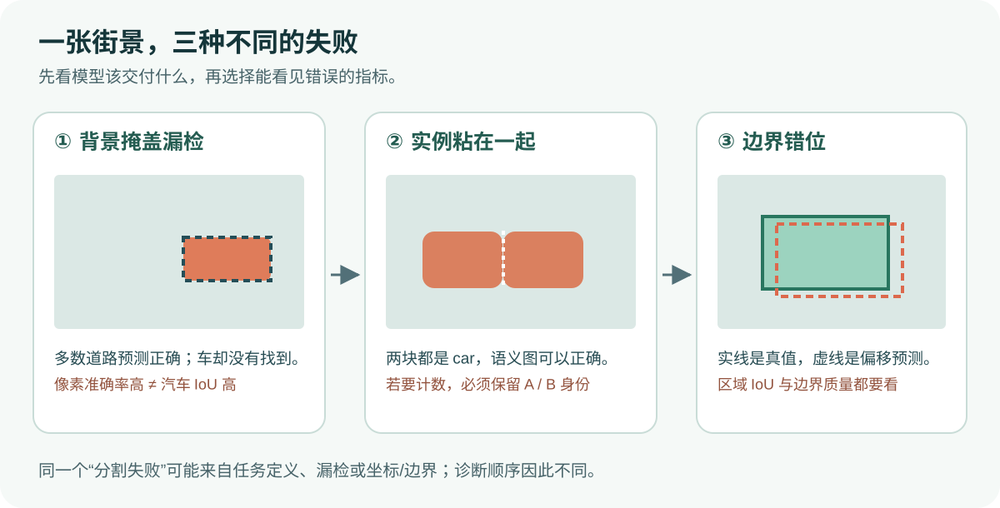
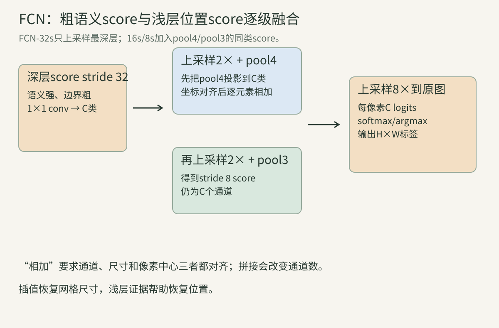
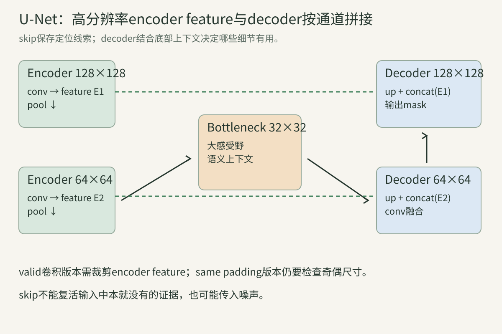
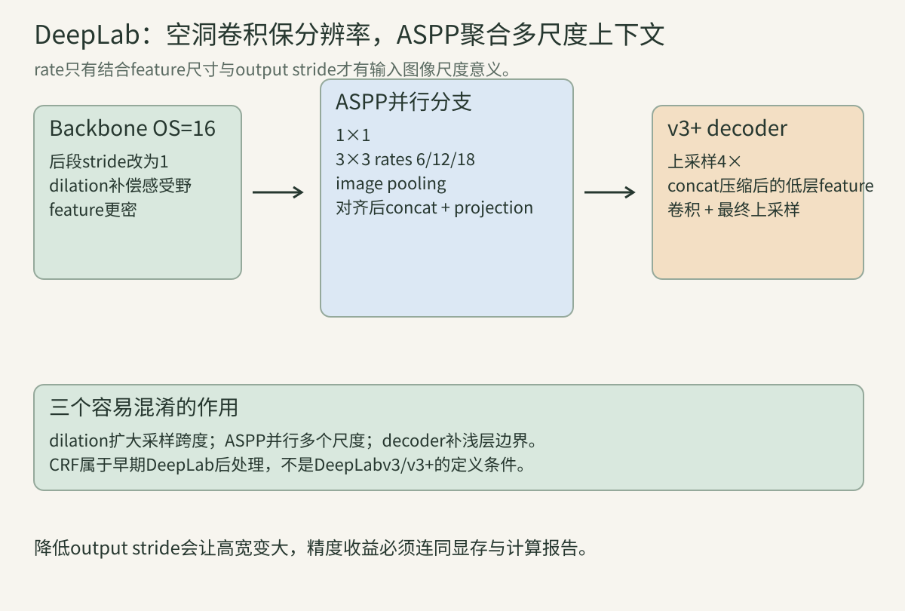
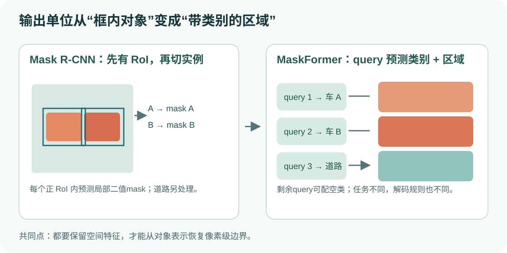
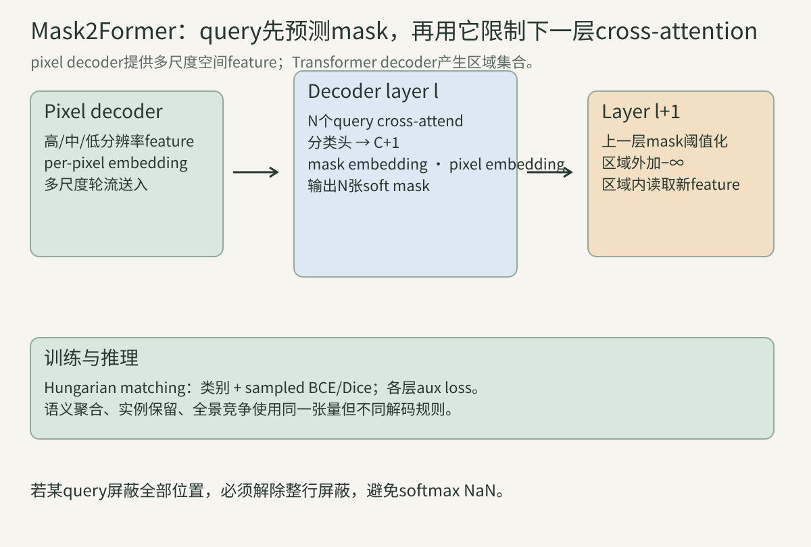

> 前两讲把物体放进矩形框里，但框内有车，也有它后面的路。现在我们希望得到车的真实轮廓。先别急着记架构名字：这一讲始终想象同一张街景照片——两辆相邻的汽车、一个行人、一条道路。你会看到，每篇论文都是在解决前一种做法留下的具体麻烦。读完后，你应该能亲手把一张图从“每像素是什么”推进到“每个像素属于哪个实例”，并能解释为什么有时要预测像素类别，有时要预测一组区域。



## 一、先决定要交给模型怎样的答案

不论用哪种网络，输入图像都可以记为$X\in\mathbb R^{H\times W\times3}$。问题先从输出开始。假设街景里两辆汽车分别是A和B，紧贴着停在路边。**语义分割**给每个像素一个类别，A和B的像素都写“汽车”；它能说哪里是车，却未必能数出有几辆。**实例分割**给每辆车独立的mask、类别和分数，因此A和B必须分开。它通常只关心可数的前景物体，未必给道路和天空完整标签。**全景分割**把两者合在一张不重叠的地图里：A、B有不同实例ID，道路属于“road”这一整片区域，每个被评估的像素只有一个归属。

这三个目标不是把同一个输出文件改个名字。若已经把A和B合成一块“car”语义区域，后来它们的边界恰好接触，仅靠这块二值图无法可靠恢复两辆车；反过来，只有A、B实例mask也不能自动填满道路。数据集把可数对象称为*thing*，把道路、天空等通常不单独编号的区域称为*stuff*。这份类别表由数据集规定，训练前要读取，而不是凭词义猜。

拿一个只有12个像素的玩具例子试一下：

```text
真值类别：路 路 车 车 车 车 / 路 路 车 车 人 路
实例编号：— — A  A  B  B  / — — A  B  C  —
```

第一行语义标签把A、B都写成“车”；第二行的A/B/C才告诉我们有两辆车和一个人。真实数据常有`ignore`像素，例如未标注区域或边界不确定区域。训练的交叉熵、评估的混淆矩阵都应跳过这些像素；把`255`当成普通类别，会同时污染梯度与分数。

接下来用一个指标问题理解为什么需要这些不同答案。设某张图只有10个有效像素，其中8个道路、2个汽车。模型全部预测道路，像素准确率仍是$8/10=80\%$，但汽车一次都没找到。汽车的交并比定义为

$$IoU_{car}=\frac{TP_{car}}{TP_{car}+FP_{car}+FN_{car}},$$

此例汽车$TP=0,FP=0,FN=2$，所以IoU为0。对每个类别分别算IoU再平均，得到mIoU。通常先跨**整个数据集**累计混淆矩阵，再按类计算；先按图片平均会给一张很小的图和一张很大的图相同权重，属于另一种约定。若某类在真值与预测中都不存在，则分母为0，必须按基准规则选择忽略或另行定义，不能悄悄设成1。

Dice也是集合重叠：$Dice=2TP/(2TP+FP+FN)$。它和硬IoU满足$Dice=2IoU/(1+IoU)$，但训练时常用概率计算*soft Dice*，不应把训练loss的数值和阈值化指标混为一谈。对于我们那条很细的人行道边缘，区域IoU可能看起来尚可，边界却已经偏了几像素；这时可补边界指标，但要报告其容差和距离单位。

全景分割还要问“实例有没有找对”。Panoptic Quality（PQ）先把同类别预测区域与真值区域在$IoU>0.5$时配对。若两对匹配IoU分别为0.8、0.6，另有一块误报与一块漏报，则

$$PQ=\frac{0.8+0.6}{2+0.5\times1+0.5\times1}=\frac{1.4}{3}\approx0.467.$$

分子反映配对区域切得多好，分母惩罚漏找和误找。可写成$PQ=SQ\times RQ$：$SQ=0.7$是已配对区域的平均IoU；$RQ=2/3$表示识别部分。若某方法只把已找到的车切得很漂亮，却漏掉一半车辆，PQ仍会下降。



## 二、FCN：怎样从分类器走到每个像素

回到2015年前后的思路。图像分类器给整张图一个“有车”的分数；我们需要在照片的每个位置都给分数。直觉做法是以每个像素为中心裁一个小窗口，送进分类器，再把结果填回该像素。它可以工作，却让相邻窗口重复计算几乎相同的卷积。FCN（Fully Convolutional Network）的关键是**整张图只卷积一次，保留最后的空间网格**。卷积天然共享邻近窗口的计算，这使密集预测成为一个端到端网络。

先看“全连接层改卷积”为什么不是魔法。设分类网络末端的特征图为$7\times7\times512$。若紧接着的全连接层输出1000个数，每个神经元都读取$7\times7\times512$个输入，其权重可重新排成1000个$7\times7\times512$卷积核。对原来的$7\times7$特征图，每个核只放得下一个位置，仍输出1000个数；若换一张更大的图，使末端特征图变成$10\times10\times512$，同样的核能滑出$(10-7+1)^2=16$个位置，得到$4\times4\times1000$分数图。后续全连接层若原来读一个位置的通道，也可改成$1\times1$卷积。权重含义保留了，空间输出却不再限于一个格子。

**新的困难是格子太粗。** 一个分类骨干多次用stride 2缩小图像；若总output stride（OS）为32，$512\times512$输入只得到$16\times16$的深层分数图。每个深层格子有较大感受野，知道附近大概是汽车还是道路，却难把车门边缘放到原图某个像素。把$16\times16$直接放大32倍，并不会恢复网络已经丢掉的细节。

最简单的放大是双线性插值：新位置由周围四个旧格子的分数按距离加权。它没有学习参数，结果平滑，但两辆紧贴的车可能仍糊成一块。FCN论文还使用可学习的转置卷积上采样。注意“转置”说的是线性算子的矩阵转置：若下采样卷积可写成$y=Kx$，转置卷积计算$K^\top y$；$K^\top$一般不是$K^{-1}$，无法凭空逆转丢失的信息。1D尺寸按

$$L_{out}=(L_{in}-1)s-2p+d(k-1)+output\_padding+1$$

计算；例如输入长度3、核4、步长2、padding1、dilation1、output padding0，输出长度$(3-1)2-2+3+1=6$。核大小与步长组合不当还会使输出位置受不同数量卷积核覆盖，形成棋盘格。插值后再卷积是常见缓解方案。

FCN的真正启发是：深层给**类别语义**，较浅层保留**位置**。FCN-32s直接把深层分数上采样32倍；FCN-16s先上采样两倍，和stride 16的pool4类别分数相加；FCN-8s再加入stride 8的pool3分数，最后回到原图。浅层特征先经$1\times1$卷积变成同样的类别数，因此两个$H'\times W'\times C$分数图能逐元素相加。这和“按通道拼接”不一样。图像放大、padding与crop时，还必须对齐两个分数图的像素中心；数值shape相同也可能相差一个像素。



至此，模型输出$H\times W\times C$个logit。训练时每个非ignore像素取真值类的交叉熵，再对有效像素平均：

$$L_{CE}=-\frac1{|\Omega|}\sum_{u\in\Omega}\log\frac{e^{z_{u,y_u}}}{\sum_{c=1}^{C}e^{z_{u,c}}}.$$

$\Omega$是参与监督的像素集合。整图一次计算、多处共享卷积权重，仍然可针对每个像素反向传播。FCN提供的主要答案是“怎样从分类网络得到稠密预测”；它没有自动解决细长目标、边界与多个同类实例。

## 三、U-Net：若细节在下采样时消失，谁来把它找回来

想象街景缩成一张显微照片，目标是几个很小的细胞。若把一处只有两像素宽的边界连续下采样，在最深层它可能已经没有独立位置。仅靠深层分数上采样，就像把一张小图放大：画布大了，原来没记录的信息仍不在。U-Net让encoder在每个尺度把较细的特征留给decoder。网络左边逐级收缩，右边逐级放大，所以拓扑像字母U。

它与FCN的skip差别值得慢读。FCN-8s常把浅层特征投影为$C$通道**类别分数**，然后与深层分数相加。经典U-Net把浅层的**多通道feature**直接与同尺度decoder feature拼接，让后续卷积学习哪些边缘、纹理值得用。假设decoder上采样后是$64\times64\times256$，encoder送来的也是$64\times64\times256$，拼接后是$64\times64\times512$。一个$3\times3$卷积再输出256通道，权重和偏置共$3\cdot3\cdot512\cdot256+256=1,179,904$个参数。拼接保留的信息更多，也付出了显存和融合计算成本。



你在现代代码里经常看到`same padding`的U-Net，原论文却用`valid`的$3\times3$卷积：每次卷积使高宽各少2。这样decoder上采样后的图与较早encoder特征尺寸不完全相等，原论文要先**中心裁剪**encoder特征再拼接。使用same padding不代表方法“错了”，但它改变了边界位置的可见上下文；写论文复现或核参数尺寸时要说明版本。处理特别大的图时，原论文采用重叠tile：邻接小块有重叠，只取每块中心较可信的输出拼起来，避免tile边界缺上下文。

小样本医学影像还提出另一层问题：训练集很少时，模型怎样见过足够多的形变？U-Net原论文强调弹性形变等数据增强。对图像与标签做同一个几何变换，但插值方式不同：RGB图像可以双线性插值获得平滑颜色，硬类别mask通常要最近邻。设两个相邻标签是0与2；双线性混成1，会凭空造出第三个类别。若标签是soft概率则是另一种情况，应按目标定义决定。

很多人把Dice loss与U-Net固定绑定，实际上原U-Net论文有自己的像素级加权交叉熵设计；后来的大量U-Net变体才广泛搭配Dice或BCE+Dice。若我们用soft Dice，二分类常写成

$$D_{soft}=\frac{2\sum_u p_uy_u+\epsilon}{\sum_u p_u+\sum_u y_u+\epsilon},\quad L_{Dice}=1-D_{soft}.$$

$p_u$是前景概率，$y_u$是真值。一个小前景只占极少像素时，普通未加权CE的总梯度容易被背景主导；Dice把前景集合的重叠直接放进分母。它也有空mask、平滑项和batch聚合等约定，不能看到名称就认为两份代码等价。U-Net的核心不是某一个loss，而是**让深层上下文与浅层定位重新相遇**。若浅层本身被噪声污染，skip也可能把噪声带进decoder；它不能制造输入中不存在的证据。

## 四、DeepLab：不把网格压得太小，能否又看得足够远

FCN、U-Net通过上采样和skip补救下采样带来的细节损失。DeepLab提出另一种办法：后段别再急着下采样，但要维持较大的感受野。做法是空洞卷积（atrous/dilated convolution）。普通一维三点核看相邻位置$x[i-1],x[i],x[i+1]$；rate为2时看$x[i-2],x[i],x[i+2]$。核的**参数个数仍是3**，采样跨度却变大。二维$3\times3$核、rate为$r$时，有效核宽为

$$k_{eff}=3+(3-1)(r-1)=1+2r.$$

rate为1、2、3时分别跨3、5、7个位置，但各只有9个实际权重。这里“跨7”不是把49个位置都读一遍，中间有采样空隙。

设输入$512\times512$，output stride从16降到8，主干特征从$32\times32$增为$64\times64$：空间位置变成4倍，显存和后续计算会增加。为避免感受野因少下采样而收缩，需要在受影响的后续卷积层配合调整dilation；仅给最后一层加个rate不能保证整个主干与原设计等价。rate也要结合output stride解释：特征图上的间隔$r=6$，相对于输入图像大致跨越$6\times OS$的步距，忽略感受野和padding细节。



同一辆汽车，近处占画面一半，远处只占几十像素；固定一种上下文范围很难兼顾。ASPP（Atrous Spatial Pyramid Pooling）并联几种rate的卷积、$1\times1$分支和图像级池化分支，再把它们对齐、按通道拼接并投影。图像级池化能告诉局部“我们大致在街道场景”，却无法独自给出车门边界。多个rate也不是简单复制：它们采样到不同跨度的邻域。若rate大到在小特征图上大量点落到padding，收益会变小；周期采样还可能产生gridding盲点。

DeepLab版本要分清。早期DeepLab使用空洞卷积并在一些设置中结合DenseCRF后处理；DeepLabv3重点整理了ASPP与多尺度上下文；DeepLabv3+再加入轻量decoder，把ASPP的语义特征上采样并与低层特征融合以修正边界。假设低层特征有256通道，直接与ASPP输出拼接会让后续卷积过宽，因此v3+先用$1\times1$卷积压缩低层通道，再拼接与卷积。论文还在骨干或decoder中使用空洞深度可分离卷积：depthwise负责各通道空间采样，pointwise负责通道混合。把版本都笼统写成“DeepLab用了CRF”会误导复现。

这条路线解决的是**语义区域的空间密度和多尺度上下文**。它仍可能把紧贴的两辆车标成一整片car，因为它的基本输出仍是每像素类别。若任务要区分A和B，我们需要让输出带上“实例”这个单位。

## 五、从每像素到每个对象：Mask R-CNN与MaskFormer

第21讲已讨论Faster R-CNN：先产生候选框RoI，再给每个RoI分类和回归框。Mask R-CNN在每个正RoI旁加一条并行mask分支，预测该实例的局部二值mask。一个RoI大致框住汽车A，就在该RoI内部找A的像素；另一个RoI框住B，就找B。它自然地保留了两个实例，即使两者紧挨。训练时分类、box和mask分支有各自损失；mask分支不负责预测道路等stuff区域。

这时RoIAlign格外重要。若从原图到特征图的坐标量化为整数，框边界可能偏半格甚至一格；分类对这种偏移可能容忍，像素mask边缘却直接错位。RoIAlign保留浮点坐标，在规则采样点上双线性取feature，让框与mask对齐。Mask R-CNN原论文使用按类别的mask输出：对一个RoI可输出$K$张候选类别mask，训练和推理按该RoI的类别选对应通道，而不是把所有$K$张都当作$K$个独立物体。评价实例分割常用mask AP：先按mask IoU判断预测实例是否匹配GT，再由置信度排序得到精确率—召回率曲线。框AP高不保证mask AP高。



如果把thing实例与stuff语义图直接叠起来，会遇到重叠：汽车mask和道路图可能都覆盖汽车像素。传统panoptic系统需要一套融合与归属规则。MaskFormer换了表达方式：让网络预测一组区域，每个区域有**类别分布**和**soft mask**。一辆车对应一个query区域，道路也可对应一个区域；未用到的query属于空类$\varnothing$。于是不同分割任务可以共享相近的内部表示，再各自按语义、实例或全景规则解码。

MaskFormer的pixel decoder生成每像素embedding $F_u\in\mathbb R^d$，Transformer decoder产生第$i$个query的区域向量$e_i$与类别分布$p_i(c)$。简化地看，mask logit来自$e_i^\top F_u$，sigmoid给出$m_i(u)$。如果有$N$个query和$C$个类别，输出是一张$N\times(HW)$的区域概率表，以及$N\times(C+1)$的类别概率表。**这里仍需要逐像素特征**：只是最终决策单位由“每个像素直接分类”改为“区域加类别”。

训练时GT区域数量不固定，例如我们的街景有汽车A、汽车B、行人和道路四个区域，但网络可能固定给100个query。不能规定query0永远负责汽车A，因为区域顺序本没有意义。要先用类别和mask成本在预测query与GT区域之间做一对一二分图匹配；匹配上的query学习对应区域，剩余query学习空类。第22讲DETR的匈牙利匹配在这里再次出现，只是匹配对象从box变成mask。若某query与两个GT都相似，它仍只能被分给其中一个，另一个GT需要另一query。

推理时三种任务的读法不同。做语义分割，可以把同类query对每个像素的贡献相加，例如

$$s_c(u)=\sum_{i=1}^{N}p_i(c)m_i(u),\qquad \hat y_u=\arg\max_c s_c(u).$$

它让多个“car”区域一起给car类别投票，最后还是一张类别图。做实例分割则保留高分query作为独立对象，处理分数阈值与重复区域；做全景分割要让重叠候选竞争每个像素的唯一归属，并按thing/stuff规则合并。相同的内部张量不等于三套任务有完全相同的后处理和指标。

## 六、Mask2Former：既然query预测了区域，下一层就去那个区域看

MaskFormer的query做cross-attention时通常读较大范围的图像feature。想象负责汽车A的query在下一层仍反复看整张街景：它得花注意力容量排除道路、天空、汽车B。Mask2Former用前一层自己预测的mask给后一层**划一块可读区域**。对query $i$ 和图像位置$u$，若前层mask认为$u$在区域内，attention logit保持原值；否则加一个很小的数，softmax后该位置的权重接近0：

$$
a_{iu}=\operatorname{softmax}_u\!\left(\frac{q_i^\top k_u}{\sqrt d}+b_{iu}\right),\quad
b_{iu}=\begin{cases}0,&m_i^{(\ell-1)}(u)\text{允许读取},\\-\infty,&\text{否则}.\end{cases}
$$

这是*masked attention*。它与输出阶段把mask阈值化不是同一操作：这里的二值区域只决定下一层query去哪里读feature，后续仍会生成新的soft mask。若某query把所有位置都屏蔽了，softmax分母为0，实际实现须解除这一行的屏蔽或提供其它保护，避免NaN。早期错误区域会不会把query锁死？可能，因此训练、初始层和多尺度迭代都重要；不能把masked attention说成永远只带来好处。



Pixel decoder还提供不同分辨率的feature供decoder层轮流读取。低分辨率让query看较大上下文，高分辨率帮助边界；不同尺度的attention mask必须重新插值到相应feature网格。训练时，mask loss不必在全部高分辨率像素上逐点计算，可以采样一部分点，并多采预测靠近0.5、最不确定的边界位置。例如概率0.49和0.51比0.01和0.99更值得检查；但如果只采不确定点，也可能漏掉“自信地错”的整块区域，因此实现会混合其他采样点。二分图匹配、mask BCE/Dice和各decoder层的辅助损失共同决定训练行为。

用我们的街景做最终检查：若query1负责车A、query2负责车B、query3负责道路，Mask2Former会让两个汽车query在不同区域继续精修；语义读法把1和2聚合成`car`，实例读法保留A/B两张mask，全景读法再让三者给每个像素确定唯一归属。这样你也能看到它和第24讲SAM的分界：这里模型从图像中主动预测区域集合；SAM以用户提示指定当前想分的区域。

## 七、把方法放回实际任务

遇到新数据集，不要先选最流行的架构。先画出一张你希望模型交付的答案：是否需要A/B实例ID？道路是否必须填满？标签中有多少ignore像素？细长边界是否比大面积IoU更重要？一张图可能有多少实例？这些问题决定输出头、损失、后处理和指标。

若只要每像素类别，FCN给基本路线，U-Net擅长以浅层特征补定位，DeepLab进一步在较密网格上读多尺度上下文。若要单个可数对象mask，Mask R-CNN的RoI路线很直接。若想在相近表示上覆盖语义、实例与全景，MaskFormer/Mask2Former的query区域路线更自然。它们之间没有简单的“历史越晚任何数据都更好”：数据量、对象尺寸、标注形式、算力、版本和推理协议都影响结论。

真正调试时，按错误来源往回找：两辆车粘在一起，是标签本来没有实例ID，还是模型有实例输出却没有分开？边界偏移，是预处理坐标、RoI量化、feature stride，还是上采样插值？小目标消失，是下采样前已经丢失，还是后处理阈值过滤？全景图有洞或重叠，则查区域竞争与stuff融合。把失败定位到这一层，比只看最终mIoU更容易知道该改哪里。

## 八、动手核对两段关键计算

第一段用标准库从小图算混淆矩阵和IoU。改动预测数组一个数字，观察哪一类的$FP/FN$改变；它比背“mIoU更公平”有效。

~~~python
gt =   [0, 0, 1, 1, 1, 255]
pred = [0, 1, 1, 1, 0, 0]
valid = [(g, p) for g, p in zip(gt, pred) if g != 255]
for c in (0, 1):
    tp = sum(g == c and p == c for g, p in valid)
    fp = sum(g != c and p == c for g, p in valid)
    fn = sum(g == c and p != c for g, p in valid)
    score = tp / (tp + fp + fn)
    print(c, {'TP': tp, 'FP': fp, 'FN': fn, 'IoU': round(score, 6)})
assert len(valid) == 5
~~~

第二段模拟两个query给同一个像素投票。先让它们同属“car”，再改变其中一个query的类别概率，观察语义聚合和实例保留为何是两种读法。

~~~python
queries = [
    {'class': {'car': 0.9, 'road': 0.1}, 'mask': [0.8, 0.1]},
    {'class': {'car': 0.7, 'road': 0.3}, 'mask': [0.2, 0.9]},
]
scores = {}
for cls in ('car', 'road'):
    scores[cls] = [sum(q['class'][cls] * q['mask'][u] for q in queries)
                   for u in range(2)]
labels = [max(scores, key=lambda cls: scores[cls][u]) for u in range(2)]
assert all(abs(a-b) < 1e-12 for a, b in zip(scores['car'], [0.86, 0.72]))
assert labels == ['car', 'car']
print('semantic:', scores, labels)
print('instance masks remain separate:', [q['mask'] for q in queries])
~~~

## 九、六道复盘题，先试后看解析

**1．两辆车贴在一起，语义模型给出一整块car，这一定是模型错误吗？**

解析：若标注任务只是语义分割，这可能完全正确。若业务要分别计数，需实例标注和实例输出。不能用实例需求去否定一个只受语义监督的模型；应先改任务合同。

**2．模型预测10个汽车像素，GT有8个，重合6个，汽车IoU和Dice各是多少？**

解析：并集$10+8-6=12$，所以$IoU=6/12=0.5$，$Dice=2\times6/(10+8)=2/3$。两个数字评价的是同一对二值集合；训练时soft Dice另算。

**3．$512\times512$输入、OS为32与16时，深层网格各有多少位置？**

解析：OS32给$16\times16=256$位置；OS16给$32\times32=1024$位置，是4倍。更密的网格能改善定位机会，也提高内存和计算；并不能保证标签本来就有更精确的边界。

**4．U-Net浅层特征是$64\times64\times128$，decoder同尺度是$64\times64\times256$，拼接后shape是什么？**

解析：沿通道轴拼接得到$64\times64\times384$；高宽必须先对齐。若是FCN的逐元素相加，两侧通道也必须先变成同一数目。拼接保留两路信息，后续卷积再学习融合。

**5．三点空洞卷积rate为4，跨度和参数数目各是多少？**

解析：有效宽$1+2r=9$，仍只有3个一维权重；二维$3\times3$也仍是9个空间权重。跨度大不等于读取所有9个连续点，因此有周期采样盲点。

**6．Mask2Former某query在一层把全部位置都屏蔽，下一层会怎样？**

解析：若直接给所有attention logit加$-\infty$，softmax归一化没有有效分母，产生NaN。实现应解除整行屏蔽或采用等价保护。然后还要追问为什么该query区域为空、空query是否本来就该退出，以及辅助损失是否把它训练到有用区域。

## 十、原论文、实现与本讲边界

从以下原始资料按“任务定义 → 结构图 → 训练/推理接口 → 消融和失败例”阅读，会比只记模型名字更快建立脉络：

- [Long等，Fully Convolutional Networks for Semantic Segmentation](https://openaccess.thecvf.com/content_cvpr_2015/papers/Long_Fully_Convolutional_Networks_2015_CVPR_paper.pdf)：全卷积、上采样、FCN-32s/16s/8s。
- [Ronneberger等，U-Net](https://arxiv.org/abs/1505.04597)：valid卷积、裁剪拼接、重叠tile和小样本增强。
- [Chen等，DeepLabv3](https://arxiv.org/abs/1706.05587)及[DeepLabv3+](https://arxiv.org/abs/1802.02611)：空洞卷积、ASPP、decoder与空洞深度可分离卷积。
- [He等，Mask R-CNN](https://arxiv.org/abs/1703.06870)：RoIAlign和并行实例mask分支。
- [Kirillov等，Panoptic Segmentation](https://arxiv.org/abs/1801.00868)：thing/stuff与PQ。
- [Cheng等，MaskFormer](https://arxiv.org/abs/2107.06278)及[Mask2Former](https://openaccess.thecvf.com/content/CVPR2022/html/Cheng_Masked-Attention_Mask_Transformer_for_Universal_Image_Segmentation_CVPR_2022_paper.html)：mask classification、query匹配和masked attention。

本讲的街景、数值和两个标准库程序是教学构造，用来检查定义、shape和推理读法；没有运行上述模型的官方权重，也没有复现论文指标。接着读[第24讲](../vision-24-sam/)时，可把“网络主动预测区域集合”和“用户用提示指定区域”放在一起比较。返回[课程总览](../vision-00-overview/)；若DETR匹配不熟，先看[第22讲](../vision-22-detr/)。
