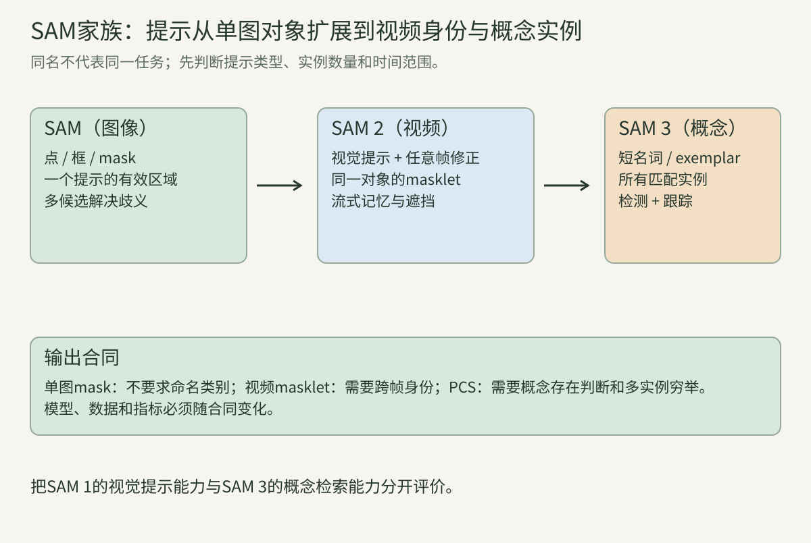
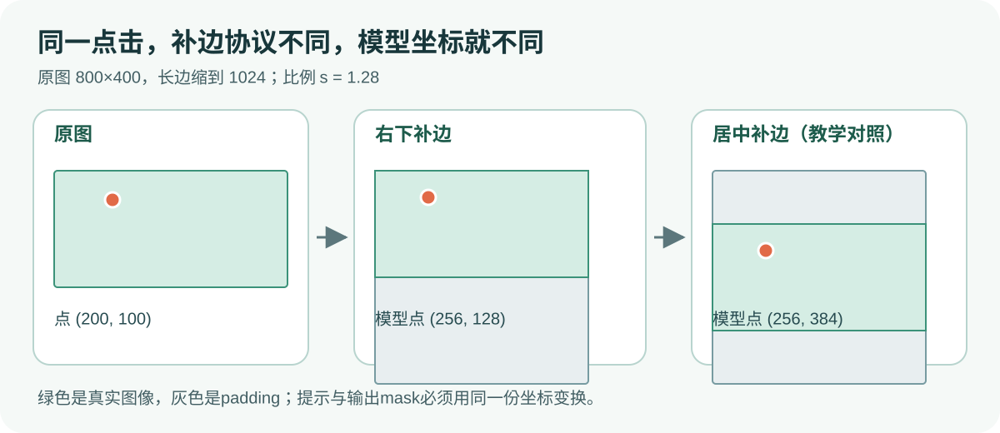
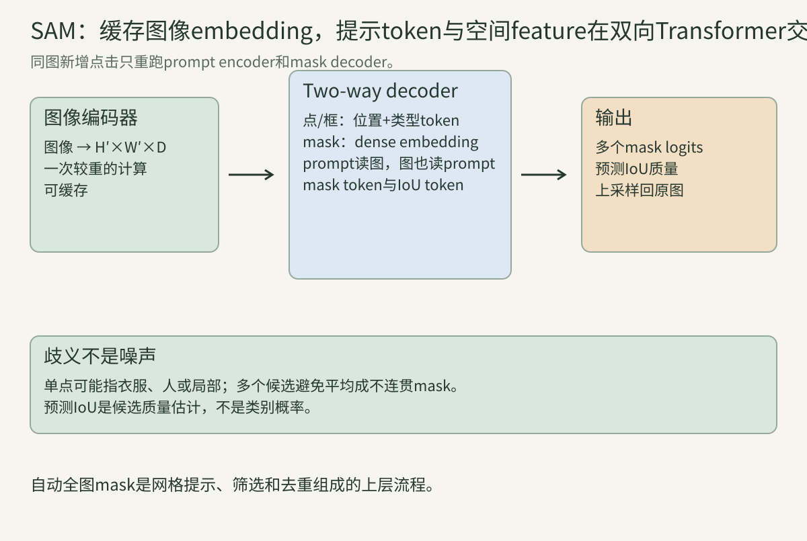
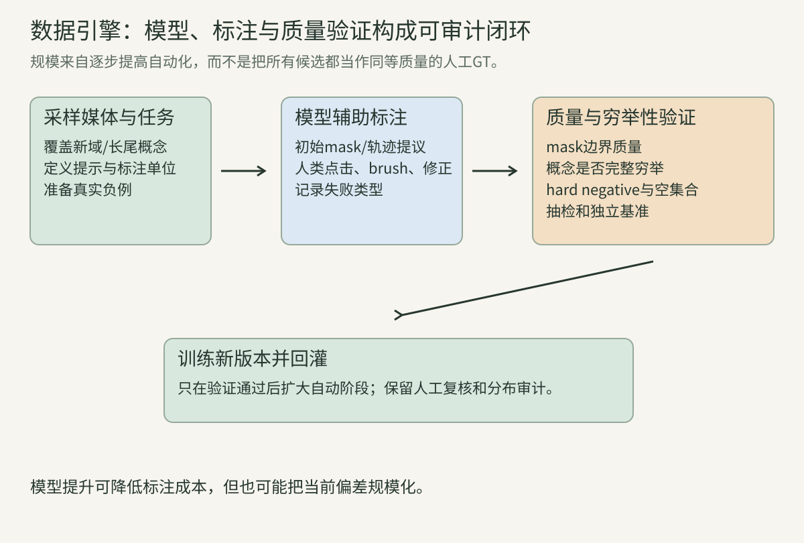
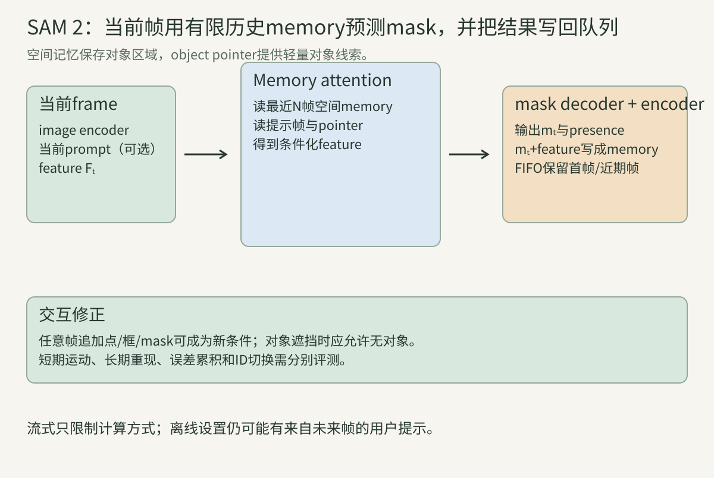
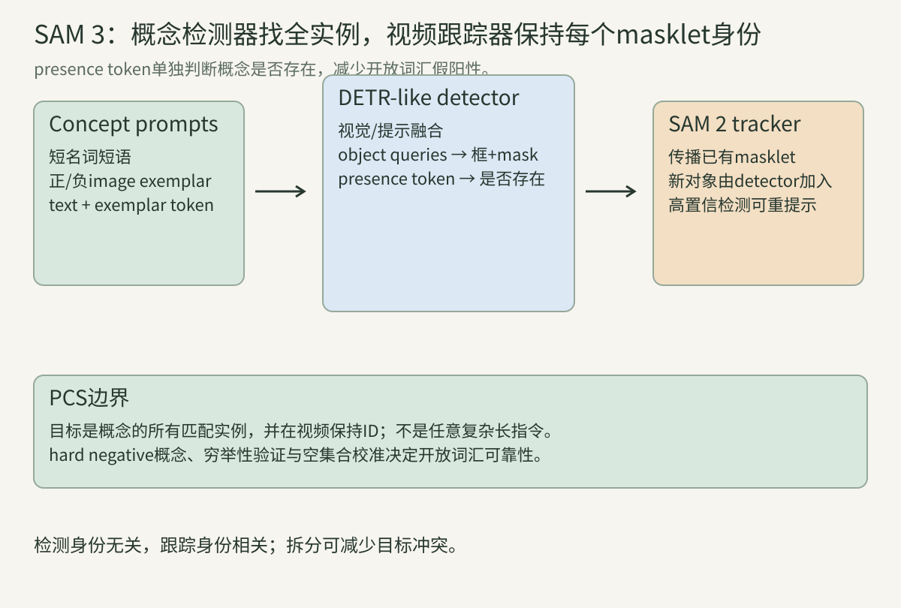

> 学完第23讲，你已知道语义分割给每个像素分类、实例分割给每个对象一张mask。本讲换一个起点：**如果用户已经用鼠标指出想要的东西，模型如何迅速给出其像素边界？** 为回答它，我们先把输入、输出和坐标写清，再沿着SAM、SAM 2、SAM 3的论文逐步增加能力。读者只需会矩阵乘法、softmax、交叉熵和第11讲的注意力；用到更复杂的地方会现场拆开。

## 一、先用一张小图定义问题

### 1. mask究竟是什么

一张高为$H$、宽为$W$的RGB图像可写成$I\in\mathbb R^{H\times W\times3}$。对一个指定对象，二值mask $M\in\{0,1\}^{H\times W}$在属于对象的像素处为1，其余为0。模型通常先输出连续logit $Z\in\mathbb R^{H\times W}$，再通过$s=\sigma(Z)$得到前景概率，最后用阈值二值化。**logit、概率、二值mask是三个不同阶段**：训练损失常用前两者，交并比（IoU）用二值集合。

若$H=W=4$，一个杯子的教学mask可以是

$$M=\begin{bmatrix}0&1&1&0\\0&1&1&0\\0&1&1&0\\0&0&1&0\end{bmatrix}.$$

它含7个前景像素。若预测有6个像素与它重合，另有2个误检，便是$|P\cap G|=6$、$|P\cup G|=7+8-6=9$、$IoU=6/9$。这里$P,G$是像素集合，绝不能把$6/8$误称IoU。

### 2. 提示把“想分什么”带进模型

传统语义分割的输入通常只有图像，输出固定类别表中的每像素类别。SAM的提示式分割输入是$(I,p)$：$p$可以是正点、负点、框或已有mask；输出是与提示相容的区域$M$。一点落在狗身上并未告诉模型“狗”这个类别，框也未告诉它“找所有狗”。提示给的是位置或区域约束。原论文还讨论了利用外部CLIP文本编码器进行文本提示的探索性实验，但本文讲解的SAM基本交互与公开常用推理接口以点、框和mask为主，不能把这项探索当成SAM 3的PCS能力。

设提示集合$P=\{(x_i,y_i,t_i)\}_{i=1}^n$，$t_i\in\{+,-\}$表示包含或排除。增加负点改变的是所求区域的约束，不是训练一个新类别。给出框$b=(x_1,y_1,x_2,y_2)$时，还需规定它的坐标系和端点是否包含像素边界；不同实现的边界约定可能差一个像素。

### 3. 一个点击为何可能有多个正确答案

点在人衣服上，用户也许想要“袖子”“整件衣服”“整个人”。只要包含该点，三者都可能与提示相容。若训练时强迫网络把这些有歧义的答案平均，它可能画出一块没有语义的中间区域。SAM因此允许一个提示对应多个候选mask，再估计每个候选的质量。歧义是任务定义的一部分，不等于标注人员出错。

### 4. 先分清三种问题的输出单位

| 问题 | 输入提示 | 输出单位 | 必须解决的额外问题 |
| --- | --- | --- | --- |
| SAM图像提示分割 | 一个目标的点、框或mask | 这个目标的候选mask | 单点歧义、边界质量 |
| SAM 2视频提示分割 | 在一帧或多帧指定一个目标 | 同一目标跨帧masklet | 遮挡、重现、身份保持 |
| SAM 3概念分割（PCS） | 短名词短语和/或正负图像示例 | 所有匹配实例的mask；视频还需ID | 概念是否存在、穷举、发现新实例 |

“有图中所有猫吗”和“框里这只猫在哪里”需要不同输出合同。后面每次谈准确率，先回到这张表检查任务是否一致。

### 5. 点击坐标并不会自动跟着图像缩放

若原图尺寸$H\times W$，等比例缩放到长边$L$，比例$s=L/\max(H,W)$。设缩放后四周左上padding为$(p_x,p_y)$，原图点$(x,y)$进入编码器时为

$$x'=sx+p_x,\qquad y'=sy+p_y.$$

框的两个角都应用同一变换。输出mask需要先去padding，再按原尺寸插值；若先阈值化再缩放，与先插值logit再阈值化通常不相同。官方SAM预处理遵循长边缩放和padding协议；上面的居中padding只是通用教学坐标例子，实际调用必须以实现的padding位置为准。

### 6. 提示、预测和真值必须使用同一参照系

想象一张$800\times400$图像被缩成$1024\times512$，并在下方补到$1024\times1024$。原图点$(200,100)$变为$(256,128)$，不是$(256,384)$。若程序按居中padding多加256到纵坐标，点会落在另一个区域。模型仍能输出mask，所以此类错误比程序崩溃更危险。输出返回原图时也要从logit中裁除补边，而不能把补边当作真实图像。

### 7. 两个质量分数回答不同的问题

IoU是有真值时$|P\cap G|/|P\cup G|$。**预测IoU**是网络对自身候选mask质量的估计，推理时不需要真值；它可能失准。SAM 3的**概念存在分数**则回答“这个短语在图中有没有实例”，和候选边界质量不同。不能把预测IoU为0.9读成“90%可能是猫”。

### 8. 本讲的学习路线

接下来按“单图输入 → 图像特征 → 提示编码 → 双向解码 → mask损失与交互训练 → 数据引擎 → 视频记忆 → 概念检测”走。每增加一个组件，都问三件事：它看到了什么张量、它解决上一代的哪个具体失败、还需要怎样评价。下方20个算例集中放在原理后，便于第一遍阅读不断线、第二遍动手核算。

## 二、SAM：一张图和一个提示怎样得到mask

### 9. 图像编码器为何只跑一次

将图像经过MAE预训练的ViT图像编码器得到空间特征$F=E(I)$。同图连续加点时$I$没有变，$F$也不用变。第$t$次交互只需

$$M_t=D\bigl(F,\,P(P_t)\bigr),$$

其中$P(\cdot)$是提示编码器、$D$是轻量mask decoder。如果单次重编码耗时$T_E$，提示解码耗时$T_D$，$k$次点击从每次全算的$k(T_E+T_D)$降到$T_E+kT_D$。这是计算量分解，不保证任意设备的绝对毫秒数。

### 10. ViT的patch网格仍保留二维位置

论文的典型输入长边为1024，ViT patch为$16\times16$，于是图像token网格为$64\times64$。经过neck投影后，常用图像embedding为$64\times64\times256$。第12讲的patch embedding解释了$1024/16=64$；注意这里并没有把整图只压成一个CLS token。输出像素边界需要这些空间位置。若输入使用不同长边、patch或模型版本，具体尺寸也会变。

### 11. 全局注意力和局部注意力是图像侧计算选择

$64^2=4096$个图像token若每层完整自注意力，注意力矩阵是$4096^2\approx1.68\times10^7$个元素/头。SAM的高分辨率ViT在多数层使用窗口注意力，并在少数层使用全局注意力，以降低成本同时交换远处信息。窗口注意力并不意味着mask decoder只能看窗口：图像编码器的全局层、空间特征和后续双向交互共同决定视野。

### 12. 正点和负点各自需要坐标与类型

一个点先得到二维位置编码$\phi(x,y)$，再加可学习类型向量$e_+$或$e_-$：

$$q_i=\phi(x_i,y_i)+e_{t_i}.$$

坐标相同但类型相反时，$\phi$相同、类型向量不同；类型相同但坐标不同则反过来。漏掉任何一项都会让一种本来不同的提示无法区分。论文附录使用随机傅里叶位置编码；初学时先记住它把连续位置映到可与视觉token相加的维度。

### 13. 框是两个有角色的角点

框的左上角和右下角各变成一个稀疏token，除了位置编码，还分别加角点类型embedding。框并不是一个“坐标平均值token”；仅取框中心会丢失宽高。若给同一中心但尺寸不同的框，模型应得到不同约束。框外像素也不是绝对禁止出现的硬mask，预测仍需由图像证据决定。

### 14. 已有mask是稠密提示

纠错时给上一轮低分辨率mask，模型通过卷积把它变为与$F$同空间尺寸、同通道数的稠密提示$P_M$，逐位置融合$F+P_M$。点与框只占几个token，而mask形状含每个位置的信息，因而不能随意压成一个均值向量。没有mask输入时，模型使用可学习的no-mask embedding维持同一输入协议。

### 15. Prompt encoder输出有两条路径

把前面三节放在一起：稀疏token序列$S\in\mathbb R^{n\times C}$装下点与框角；稠密张量$D_M\in\mathbb R^{64\times64\times C}$装下已有mask或“无mask”。解码器还会附加输出token。若一个正点、一个负点和一个框同时存在，稀疏提示至少有4个位置token：2个点加2个框角。这只是提示token数，尚未计IoU与mask输出token。

### 16. Two-way Transformer中的第一方向：提示读图

提示token先相互做self-attention，再以提示为query、图像特征为key/value做cross-attention，随后过MLP。对于提示query $q_i$，注意力权重是

$$\alpha_{ij}=\frac{\exp(q_i^\top k_j/\sqrt d)}{\sum_{j'}\exp(q_i^\top k_{j'}/\sqrt d)},\qquad u_i=\sum_j\alpha_{ij}v_j.$$

$j$遍历图像空间token。正点token因而能读取点击处和周边的颜色、形状及上下文；但$\alpha$是学习所得的软权重，不是把点击坐标当作唯一可看的像素。

### 17. 第二方向：图像也读提示

同一block随后以图像token为query、更新后的提示token为key/value再做cross-attention。这样空间位置得到“本轮用户要什么”的条件信息。只做提示读图，图像embedding仍固定，最终每个像素如何随正负点改变更难表达；双向结构让两类token共同更新。论文mask decoder堆叠两个这样的block，并在最后再做一次token到图像的注意力。

### 18. Mask token像一把动态的像素分类尺

解码后得到若干mask输出token $h_k$。各token经小MLP变为向量$w_k\in\mathbb R^{c}$；上采样后的空间特征为$U\in\mathbb R^{H'\times W'\times c}$。第$k$张低分辨率mask在位置$(u,v)$的logit是

$$Z_{k,u,v}=w_k^\top U_{u,v}.$$

这相当于用当前提示动态产生一个$1\times1$像素分类器。若$U$为$256\times256\times32$、有4个mask token，得到$4\times256\times256$个logit。输出再插值、去padding、还原到原图尺寸。

### 19. IoU token与mask token不做同一份工作

另有IoU token用于预测每个mask的质量分数$\hat q_k$。mask token产生空间logit，IoU token产生候选排序依据；二者在Transformer里交互但输出头不同。无GT的真实交互只能使用$\hat q_k$而无法计算真实IoU；在标注集上应画可靠性曲线，检查$\hat q_k$是否系统性偏高。

### 20. 多候选解决训练目标中的歧义

原SAM对有歧义提示预测3张候选mask。设它们与真值的mask损失为$\ell_1,\ell_2,\ell_3$，训练时仅从最小者回传主mask损失：$\ell_{mask}=\min_k\ell_k$。若损失分别是$(0.8,0.2,0.7)$，本次主要更新第2个候选朝真值移动；其他候选可保留不同解释。推理时不知道真值，转而参考预测IoU分数。具体单mask/多mask输出选择属于推理接口，不可把“三候选”说成每个物体必然有三层。

### 21. Focal与Dice怎样互补

对像素$u$的真值$y_u\in\{0,1\}$和模型前景概率$p_u$，二元交叉熵是$-y_u\log p_u-(1-y_u)\log(1-p_u)$。Focal loss给容易像素乘较小权重，使大量简单背景不盖过难边界。Soft Dice可写为

$$D=\frac{2\sum_u p_uy_u+\epsilon}{\sum_up_u+\sum_uy_u+\epsilon},\qquad L_{Dice}=1-D.$$

Focal看逐像素难度，Dice看整个前景集合的重叠；SAM联合使用它们。这里是教学版公式；论文/代码的采样、权重和稳定项要据版本核对，不能由公式推断具体训练超参。

### 22. IoU预测头需要有真值监督

训练时先把某个候选二值化，和标注mask计算真实IoU $q_k$，再令预测$\hat q_k$接近$q_k$。推理时没有标注，只能使用$\hat q_k$。如果在推理程序里误把“预测IoU”写成GT IoU，就是泄漏答案；如果把$\hat q_k$当作概率阈值，还会混淆“mask质量”和“对象存在”。

### 23. 多轮交互如何模拟

只用中心正点训练，模型可能在第二、三次纠错时不知如何响应。SAM训练为每张GT mask模拟多轮提示：可以先给点或框，观察模型漏掉的区域与多出的区域，再从错误区域采正点或负点；论文使用11轮提示采样。这样训练的是“收到新信息后收敛”的能力。相同点击数的评价也要说明点击由随机、中心还是误差驱动策略产生。

### 24. 单点IoU为什么不能完全描述质量

一点在衣服上，GT若是整个人，模型输出衣服即使边界漂亮，IoU也可能低；若GT是衣服则可能高。因此单点mask任务的标注语义决定评价。可以报告不同提示强度下的IoU、多个候选的oracle上界、人工评分或交互次数，但oracle选择使用真值，不能当作真实推理性能。

### 25. 自动生成全图mask是一个额外流程

想把一张图切成许多可用区域，可以在网格点反复询问SAM，得到跨提示候选；然后按预测质量、阈值稳定性、尺寸和重复程度过滤。若两个网格点都落在同一张桌子上，即使每个调用都正确，也会得到两张重复桌子mask。需做box/mask NMS或其他去重。**单提示多候选**与**跨提示去重**是两层问题。

## 三、SA-1B：数据是如何被造出来的

### 26. 为什么不能直接从网络抓到十亿张真值mask

图像很多，像素级标注昂贵，且“物体或物体部件”可以被人选择不同粒度。SAM论文把模型和标注过程组成数据引擎：模型提议，人类确认或修正，再训练新版模型。这使标注生产量随模型改进上升，但也使候选质量筛选成为数据定义的一部分。

### 27. 三阶段分别让人和模型做什么

第一阶段是人工辅助：标注者使用交互模型制作mask。第二阶段是半自动：模型先生成较可信的区域，人再补漏和修正。第三阶段是全自动：规则网格采点、多候选、质量与重复筛选，得到大规模mask。每一步都改变了标注者看到的候选分布，因此这三个阶段的数据不能简单视为同一来源的随机样本。

### 28. SA-1B的统计单位要读准确

SA-1B约有1100万图像和11亿mask。一张图可贡献许多mask，mask也可能是“物体部件”而非一张图的完整语义标签。因此$1.1\times10^9/(1.1\times10^7)\approx100$只能说明平均每图mask数量量级，不能推断每张图都有100种独立物体类别。数据集中绝大部分mask来自自动阶段，论文也做了人工质量抽检。

### 29. 预测IoU与稳定性过滤的是不同错误

预测IoU由模型估计当前mask质量；稳定性则把相同logit用两个接近阈值变成$M_{\tau-\delta}$和$M_{\tau+\delta}$，比较

$$S=\frac{|M_{\tau-\delta}\cap M_{\tau+\delta}|}{|M_{\tau-\delta}\cup M_{\tau+\delta}|}.$$

若$S$低，说明少量阈值移动就改动大面积边界。$S$高只表示阈值附近自洽，仍可能把桌子误当杯子。NMS又是第三件事：筛掉跨提示的重复区域。

### 30. 过滤也会改变学习到的世界

假设清楚边界有80例、透明薄物有20例。过滤留下76例清楚边界与4例薄物，保留集困难样本比例从20%降到$4/80=5\%$。模型在这些数据上训练可能更会切清楚物体，却更少看到正需要改进的失败类。论文中的规模和质量实验应结合分布、人工抽检、隐私处理、地域覆盖与下游域验证解读。

### 31. 数据引擎不是无条件自我改进

令当前模型生成候选集合$C_t$，筛选器取$A_t\subset C_t$，新模型在$A_t$上训练。若某类目标几乎不进$C_t$，单靠筛选与重训无法凭空补足它；需要人工发现漏检域，新增采样或标注策略。SAM家族后续的SA-V和SA-Co也都有模型参与采标和质量验证，必须分别检查对象、视频身份和概念穷举性。

### 32. 部署SAM前该做怎样的目标域检查

至少定义目标对象的边界规则、提示方式、输出用途和错误代价；在目标域按小物体、细长物、透明物、遮挡、模糊等分层抽样，测每层真实IoU、交互修正次数和失败例。医学影像、遥感等场景不能由SA-1B总体规模直接推出可靠性。这里是模型评价设计，不是替代专业审核。

### 33. SAM的基础模型地位来自可迁移接口

它把“一个视觉提示→一个有效mask”作为统一接口，并用大规模数据覆盖许多视觉区域。这使标注、抠图和其他模型的候选区域生成容易复用。基础模型不是说它会命名所有类别、自动跟踪视频、理解复杂自然语言或保证任何专业领域精度。下一代各自补的是这些不同空缺。

### 34. 读原论文时将声明、机制和测量分开

“零样本迁移”是论文在指定数据和提示规则下测得的能力；“双向Transformer”是架构机制；“约50ms轻量解码”是论文环境中的测量。一个机制不自动证明另一个数据集结果。我们下面用相同方法读SAM 2和SAM 3：先描述训练/推理合同，再描述论文证据可支持的边界。

## 四、SAM 2：一张图变成一段视频

### 35. 视频需要在时间轴上定义同一个目标

视频有$T$帧$I_1,\ldots,I_T$。用户在某帧给目标提示后，所求的是$\mathcal M=(M_1,\ldots,M_T)$，论文称masklet。对一个对象，每帧$M_t$可以是有效区域，也可因完全遮挡而为空。对多个对象，还要有稳定ID：第12帧的“对象1”必须仍指第1帧的同一实体。每帧独立跑SAM再按mask交叠拼接，在交叉、遮挡或视角变化时会断开。

### 36. 最简单的传播为何会漂移

若直接把上一帧预测$\hat M_{t-1}$作为下一帧提示，误检像素会被带入下一轮。假设每步独立有$0.98$的机会保持正确，经过50步全程正确概率的教学模型是$0.98^{50}\approx0.364$。真实误差相关，不会严格按这个数下降；算例只说明小的逐帧错误可累积，必须保留更可靠的参考与交互修正。

### 37. 流式架构每帧依次做四件事

给定当前帧，先由Hiera图像编码器得到视觉特征$F_t$；然后memory attention读取该对象先前的空间记忆与object pointers，得到条件化特征$\tilde F_t$；接着提示编码器和mask decoder输出$\hat M_t$及对象存在分数；最后memory encoder把当前预测与未条件化的视觉特征融合成未来可读的记忆。处理完一帧再处理下一帧，不要求把整个视频所有patch一起塞入全局Transformer。

### 38. Hiera的分层特征服务于效率与边界

SAM 2的图像骨干为Hiera，产生多尺度表示。主路径为memory attention和decoder提供语义特征，较高分辨率特征还通过skip连接帮助decoder恢复边界。skip不等于直接复制原像素：它提供定位信息，仍需与目标条件共同决定哪些边缘属于被跟踪对象。

### 39. Memory attention并非把上一帧图像粘到当前帧

当前帧feature作query，历史空间记忆及object pointer作key/value。一个简化的单头表达式是

$$\tilde F_t=\operatorname{softmax}\left(\frac{Q(F_t)K(\mathcal B_t)^\top}{\sqrt d}\right)V(\mathcal B_t),$$

其中$\mathcal B_t$是当前对象的记忆库。论文模块还含self-attention、残差、MLP和多个block；上式只展示“当前查历史”的核心。前景像素与周边上下文共同进入记忆，注意力通过学习寻找对应，不要求光流坐标严格相同。

### 40. Memory encoder保存了什么

当前mask先下采样，再与当前帧**未经目标记忆条件化**的图像embedding逐位置相加，经过轻量卷积得到空间memory。直觉上，图像feature说“这里长什么样”，mask说“其中哪一块是此目标”。若只存二值mask，下一帧发生位移就难以从外观寻找；若只存图像feature，又不知道要跟哪一部分。

### 41. 两类队列各有角色

Memory bank保留最多$N$个近期未提示帧，以及最多$M$个用户提示帧的空间记忆；单首帧提示的VOS设置通常一直保留首帧，同时滚动近期帧。近期帧支持运动和外观变化，提示帧是较可靠的身份锚点。FIFO限制随$T$增长的显存，但如果长时间遮挡，近期队列可能充满无效或受污染的预测。

### 42. Object pointer补充对象级线索

除空间memory外，SAM 2从mask decoder输出token得到object pointer向量，供后续memory attention读取。空间memory保留哪里像目标，pointer浓缩对象级信息。它是连续学习表示，并非可验证的永久数据库ID；两只相似狗交错时仍可能切换身份。每个对象有自己的提示与记忆状态，图像编码可以共享。

### 43. 对象不存在也是合法输出

球被桌子完全挡住时，硬输出一张非空mask会在背景制造假球。SAM 2增加对象存在判断；低存在分数可以让该帧无有效mask。若二值mask恰好因阈值太高而面积0，也不必然表示真的遮挡；需同时检查存在分数、原始logit与标注协议。重现时的正确目标是恢复同一对象，而不是创建一个外观相似的新身份。

### 44. 有歧义时视频只传播选定候选

与SAM相似，SAM 2在当前帧可预测多个兼容mask及质量分数；若没有进一步提示，选择预测质量最高的候选向后传播。错误候选一旦写入memory会影响后续帧，所以“第一帧单点”与“第一帧GT mask”的难度差别很大。评测必须报初始提示类型、每个对象的修正次数、提示落在哪些帧。

### 45. 交互纠错改变记忆，而不只是当前一张图

若第30帧漂到错误对象，用户给第30帧补正点、负点或mask，模型修正当前结果，把它作为新的提示帧记忆，再传播到其他需要更新的帧。对于离线编辑，可以向两个时间方向传播；在线直播只能使用当时已知的信息。训练时论文联合图像与视频，抽取短序列并模拟初始提示和根据误差给出的纠错提示，使模型学会接收这类修正。

### 46. SA-V怎样收集视频标注

SA-V以masklet为单位，通过人工逐帧、模型辅助、交互修正与质量验证逐步收集。论文给出的最终数据量约为50.9K视频、35.5M mask；这不是每帧都由人工独立从零描绘。它特别包含小目标、部件、遮挡和重现等时序难例。数据引擎缩短标注时间，也会影响哪些失败能进入训练集。

### 47. 视频评价要把区域、边界和交互分开

视频物体分割常以区域J（逐帧IoU）和边界F（边界precision/recall的F度量）总结，再报$J\&F=(J+F)/2$。同一个模型可能区域大体正确却边界粗，或边界局部精细却跟错ID。提示次数越多通常越易修好，所以要画性能随交互次数的曲线，而不是只给最终一分。空帧如何计、对象ID如何计，也要按基准协议说明。

### 48. 帧率必须说明计算边界

完整延迟包含视频解码、图像编码、每对象的memory attention和mask decoder、memory写入，以及可能的交互重传播。一个对象的编码可与多对象共享，后续对象状态却可能重复计算。报告FPS时应锁定分辨率、对象数、硬件、精度、记忆容量和是否计重传播。把单对象纯模型FPS直接当作多对象编辑器体验会高估实际吞吐。

## 五、SAM 3：从指定一只到寻找所有同类

### 49. PCS的输出集合是什么

Promptable Concept Segmentation（PCS）给一个概念提示$c$以及图像或短视频，输出所有匹配实例的mask集合$\{M_i\}_{i=1}^{K}$；若是视频，还要让每个实例的身份在帧间连续。$K$未知，可能为0。这比SAM的一次视觉提示多出**概念识别、所有实例发现、空集合判断**三项要求。论文还定义语义区域输出，但实例mask和跨帧ID是理解核心。

### 50. 文本提示的边界要写在输入合同里

SAM 3使用短名词短语，例如“yellow school bus”；可有简单修饰语。它并不因此承诺正确执行“找出去年在这条街上经过的、看起来最贵的车”之类含历史、关系、主观判断的长指令。短语在图中是否存在可以验证；复杂指令往往须由上层语言系统先拆成视觉概念和关系，再分别评估。

### 51. 正负示例与点、框提示作用不同

SAM 3可给图像示例：框住某实例并标为正例，意思是“寻找与它同概念的所有对象”；负例表示类似但不属于目标的区域。SAM或SAM 2的一只狗框通常指定这一只狗；SAM 3的正示例可能导致全图所有狗被检出。示例编码结合框位置、正负标签和ROI视觉特征；文本与示例的token可以一起条件化模型。

### 52. 为什么需要检测器来穷举

图中有5辆黄色校车，点击其中1辆只能给出它的边界，无法证明其余4辆已被寻找。SAM 3的检测器采用DETR式可学习object queries并行预测候选框、匹配概念的分数和mask；这把“找到所有实例”变成集合预测问题。第22讲的query匹配、空查询和去重知识在此复用，区别是类别条件来自文本或示例而非固定类别表。

### 53. 共享Perception Encoder如何融合图文

图像与文本先经对齐的Perception Encoder；示例框可由exemplar encoder变成提示token。Fusion encoder使图像feature读提示token，DETR式decoder让object queries读已经受概念条件化的图像feature。每个query预测“是否匹配提示”、box与mask；mask head借鉴MaskFormer，另有二值语义分割head。这里的“共享”说的是检测器与跟踪器使用共同视觉骨干，不等于它们的任务头或记忆状态完全相同。

### 54. 为什么另设全局presence token

在开放词汇中，某个query需要定位局部区域；判断“这个短名词短语在整图是否存在”却可能需要全局上下文。SAM 3因此令全局presence token估计$p(c\text{存在}\mid I)$，局部query估计$p(q_i\text{匹配}\mid c\text{存在},I)$。这里$c$指短名词短语；图像示例提示还有自己的编码路径。最终候选分数取两者乘积：

$$s_i=p_{presence}\,p_{i\mid presence}.$$

这个乘积可从概率乘法法则理解为联合事件的分解，实际分数是否完全校准仍需测量。若$p_{presence}=0.1$、局部query为0.9，最终是0.09；单看局部0.9会在概念不存在时造成假阳性。

### 55. Presence不能代替定位

若$p_{presence}=0.99$，只说明短语很可能在图中，并不知道有几只、在哪里。10个query可有不同条件分数；还要经过mask/box预测与实例去重。反过来，某query画出很像车的区域，也不足以说明用户要的“黄色校车”存在。全局识别和局部定位都要成立。

### 56. 检测器和tracker分工的原因

视频中，检测器在每帧寻找新出现的概念实例，身份无关；tracker传播已有masklet，身份相关。记上一帧已有masklet为$\mathcal M_{t-1}$，当前检测集合为$\mathcal O_t$，可概括成

$$\hat{\mathcal M}_t=\operatorname{propagate}(\mathcal M_{t-1}),\quad\mathcal O_t=\operatorname{detect}(I_t,c),\quad\mathcal M_t=\operatorname{match\_and\_update}(\hat{\mathcal M}_t,\mathcal O_t).$$

若检测与已有轨迹匹配，更新原ID；若是未匹配新检测，可创建新masklet。匹配错误会引起重复轨迹或ID切换，所以仍需时序验证。

### 57. Tracker沿用SAM 2式记忆但增加发现能力

跟踪器为每个实例保留条件帧和近期空间记忆，逐帧传播mask。只有tracker时，新进入视野的同概念对象可能没有轨迹；只有detector时，两只同概念对象交叉后难保持ID。SAM 3共享视觉骨干以减少重复编码，并把检测与跟踪的目标分开训练。论文在检测器训练后冻结视觉骨干训练tracker，不能简单把两模块描述成完全联合从零训练。

### 58. 高置信检测可修正漂移，也可带来误纠正

某轨迹在遮挡后漂到相邻物体，检测器新输出可重新提示tracker，并替换不可靠的当前预测写入记忆。若检测器本身误检，过于频繁的re-prompt反而会污染轨迹。论文使用高置信检测、匹配和时序证据控制这一过程。报告收益时需同时看遮挡恢复、误注入率、重复实例与ID稳定性。

### 59. SA-Co的数据目标比SA-1B多一层“完整性”

SAM 3的数据引擎要为大量名词短语收集正例、困难负例和实例穷举标注。论文提到约400万个独特概念标签，另建包含穷举mask的SA-Co基准。若图中确有五辆符合短语的车，却只标出两辆，模型预测其余三辆时会被误判为假阳性；若只收明显不存在的随机负短语，模型容易学会无意义的捷径。概念覆盖、困难负例和标注完整性是PCS成立的条件。

### 60. 三代能力用同一个样例回看

给一段视频，其中先有一只灰猫，后来又进来两只：SAM能在某帧给定点/框后切出一只猫；SAM 2能把指定的灰猫跨帧传播并修正遮挡；SAM 3给“cat”后还要发现后来的两只、分割三只并保持各自ID。若给“grey cat”，颜色条件和同色干扰又增加概念识别难度。把三者输出放在同一张图中，恰好能看到新增能力分别在哪一步进入。

## 六、20个从数字走到结论的算例

### 算例A：一张mask的IoU与Dice

GT有7个前景像素，预测有8个，重合6个。并集是$7+8-6=9$，所以$IoU=6/9\approx0.6667$；$Dice=2\times6/(7+8)=12/15=0.8$。两个指标不相等，但对同一对二值集合满足$Dice=2IoU/(1+IoU)$。代入$IoU=2/3$得到$4/5$。这是集合上的硬Dice；训练的soft Dice以概率代替预测集合，数值未必相同。

### 算例B：长边缩放、padding与点坐标往返

原图宽800、高400；长边到1024的比例为$1.28$。若**教学中采用居中padding**，新内容高512，上下各补256。点$(200,100)$到$(256,384)$；反算$(256/1.28,(384-256)/1.28)=(200,100)$。而官方SAM常用右/下padding，此时同一点是$(256,128)$。这两套坐标不能混用，模型调用前应以实际预处理代码为准。

### 算例C：框角与提示token数

一个正点$(10,20)$、负点$(12,20)$、框$(5,5,30,40)$，稀疏提示至少有$1+1+2=4$个位置token；它们各有类型，两个框角并非同一类型。设一个IoU token、4个mask token，送入two-way decoder的提示/输出token总数为9。真实接口在padding点等情形可能另加token，算例只核对基本结构。

### 算例D：为什么要缓存图像特征

教学假设图像编码耗时100ms、一次提示解码5ms、连续点5次。每次重算为$5(100+5)=525$ms；缓存后为$100+5\times5=125$ms，省400ms。这里是人为数字，用于检查成本公式；真实论文/设备延迟不可由此推断。改换图像或编码分辨率后缓存失效。

### 算例E：图像token的注意力尺寸

$1024\times1024$图像按$16\times16$patch分为$64^2=4096$个token。完整空间注意力一头有$4096^2=16,777,216$个相似度。若窗口是$16\times16$ token，每窗256 token，$16$个窗总相似度为$16\times256^2=1,048,576$，约为前者$1/16$。这是注意力矩阵元素数，未计MLP、投影和全局层成本。

### 算例F：一个mask token如何产生四个像素logit

取教学特征$U_{1,1}=(1,0)$、$U_{1,2}=(0,1)$、$U_{2,1}=(1,1)$、$U_{2,2}=(-1,1)$，mask token的动态向量$w=(2,-1)$。逐位置点积得到$Z=\begin{bmatrix}2&-1\\1&-3\end{bmatrix}$。以0为logit阈值，二值mask为$\begin{bmatrix}1&0\\1&0\end{bmatrix}$。这里的二维通道便于手算，SAM实际通道更高。

### 算例G：最小损失训练与推理排序

三个候选对GT的教学损失为$(0.7,0.2,0.5)$，训练主mask梯度选择第2个；对应预测IoU却为$(0.91,0.75,0.60)$，推理无GT会选第1个。两者不矛盾：一个使用真实训练监督，另一个使用学习出的质量估计。若长期差很大，说明IoU head需要校准或输入分布已变。

### 算例H：Focal与Dice关注不同错误

4个像素GT为$(1,1,0,0)$、预测概率为$(0.9,0.4,0.3,0.1)$。忽略$\epsilon$，soft Dice分子$2(0.9+0.4)=2.6$，分母$0.9+0.4+0.3+0.1+2=3.7$，故Dice约0.7027。第2像素是漏检风险，第3像素是误检风险；逐像素focal loss会根据置信度给它们不同权重，而Dice先从整体重叠看待这四个数。

### 算例I：多轮纠错该点哪里

GT为$\{a,b,c,d\}$，当前预测$\{a,b,e\}$。漏检$G\setminus P=\{c,d\}$，误检$P\setminus G=\{e\}$。在$c$给正点或在$e$给负点都传达了新信息；在$a$重复正点通常较弱。训练模拟可从错误区域采样，用户真实操作也应记录点击策略，才可比较“平均几次点到目标IoU”。

### 算例J：稳定性高也可能完全选错目标

两个阈值下某mask分别为像素集$A=\{1,2,3,4\}$和$B=\{1,2,3,4,5\}$，稳定性IoU为$4/5=0.8$。若用户目标GT为$\{8,9\}$，两个mask与GT的真实IoU都为0。稳定性只检查阈值扰动，不能代替语义和真值评价。

### 算例K：数据筛选的选择偏差

100个候选里20个是细长困难目标、80个普通目标。若质量筛选保留4个困难目标与76个普通目标，困难比例从20%降到$4/(4+76)=5\%$。保留率普通目标$76/80=95\%$，困难目标$4/20=20\%$。总体质量上升可能伴随关键场景覆盖下降；下一轮应针对困难目标采样和人工复核。

### 算例L：短期FIFO与长期锚点

教学记忆容量$N=3$，首帧$F_1$为固定锚，处理到第8帧后近期队列为$F_6,F_7,F_8$。进入第9帧时成为$F_7,F_8,F_9$，总可读参考是$F_1,F_7,F_8,F_9$。若第7—9帧都遮挡，近期参考的信息很差，只能更多依赖首帧；首帧视角与第10帧差异太大时仍可能恢复失败。

### 算例M：一次memory attention的权重

取当前query对“首帧清晰对象”和“最近帧受遮挡对象”的缩放后相似度为$(\ln3,0)$，softmax得到权重$(3/4,1/4)$。两帧value为$(1,0)$与$(0,2)$时，读出的向量是$(0.75,0.5)$。这是attention加权平均的简化教学例子；真实模块还包括多头、位置、残差和MLP，权重高也未必代表那帧mask是正确的。

### 算例N：边界与区域指标可能意见不同

对$10\times10$的大矩形，预测整体平移1像素，区域IoU可能仍高；但若边界容差小，左右边界许多点不匹配，边界F可能明显下降。给定教学分数$J=0.8,F=0.6$，汇总$J\&F=(0.8+0.6)/2=0.7$。评价时还要看对象ID、空帧和交互次数，否则这个0.7并不能描述是否跟丢。

### 算例O：一次对象消失与重现

球在1—10帧可见、11—15帧完全遮挡、16帧重现。正确masklet在11—15帧允许空mask，第16帧重新给球区域，并延续相同ID。若模型在12帧复制第10帧位置，就制造假前景；若第16帧把球标为新ID，区域IoU可能仍高但跟踪目标没完成。

### 算例P：多对象共享图像编码但不共享身份状态

一帧图像编码成本教学取100单位，每对象记忆与解码成本20单位。三对象若各自重新编码，成本$3(100+20)=360$；共享图像编码、分别维护三套对象状态，成本$100+3\times20=160$。这解释共享骨干的动机，也说明对象数增加时帧率仍会下降。数字仅为成本模型。

### 算例Q：概念存在与定位分数相乘

画面没有“yellow school bus”，全局presence为0.05。一个局部query误把普通黄车判为匹配，条件分数0.8；最终$0.05\times0.8=0.04$。如果只有局部分数，0.8会显得很肯定。相乘可压低此误检，但若presence误判为0，也会压低真正实例，需在正负样本上评价召回与精确率。

### 算例R：示例框与视觉定位框的不同含义

图中有三只狗$D_1,D_2,D_3$。给SAM一个包住$D_1$的框，目标是$D_1$的mask；给SAM 3一个标记为正的$D_1$示例框，目标集合可能是$\{D_1,D_2,D_3\}$。再用标记为负的示例框住类似但非狗的玩偶，可帮助概念边界。对SAM 3来说，这不是简单地把同一框送进SAM解码器三次。

### 算例S：检测与跟踪的两种冲突

第1帧有猫A，第5帧猫B进入。只传播已有轨迹会漏B；每帧独立检测可找B，但A、B交叉后可能交换ID。SAM 3在第5帧把未匹配检测创建新masklet，再用跟踪器保留A、B历史。若两个检测都与同一轨迹高度重叠，仍需匹配规则与时序证据，不能仅凭一帧IoU保证身份。

### 算例T：困难负例怎样检验概念理解

目标短语“黄色校车”。图像A有黄色校车，B有黄色普通巴士，C有蓝色校车，D只有狗。D是容易负例；B、C分别考验“校车”和“黄色”条件。若数据只含A与D，模型靠“有任何巴士”或颜色捷径也可能得高分。评价应同时包含B、C、空集合正确率和所有实例是否穷举。

## 七、四段标准库程序：把关键推导逐项核对

### 程序一：核对两种padding、点与框的往返

这个程序特意同时算“居中补边”和“右/下补边”。变量`mode`是调用协议的一部分；相同原图点在两个协议下得到不同模型坐标，但分别反算都应回到原点。

~~~python
def protocol(w, h, side, mode):
    scale = side / max(w, h)
    scaled_w, scaled_h = scale * w, scale * h
    if mode == 'center':
        return scale, (side - scaled_w) / 2, (side - scaled_h) / 2
    if mode == 'right-bottom':
        return scale, 0.0, 0.0
    raise ValueError(mode)

def forward(point, trans):
    x, y = point
    s, px, py = trans
    return s*x + px, s*y + py

def inverse(point, trans):
    x, y = point
    s, px, py = trans
    return (x-px)/s, (y-py)/s

for mode, expected in [('center', (256.0, 384.0)),
                       ('right-bottom', (256.0, 128.0))]:
    trans = protocol(800, 400, 1024, mode)
    point = forward((200, 100), trans)
    box = [forward(p, trans) for p in [(100, 50), (500, 300)]]
    assert point == expected
    assert inverse(point, trans) == (200.0, 100.0)
    assert [inverse(p, trans) for p in box] == [(100.0, 50.0), (500.0, 300.0)]
    print(mode, 'point=', point, 'box=', box)
~~~

### 程序二：复算IoU、Dice、动态mask头与候选选择

先从集合算真实指标，再手动执行$w^\top U_{u,v}$。最后故意让“训练最小损失候选”和“推理预测质量最高候选”不同，防止把两种选择混为一谈。

~~~python
def iou(a, b):
    union = a | b
    return len(a & b) / len(union) if union else 1.0

gt = {0, 1, 2, 3, 4, 5, 6}
pred = {0, 1, 2, 3, 4, 5, 7, 8}
hard_dice = 2 * len(gt & pred) / (len(gt) + len(pred))
assert abs(iou(gt, pred) - 2/3) < 1e-12
assert abs(hard_dice - 0.8) < 1e-12

features = [[(1, 0), (0, 1)], [(1, 1), (-1, 1)]]
w = (2, -1)
logits = [[sum(a*b for a, b in zip(pixel, w)) for pixel in row]
          for row in features]
mask = [[int(z > 0) for z in row] for row in logits]
assert logits == [[2, -1], [1, -3]]
assert mask == [[1, 0], [1, 0]]

train_losses = [0.7, 0.2, 0.5]
predicted_ious = [0.91, 0.75, 0.60]
training_choice = min(range(3), key=lambda i: train_losses[i])
inference_choice = max(range(3), key=lambda i: predicted_ious[i])
assert (training_choice, inference_choice) == (1, 0)
print('IoU=', iou(gt, pred), 'Dice=', hard_dice,
      'logits=', logits, 'choices=', (training_choice, inference_choice))
~~~

### 程序三：有限记忆、首帧锚点与一次注意力读取

队列展示第8帧后的可读状态；两条记忆value的加权平均核对算例M。真实SAM 2还有多头、残差与卷积记忆编码，本程序只验证记忆容量及最核心的加权读取。

~~~python
from collections import deque
from math import exp, log

first = 'frame1-clean-object'
recent = deque(maxlen=3)
for t in range(2, 9):
    recent.append(f'frame{t}-prediction')
memory = [first] + list(recent)
assert memory == ['frame1-clean-object', 'frame6-prediction',
                  'frame7-prediction', 'frame8-prediction']

scores = [log(3), 0.0]
weights = [exp(x)/sum(exp(s) for s in scores) for x in scores]
values = [(1.0, 0.0), (0.0, 2.0)]
read = tuple(sum(weights[j]*values[j][i] for j in range(2)) for i in range(2))
assert all(abs(a-b) < 1e-12 for a, b in zip(weights, (0.75, 0.25)))
assert all(abs(a-b) < 1e-12 for a, b in zip(read, (0.75, 0.5)))
print('memory=', memory, 'attention=', weights, 'read=', read)
~~~

### 程序四：概念存在分数、实例筛选与简化轨迹匹配

先执行论文的presence乘以局部query分数，再用教学版IoU贪心关联两个实例。匹配规则仅为演示“检测新对象、延续旧ID”，复杂交叉场景需要更严谨的关联与时序验证。

~~~python
def keep(presence, object_scores, threshold=0.4):
    return [i for i, s in enumerate(object_scores) if presence * s >= threshold]

assert keep(0.2, [0.95, 0.8]) == []       # 概念可能不存在
assert keep(0.9, [0.8, 0.3, 0.6]) == [0, 2]

def overlap(a, b):
    return len(a & b) / len(a | b) if a | b else 1.0

tracks = {'A': {0, 1, 4, 5}}
detections = [{1, 2, 5, 6}, {10, 11, 14, 15}]
remaining = []
for det in detections:
    if overlap(tracks['A'], det) >= 0.3:
        tracks['A'] = det
    else:
        remaining.append(det)
for i, det in enumerate(remaining, start=1):
    tracks[f'new{i}'] = det
assert tracks == {'A': {1, 2, 5, 6}, 'new1': {10, 11, 14, 15}}
print('absent=', keep(0.2, [0.95, 0.8]), 'tracks=', tracks)
~~~

## 八、练习与详解

### 练习1：GT有9个像素、预测有8个，重合6个，IoU与Dice分别是多少？
**解析：** 并集是$9+8-6=11$，所以$IoU=6/11\approx0.5455$；$Dice=2\times6/(9+8)=12/17\approx0.7059$。若误把6/8当IoU，分母只算预测面积，漏掉GT独有的3个像素。

### 练习2：为什么正点落在袖子上时，“袖子”和“整个人”都可能是有效mask？
**解析：** 正点只约束该像素属于目标，没有规定目标边界或语义粒度。袖子与整个人都包含该点。多候选允许不同解释共存；增加负点或框能缩小歧义。若只用某一个GT IoU评分，另一个合理解释仍可能被打低分。

### 练习3：宽600高300的图长边缩到900，右下补边。点(200,100)变成什么坐标？
**解析：** 比例$s=900/600=1.5$，右下补边意味着左上偏移$(0,0)$，所以点变为$(300,150)$。缩后真实内容高450，剩余450行补在下方；若错用居中协议会得到$(300,375)$。

### 练习4：编码耗时80ms、每次提示解码8ms，连续交互4次，缓存节省多少？
**解析：** 不缓存为$4(80+8)=352$ms；缓存为$80+4\times8=112$ms，节省240ms。这个模型假设图像和预处理不变；换图或修改编码尺寸要重新编码。

### 练习5：512乘512图像按16乘16的patch切开，有多少图像token和单头全注意力元素？
**解析：** 每轴32个patch，总$32^2=1024$ token；全注意力矩阵有$1024^2=1,048,576$元素。若每个元素4字节，单个前向注意力矩阵约4MiB；这还未含梯度、QKV、MLP或其他层。

### 练习6：一个正点、两个负点、一个框，对应几个基本稀疏位置token？
**解析：** 三个点各1个，框以左上和右下两个角表示，共$3+2=5$个。它们除位置编码外还需正/负点和角点类型。IoU token及mask token是decoder输出查询，不能算作用户提供的5个位置token。

### 练习7：三维像素特征与动态mask向量点积，此位置logit是多少？
题目数据：$U=(2,-1,3)$、$w=(0.5,1,-1)$。
**解析：** 点积为$2\times0.5+(-1)\times1+3\times(-1)=1-1-3=-3$。以0为阈值时该位置为背景。改变提示会改变mask token及$w$，即使图像缓存$U$不变，预测仍可改变。

### 练习8：三候选的训练损失与预测IoU排序不同，训练与推理各选哪个？
题目数据：训练损失$(0.6,0.1,0.4)$，预测IoU $(0.9,0.7,0.8)$。
**解析：** 训练可用GT，主mask损失最小的是第2个候选；推理无GT，预测IoU最高的是第1个。不能用训练损失在测试图像上“挑最优”，那会泄漏标注。

### 练习9：两个像素的soft Dice是多少？
题目数据：GT标签$(1,0)$，预测前景概率$(0.8,0.2)$，忽略平滑项。
**解析：** 分子$2(0.8\times1+0.2\times0)=1.6$，分母$0.8+0.2+1+0=2$，所以Dice为0.8、loss为0.2。这是soft Dice；把概率先阈值化会得到硬mask并可能算出不同值。

### 练习10：两个阈值的mask分别含10、12像素，交集9像素，稳定性是多少？
**解析：** 并集$10+12-9=13$，所以稳定性$9/13\approx0.6923$。它与真实GT无关；两个阈值下都稳定地切错对象时，稳定性仍可能高。

### 练习11：逐帧独立分割每帧都找到一只猫，就完成了视频masklet吗？
**解析：** 没有。假设第1帧找到猫A、第2帧找到猫B，两帧各自mask都可能与某只猫的GT高度重叠，但“同一目标”条件已经断裂。需按ID计算跨帧一致性，并在两猫交叉、完全遮挡与重现时检查是否把旧ID延续给正确实体。Memory attention与pointer提供线索，却不是正确性的证明。

### 练习12：对象被完全遮挡时输出上一帧mask正确吗？
**解析：** 不正确。它制造本帧不存在的像素区域；应允许presence低或无对象输出，并在重现时恢复关联。

### 练习13：固定首帧加容量2的近期FIFO，处理完第5帧后有哪些参考？
**解析：** 若首帧为$F_1$，近期队列依次加入$F_2,F_3,F_4,F_5$，容量2使$F_2,F_3$被淘汰，最终可读$F_1,F_4,F_5$。若$F_4,F_5$都是错误mask，只有首帧仍可靠；若新视角与首帧差很大，恢复也可能困难。

### 练习14：object pointer是否等于永久ID？
**解析：** 不是。它是网络学习的连续向量，没有离散唯一性保证；ID稳定需用交叉、遮挡和重现序列实测。

### 练习15：用户第50帧才在第10帧补点，能否把修正后的第20帧结果作为实时系统原本的输出？
**解析：** 不能。离线编辑器可回到第10帧重传播，产生修正后的第20帧；实时系统运行到第20帧时还不知道第50帧的操作。若要比较，必须记录每帧预测时可用的提示、输出时刻和重传播成本。

### 练习16：区域J为0.76、边界F为0.64，平均分是多少？两种提示协议可直接比吗？
**解析：** 均值是$(0.76+0.64)/2=0.70$。这个数必须配合提示协议解读：GT mask给了完整边界，单点仍有范围歧义；两套协议上的差距不能只归因于视频tracker。

### 练习17：SAM 3的“所有实例”为什么需要检测器？
**解析：** 单实例视觉提示没有遍历整图所有匹配对象的机制。DETR式queries提供并行候选与集合输出，适合概念条件下的多实例定位。

### 练习18：SAM 3是否能可靠理解任意长自然语言？
**解析：** 不能据此假定。论文限定短名词短语及修饰语；关系、主观、因果或多步指令需要额外语言推理和验证系统。

### 练习19：positive exemplar和点击有何根本不同？
**解析：** 点击主要指定一个实例的空间位置；SAM 3 exemplar用ROI视觉特征加正负标签定义概念，可泛化到其他同概念实例。

### 练习20：presence为0.2，两条query的条件分数为0.9和0.4，最终各是多少？
**解析：** 分别是$0.2\times0.9=0.18$和$0.2\times0.4=0.08$。若输出阈值为0.3，两条都被过滤。Presence只提供全局概念证据；若它高而所有query都低，也无法给出有效实例mask。

### 练习21：图中有蓝色校车，没有黄色校车；“黄色校车”是怎样的负例？
**解析：** 这是困难负例，因为名词“校车”匹配，颜色修饰语不匹配。只用“图中没有大象”之类无关负例，模型即使忽略颜色也可能通过；加入本题可直接测试它是否同时满足名词与修饰语。

### 练习22：检测器和tracker共享backbone是否意味着同一任务？
**解析：** 不意味着。共享降低重复图像编码，但detector需概念识别与新实例发现，tracker需身份保持与时序边界传播，head和训练目标不同。

### 练习23：周期性re-prompt为何可能变差？
**解析：** 低质量detector mask会覆盖正确tracker状态；阈值太低或频率太高会注入噪声。需测量遮挡恢复收益与误纠正率。

### 练习24：把SAM 3输出送入MLLM就能保证复杂指令正确吗？
**解析：** 不保证。MLLM可能选错概念或忽略关系，SAM 3也可能漏检/误分。端到端评估需分别检查语言分解、概念检测、mask和最终回答。

### 练习25：100张目标概念不存在的图中，模型在15张上误报，空集合正确率是多少？
**解析：** 正确给空集合的是85张，正确率$85/100=85\%$，假阳性图像率15%。还要在目标存在的正例上测召回、mask质量与穷举程度；把阈值抬到永远输出空集合可使本题100%，却让正例召回降为0。

### 练习26：模型每帧20ms，视频解码5ms、传输8ms、结果显示7ms，端到端上限约多少FPS？
**解析：** 若这些步骤串行，每帧总耗时$20+5+8+7=40$ms，约$1000/40=25$FPS。流水线重叠可改变实际吞吐，但还需报告延迟；多对象记忆、用户交互与重传播又会增加成本。只报纯模型$1000/20=50$FPS无法代表应用体验。

### 练习27：数据引擎中AI verifier有何风险？
**解析：** verifier可能继承模型偏差，系统性漏掉困难概念或把伪mask判高质量。需要人工抽检、独立基准和对失败域的再标注。

### 练习28：四段程序通过后未证明什么？
**解析：** 未下载或运行官方权重、未复现SA-1B/SA-V/SA-Co指标、未验证GPU延迟、未测试真实视频身份稳定性；程序只核对坐标、候选、队列与分数合同。

## 九、来源、版本与下一讲

本文四段程序已运行，核对两种padding协议、IoU/Dice和动态mask点积、有限FIFO与注意力读取，以及presence分数和简化轨迹关联。它们是教学级计算检查，不构成SAM训练、权重推理、视频基准复现或产品可靠性结论。

下一讲第25讲进入开放词汇检测与分割，比较OWL-ViT、GLIP、Grounding DINO、OVSeg和ODISE的语言条件、区域词语对齐、开放词汇与开放集边界。返回[课程总览](../vision-00-overview/)；[第22讲](../vision-22-detr/)补DETR集合预测；[第23讲](../vision-23-segmentation/)补mask分类、实例与全景分割。

### 原论文与作者资料

- [Kirillov等：Segment Anything](https://arxiv.org/abs/2304.02643)，ICCV 2023；[官方代码](https://github.com/facebookresearch/segment-anything)。本文据论文核对promptable task、image/prompt encoder、two-way transformer、ambiguity与SA-1B。
- [Ravi等：SAM 2: Segment Anything in Images and Videos](https://arxiv.org/abs/2408.00714)，2024；[官方代码](https://github.com/facebookresearch/sam2)。本文核对PVS、memory attention、memory encoder、object pointer、SA-V与交互训练。
- [Carion等：SAM 3: Segment Anything with Concepts](https://arxiv.org/abs/2511.16719)，2025；[官方项目页](https://ai.meta.com/research/sam3/)。本文核对PCS、短名词短语/图像exemplar、presence head、detector-tracker结构和SA-Co数据引擎。

资料核对日期：2026-10-09。三篇论文的速度、规模和基准成绩只属于各自版本、数据、硬件和协议；本文不将其作为本站实现或任意部署场景的性能承诺。
