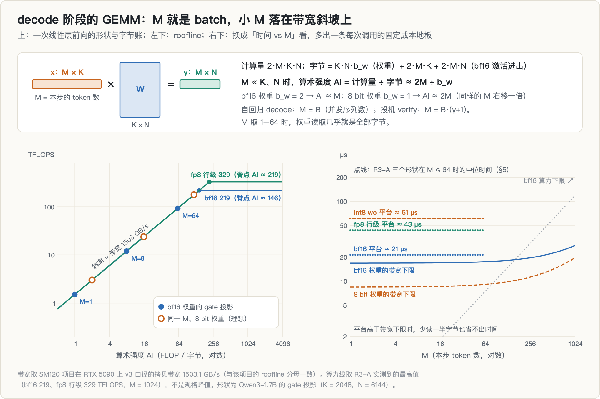
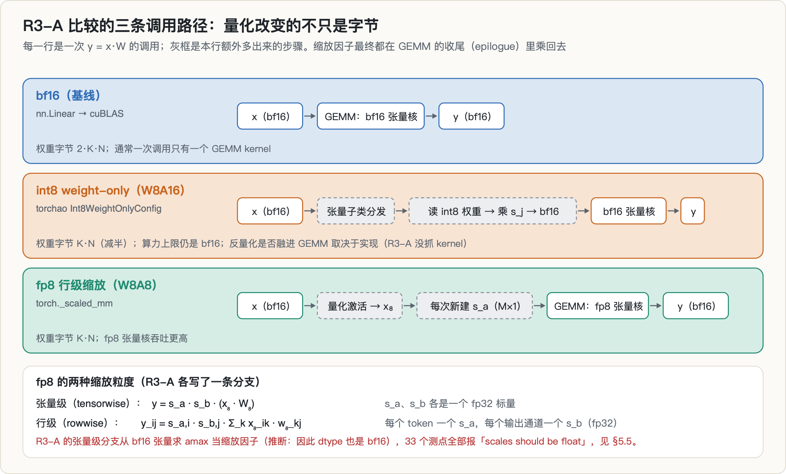
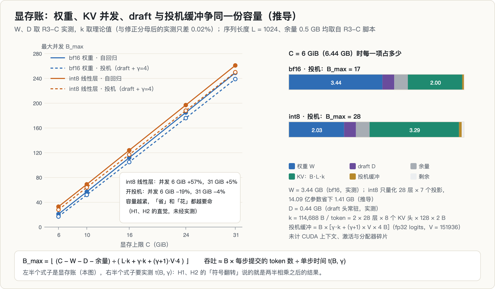
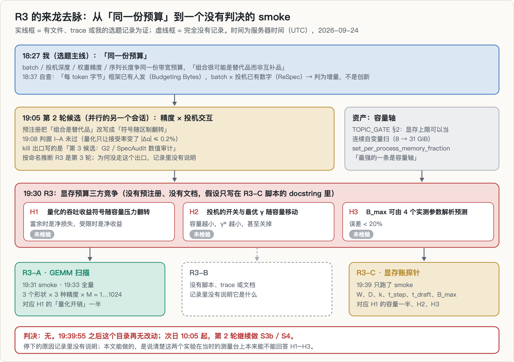
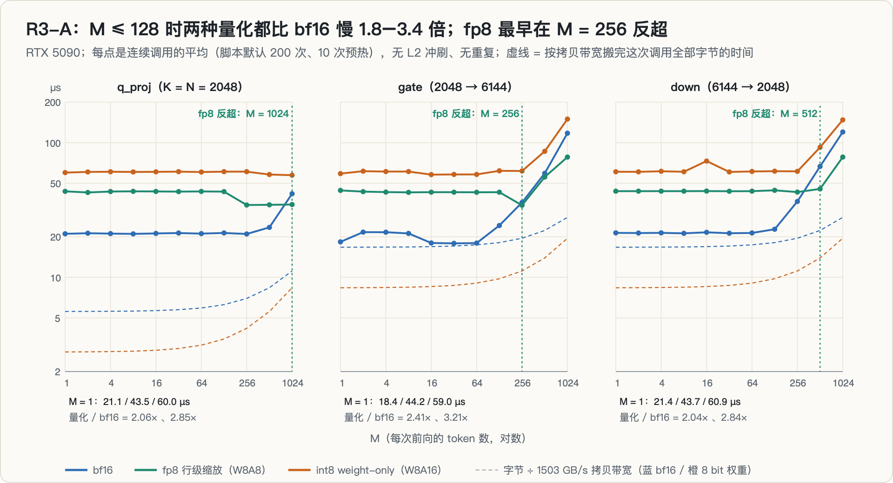
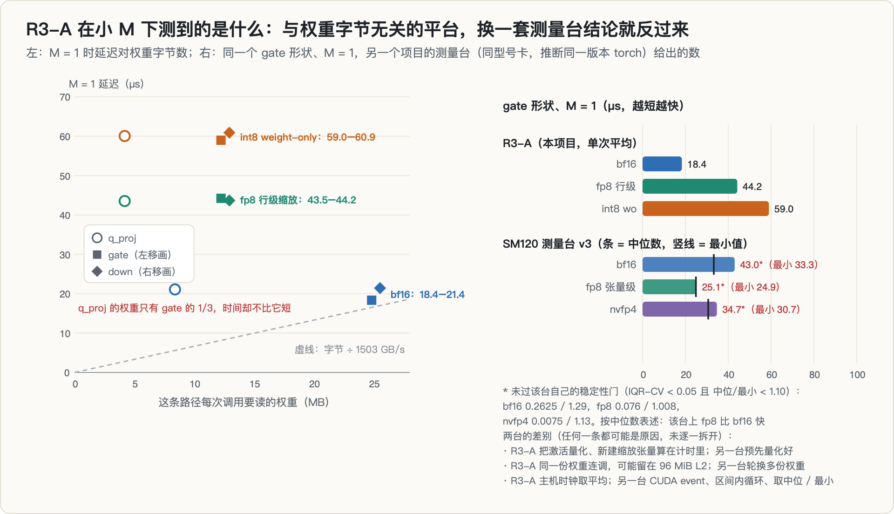
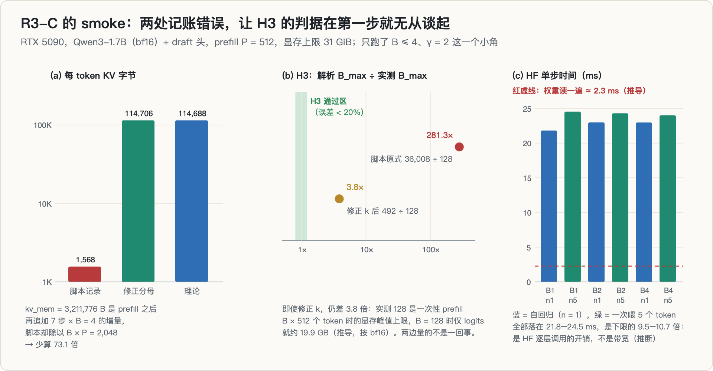
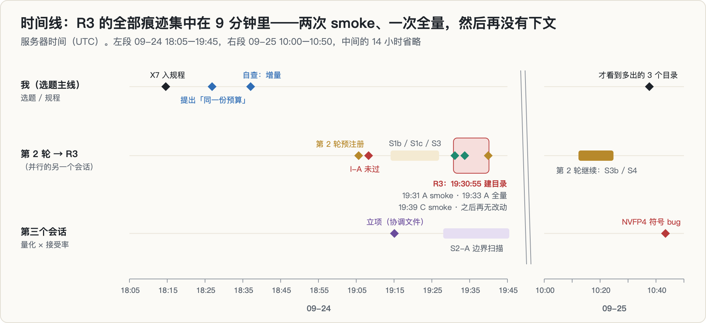
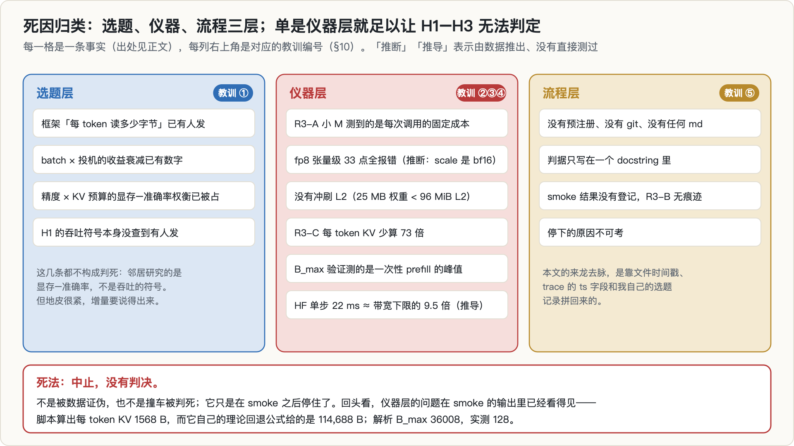

> **TL;DR**
>
> - **问题**：decode 时，一张卡的显存要同时装下模型权重、每条序列的 KV cache、draft 模型和投机解码的缓冲。我怀疑这三方在抢同一份容量，并写下三个假设：**H1** 量化的吞吐收益符号随容量压力翻转；**H2** 投机解码的开关和最优草稿长度 γ 随可用容量移动；**H3** 最大并发 B_max 可以用 4 个实测参数解析预测，误差小于 20%。
> - **做法**：两个实验。R3-A 在 RTX 5090 上扫 Qwen3-1.7B 三个线性层形状的 GEMM，比较 bf16、fp8 行级缩放、int8 weight-only，M 从 1 到 1024；R3-C 是显存账探针，测权重、draft、每 token KV 字节、单步时间和 B_max。
> - **结果**：**中止，没有判决**。R3 没有预注册、没有文档、没有 git；R3-C 只跑了一次 smoke，最后一行 trace 之后目录再无改动；R3-B 没有留下任何痕迹。H1–H3 一个都没有被检验。为什么停下，记录里没有说明。
> - **R3-A 测到的**：M ≤ 128 时，fp8 行级缩放比 bf16 慢 1.8–2.4 倍，int8 weight-only 慢 2.5–3.4 倍（M = 1 的 gate 投影：18.4 / 44.2 / 59.0 µs）；fp8 最早在 M = 256 反超，M = 1024 时 gate、down 快约 1.5 倍；int8 在 M ≤ 1024 内始终没有反超。但小 M 下三条路径各有一个**与权重字节数无关的平台**（q_proj 的权重只有 gate 的 1/3，时间却不比它短），所以它测到的是每次调用的固定成本，不是带宽，也不是随权重大小增长的反量化计算；在 SM120 项目的测量台上，同一形状 M = 1 按中位数 fp8 反而比 bf16 快（25.1 对 43.0 µs）。「小 batch 下量化是净损失」只对这条 eager 调用路径成立。
> - **R3-C 的 smoke**：两处记账错误。每 token KV 字节少算了 73 倍（1,568 对 114,688）；B_max 的「实测」量的是一次性 prefill 的显存峰值。解析估计 36,008 对实测 128，差 281 倍。另外，fp8 张量级缩放 33 个测点全部报错，大概率是脚本把缩放因子算成了 bf16（推断）。
> - **附带**：把实测的权重和 draft 字节代入显存账，6 GiB 上 int8 线性层能多装 57% 的并发，31 GiB 上只多 5%。这正是 H1 的直觉，但它是推导，不是测量。

---

## 0. 读法

| 部分 | 内容 |
|---|---|
| 1 | 原理：decode 阶段的 GEMM 与 roofline、两种量化怎么进 GEMM、显存账 |
| 2–4 | 动机与假设链、这个题的来龙去脉、跑之前写下了什么（几乎没有） |
| 5–6 | R3-A 的 GEMM 扫描，以及它在小 M 下真正测到的东西；R3-C 的 smoke |
| 7–11 | 死因、可复用的部分、错误与更正、教训、局限 |
| 12 | 复现 |

**数字来源。** R3 在服务器上只留下三个数据文件：`r3a_gemm.jsonl`（113 行，14 行 smoke + 99 行全量）、`r3c_budget.jsonl`（12 行 smoke）和 `r3a.log`（134 行）。本文所有 R3 的数字都由脚本从这三份文件读出，图也是从它们直接画的。另外用到四类材料：另一个项目（[SM120 FP4 悬崖](../sm120-fp4-cliff/)）测量台 trace 里的 RTX 5090 拷贝带宽、L2 容量（96 MiB）和一组对照 GEMM 时间；第 2 轮候选的预注册与判定文件；选题规程 `TOPIC_GATE.md`；我自己当晚的选题记录，用来重建来龙去脉。

**标注规则。** 没有标注的数字是实测（直接来自 trace 或日志）。**推导**＝由实测数字按公式算出来的；**推断**＝从代码或数据推出来、但没有直接验证过的；**引用**＝来自论文或别的项目。推导和推断不进结论。

**时间。** 一律用服务器时间（UTC）。并行的另一个会话（第 2 轮）的日志带 `+08:00` 时区，所以项目文档里把同一晚记作 09-25。

---

## 1. 背景与原理

### 1.1 decode 阶段的 GEMM：M 就是 batch

Transformer 的每一层有 7 个线性投影（q、k、v、o 与 MLP 的 gate、up、down）。每个投影都是一次矩阵乘 $y = xW$，其中 $x \in \mathbb{R}^{M \times K}$、$W \in \mathbb{R}^{K \times N}$。**M 是这一次前向里要处理的 token 数**：

- 自回归 decode：每条序列每步 1 个 token，$M = B$（并发序列数）；
- 投机解码的 verify：每条序列一次检查 $\gamma + 1$ 个位置，$M = B(\gamma + 1)$；
- prefill：$M = B \times$ 提示词长度，通常成千上万。

一次调用的计算量和要搬的字节数是

$$
\text{FLOPs} = 2MKN, \qquad \text{Bytes} = \underbrace{K N\, b_w}_{\text{权重}} + \underbrace{2MK + 2MN}_{\text{bf16 激活读写}}
$$

其中 $b_w$ 是每个权重的字节数。两者之比叫**算术强度**（AI，每搬一个字节做多少次运算）。decode 时 $M \ll K, N$，权重字节几乎就是全部字节，于是

$$
\mathrm{AI} \approx \frac{2M}{b_w} \quad\Rightarrow\quad \text{bf16 权重：} \mathrm{AI} \approx M, \qquad \text{8 bit 权重：} \mathrm{AI} \approx 2M
$$

**roofline** 说：一个 kernel 能达到的吞吐不超过 $\min(P_\text{peak},\ \text{BW} \times \mathrm{AI})$。算术强度低于**脊点** $P_\text{peak}/\text{BW}$ 时受带宽限制，高于它时受算力限制。拿两个实测锚点算一下（都不是规格值）：带宽用 SM120 项目 v3 口径在 RTX 5090 上测到的拷贝带宽 1503.1 GB/s（引用；该项目的 roofline 分母一直用拷贝带宽，本文与它保持一致），算力用 R3-A 自己测到的 bf16 最高吞吐 219 TFLOPS（M = 1024），脊点约在 AI ≈ 146（推导）。也就是说 **M = 1 到 64 的 decode 全在带宽斜坡上**：时间约等于「权重字节 ÷ 带宽」，把权重从 2 字节压到 1 字节，时间应该减半。这就是 decode 阶段做 weight-only 量化的主要理由。

**但 roofline 少了一项。** 每次调用还有一个与字节数、计算量都无关的**固定成本** $t_0$：kernel 启动、框架分发、库在这个形状下选到的 kernel 本身的延迟。于是

$$
t(M) \;\gtrsim\; \max\Big(t_0,\ \frac{\text{Bytes}}{\text{BW}},\ \frac{\text{FLOPs}}{P_\text{peak}}\Big)
$$

当 $t_0$ 高于带宽下限时，这次调用就「落在地板上」，少读多少字节都省不出时间。选题规程 `TOPIC_GATE.md` 的 X7 条专门写过这件事：**地板区里测到的一切都是那个地板，不是你要研究的现象**。还有一层要注意：RTX 5090 的 L2 有 96 MiB，一个 25 MB 的权重矩阵如果被反复调用，可能一直待在 L2 里，这时测到的「带宽」就不是显存带宽。

### 1.2 量化怎么进 GEMM：weight-only、W8A8、张量级与行级缩放

R3-A 比较的两种量化，改变的东西不一样：

**weight-only（W8A16，R3-A 里的 int8wo）**：权重存成 int8，每个输出通道 $j$ 配一个缩放因子 $s_j$；激活仍是 bf16。计算时把 int8 读进来、乘回 $s_j$、转成 bf16，再用 bf16 张量核相乘：

$$
y_{ij} = \sum_k x_{ik}\,(s_j\, q_{kj}) = s_j \sum_k x_{ik}\, q_{kj}
$$

它**只省字节，不省算力**：算力上限仍是 bf16。反量化必须融进 GEMM 的 kernel 里才划算；如果实现先把整个权重反量化成一份 bf16 再做 GEMM，每个参数要读 1 字节、写 2 字节、再读 2 字节，共 5 字节，比直接读 bf16 的 2 字节还多（推导）。R3-A 用的是 torchao 的 `Int8WeightOnlyConfig`，它把权重换成一个张量子类，每次调用先经过 Python 层的分发；R3-A 没有抓 kernel，不知道反量化是否融合。

**W8A8（R3-A 里的 fp8 行级缩放）**：权重和激活都是 fp8，用 fp8 张量核相乘（吞吐比 bf16 高），fp32 累加，输出 bf16。代价是**每次调用都要先把激活量化成 fp8**，这通常是额外的 kernel。缩放因子在 GEMM 的收尾阶段（epilogue）乘回去，有两种粒度：

$$
\text{张量级：}\ y = s_a\, s_b \,(x_8 W_8) \qquad\qquad \text{行级：}\ y_{ij} = s_{a,i}\, s_{b,j} \sum_k x_{8,ik}\, w_{8,kj}
$$

张量级只有两个 fp32 标量；行级给每个 token 一个 $s_a$、每个输出通道一个 $s_b$，精度更好。R3-A 两条分支都写了，张量级那条全部报错（§5.5）。

这些额外步骤（分发、量化激活、新建缩放张量）的开销大体与 M 和权重大小无关。**在地板区里，它们直接叠加在 $t_0$ 上。**

### 1.3 显存账：容量 → 并发 → 吞吐

一张卡的显存 $C$ 要装下：权重 $W$、draft 模型 $D$、每条序列的 KV cache、投机解码的缓冲，再留一点余量 $R$。每个 token 的 KV 字节数是

$$
k = 2 \times n_\text{layers} \times n_\text{kv-heads} \times d_\text{head} \times 2\,\text{B} = 2 \times 28 \times 8 \times 128 \times 2 = 114{,}688\ \text{B}
$$

（Qwen3-1.7B，K 和 V 各一份，bf16。）一条 1024 token 的序列要 117 MB。开投机时，每条序列还要多出 γ 个 KV 槽，以及 verify 时 $(\gamma + 1)$ 个位置的整张词表 logits。五天后的[另一个项目](../spec-decoding-rl-mismatch/)就栽在这一项上：vLLM 在 16 GB 卡上满负载 OOM，申请的正是 $256 \times 5 \times 151936 \times 4\,\text{B} \approx 742\ \text{MiB}$ 的 fp32 logits。所以

$$
B_\text{max} = \left\lfloor \frac{C - W - D - R}{L\,k + \gamma k + (\gamma + 1)\, V \times 4\,\text{B}} \right\rfloor, \qquad \text{吞吐} \approx \frac{B \times \tau}{t(B, \gamma)}
$$

其中 $L$ 是序列长度，$V$ 是词表大小，$\tau$ 是每步平均提交的 token 数（自回归为 1），$t(B, \gamma)$ 是单步时间。左半个式子是显存账，右半个式子要实测。

把 R3-C 实测的 $W$ = 3.44 GB、$D$ = 0.44 GB 和上面的 $k$ 代进去（$L$ = 1024、$R$ = 0.5 GB 取自 R3-C 脚本），可以算出上图（**全部是推导**，未计 CUDA 上下文和激活）：

| 显存上限 | bf16 · 自回归 | int8 线性层 · 自回归 | bf16 · 投机（γ = 4） | int8 · 投机（γ = 4） |
|---|---|---|---|---|
| 6 GiB | 21 | 33（+57%） | 17（−19%） | 28 |
| 16 GiB | 112 | 124 | 105 | 117 |
| 31 GiB | 249 | 261（+5%） | 239（−4%） | 250 |

（int8 只量化 28 层 × 7 个投影，共 14.09 亿参数，省下 1.41 GB；嵌入保持 bf16。）同样是「省一点权重」或「花一点给 draft」，**容量越紧，对并发的影响越大**。这就是整个 R3 的直觉。

---

## 2. 动机与假设链

R3 的假设只写在 R3-C 脚本的 docstring 里，原文三条（我把措辞整理成完整句子）：

1. **H1**：量化的吞吐收益符号随「容量压力」翻转。容量富余时量化是净损失（反量化开销换不到并发），容量受限时量化是净收益（省下的显存变成并发）。
2. **H2**：投机解码的开关与最优 γ 随可用容量移动。容量越小，最优 γ 越小，甚至应该关掉。
3. **H3**：三方（权重字节 / KV 并发 / draft 常驻与 γ 缓冲）争同一份显存，B_max 可以由 4 个实测参数解析预测，误差小于 20%。从脚本里 `probe_bmax` 的写法看，这 4 个参数是容量 C、权重 W、draft D 和每 token KV 字节 k（推断）。

链条是这样扣起来的：

- decode 受带宽限制（§1.1），所以量化能缩短单步时间；但量化路径有额外开销（§1.2），**容量富余、batch 很小时，这些开销可能吃掉节省**；
- 容量受限时，省下的权重字节可以换成更多并发序列（§1.3），而在带宽斜坡上加并发几乎是白送的吞吐，**于是量化的净效果可能从负翻到正**；
- 投机解码同理：draft 常驻和 verify 缓冲都要占容量，容量越紧，γ 的代价越高。

这类主张正好是 `TOPIC_GATE.md` §4 认为「能活下来」的形式：**在我们能扫的自变量变化时，某个决策的最优解发生了非平凡的变化**。而规程的资产表里写着，我们「最强的一条是容量轴」：在同一张卡上用 `set_per_process_memory_fraction` 把显存上限当连续自变量扫，架构、带宽、SM 数全部锁死。R3-C 脚本预设的容量档就是 6、10、16、24、31 GiB。

---

## 3. 这个题是怎么来的

[专栏最后一篇](../spec-decoding-rl-mismatch/) §4 的选题漏斗画的是我选题主线上的 8 个方向。R3 和它前面的第 2 轮候选是同一时期另一条线上的东西，没有画进那张图。它的来龙去脉，我是用文件时间戳、trace 里的 `ts` 字段和我自己当晚的选题记录拼回来的：

1. **18:14**，SM120 方向的 B200 对照刚刚做完（[那一篇](../sm120-fp4-cliff/)；B200 的 trace 在 18:00–18:08，判决 18:12 提交），我把 X7（「单一参数点不构成测量」）写进选题规程。
2. **18:27**，我在新一轮选题里提出「同一份预算」：batch、投机深度、权重精度、序列长度四项优化消耗的是同一份带宽预算，领域按技术切成几个社区分开研究，**它们的组合很可能是替代品而非互补品**。我当时建议的第一个廉价实验是 {batch × 投机深度 × 精度} 的 2 × 2 × 2。
3. **18:37**，我自查：「每 token 读多少字节」作为一等设计轴的框架已经有人发了（Budgeting Bytes，2609.04238）；batch × 投机的收益衰减 ReSpec（2510.26475）已经写过。结论是**增量，不是创新**，我随即转向别的方向（SM120 方向在 18:38 正式终止）。
4. **19:05**，并行的另一个会话立了第 2 轮候选「精度 × 投机的交互符号地图」（[那一篇](../quant-spec-interaction/)）。它的预注册把「组合是替代品」修正为「符号随区制翻转」，并写好了 kill 出口：两条主判据都不过，就转去「第 3 候选：G2 / SpecAudit 数值审计」。**19:08**，判据 I-A 未过：量化只让接受率变了 |Δα| ≤ 0.2%。
5. **19:30:55**，`~/mlsys_composition_probe` 建立。按命名推断，R3 是第 3 轮（第 2 轮的迭代日志编号为 R2.0）；R3-A 和 R3-C 是它的两个子实验。**R3-B 在服务器上没有任何脚本、trace 或文档，记录里没有说明它是什么。** 第 2 轮写好的出口是 SpecAudit，实际跑的却是显存预算；为什么换，记录里也没有说明。

R3 继承了什么：第 2 轮目录里的 `draft_head` 模块；[第一个项目](../rl-spec-draft-maintenance/)留下的 Qwen3-1.7B 和 draft 头 checkpoint；规程里的容量轴与 X7（R3-A 脚本的 docstring 直接写着「TOPIC_GATE / X7 discipline」）。它改了什么：把「区制」从带宽 / launch 地板换成**容量压力**，把观测量从接受率换成 **B_max 和吞吐**。从时间、GPU 编号和它 import 的模块看，R3 最可能出自这个并行会话（推断）。

**R3 开跑之前，邻居已经摆在记录里。** 除了我 18:37 的自查，`TOPIC_GATE.md` §5 在 09-23 的扫描里就把「量化位宽 × KV 预算联合分配」标成已被占，理由是 KV Pareto（2512.01953）和 Not All Bits Are Equal（2510.10964）。我今天重新读了两篇的摘要：前者在显存与准确率之间找 KV 量化 × chunked prefill × 权重量化的 Pareto 前沿；后者研究固定显存下把预算分给权重精度还是分给更长的生成，度量的是推理题的准确率。**两篇都没有测吞吐的符号**，所以 H1 本身并没有被直接撞死；但这块地皮很紧，增量要说得出来。跑 R3 的会话当时是否看过这些，记录里没有。

---

## 4. 判据：跑之前写下了什么

几乎什么都没写。拿它和前后两个项目对比：

| 项 | R3 | 第 2 轮（同一晚） | 专栏第 9 篇（09-29） |
|---|---|---|---|
| 预注册文件 | 无 | `PREREG_23号立项.md`，跑前冻结 | 第一个 git 提交就是预注册 |
| 主指标 | 无（H1、H2 的「吞吐」没有定义口径） | Δα、Δτ、SD 净收益比 | KL 比值 R |
| 阈值 | 只有 H3 的「误差 < 20%」 | I-A：Δα ≥ 3% 或 Δτ ≥ 5%；I-B：变化 ≥ 20% 且出现名次翻转 | EFFECT / KILL 区间 |
| 何时判死 | 无 | 写明了 kill 出口 | 写明了 KILL 与扩样规则 |
| 噪声地板 / 重复 | 无 | 同卡三重复 | 按题聚类 bootstrap |
| 质量门 | 无（量化是有损的） | I-Q：量化臂必须报质量 | —— |
| 登记 | 无 git、无 md | 预注册 + 判定报告 + trace（目录有 git 但没有提交） | git + EXPERIMENTS + amendments |

所以即使 R3-C 全部跑完，也没有一条事先写死的规则能把结果判成「H1 成立」或「H1 不成立」。

---

## 5. 实验 R3-A：GEMM 扫描

### 5.1 设计

| 项 | 内容 |
|---|---|
| 卡 | RTX 5090（日志：计算能力 12.0，170 个 SM） |
| 形状 | Qwen3-1.7B 的 q_proj（2048 → 2048）、gate（2048 → 6144）、down（6144 → 2048），随机权重 |
| M | 1、2、4、…、1024，共 11 档 |
| 路径 | bf16（`nn.Linear`）；fp8 张量级（`torch._scaled_mm`，全部报错）；fp8 行级（`torch._scaled_mm`，单位缩放）；int8 weight-only（torchao `Int8WeightOnlyConfig`） |
| 计时 | 10 次预热后连续调用 N 次（脚本默认 200），只在首尾各同步一次，用主机时钟取平均 |
| 没做的 | L2 冲刷、重复运行、CUDA graph、profiler |
| 环境 | R3 没有记录；从第 2 轮的安装日志推断为 Python 3.14、torch 2.12.0、torchao 0.18.0 |

smoke 在 19:31:05 跑了 gate 形状的 bf16 和 nvfp4、M ≤ 64；全量是 3 个形状 × 4 条路径 × 11 档 M，99 行数据的时间戳全部落在 19:33:41–42 这两秒里。

### 5.2 自检：没有，但有一个无心插柳的对照

R3-A 没有任何自检：没有核对量化后的输出是否接近 bf16（fp8 行级分支用的是单位缩放，输出本来就不是可用的近似，只能用来计时），没有重复，也没有测噪声。唯一能看重复性的，是 smoke 与全量里重叠的 7 个 bf16 gate 点：两次相差 2.9%–8.9%，远小于下面要讲的 2–3 倍差异。

它做对的一件事是遵守了 X7：M 扫了三个数量级，形状扫了三个。**正是「三个形状」让我们事后能看出小 M 下测到的是地板**（§5.4），虽然当时并不是为这个目的设计的。

脚本本身还有几处和实际行为不符的地方：docstring 写的路径是「fp8-wo (W8A16)、nvfp4-wo」，默认 `--kinds bf16,fp8,nvfp4` 里的名字在代码里根本不存在；张量级 fp8 分支的注释写着「W8A16」，代码却把激活也量化成了 fp8（W8A8）；smoke 用过的 nvfp4 分支，在保存下来的脚本版本里已经没有了。本文一律按代码的实际行为描述。

### 5.3 结果

| 形状 | M = 1（µs） bf16 / fp8 行级 / int8 wo | M ≤ 128 的倍数（÷ bf16） fp8 / int8 | fp8 首次快于 bf16 | M = 1024（µs） bf16 / fp8 / int8 |
|---|---|---|---|---|
| q_proj | 21.1 / 43.5 / 60.0 | 2.01–2.07× / 2.85–2.89× | M = 1024 | 41.8 / 34.8 / 57.4 |
| gate | 18.4 / 44.2 / 59.0 | 1.77–2.41× / 2.55–3.25× | M = 256 | 117.7 / 78.2 / 149.7 |
| down | 21.4 / 43.7 / 60.9 | 1.95–2.06× / 2.70–3.38× | M = 512 | 120.1 / 78.2 / 147.7 |

三个观察：

1. **M ≤ 128 时，两种量化都比 bf16 慢**：fp8 行级慢 1.8–2.4 倍，int8 weight-only 慢 2.5–3.4 倍。在这条调用路径上，「decode 小 batch 时量化是净损失」这半句 H1 是成立的。
2. **大 M 时 fp8 的张量核优势出来了**：M = 1024 时 gate 和 down 快约 1.5 倍，q_proj 快 1.2 倍。R3-A 测到的最高吞吐是 fp8 行级 329 TFLOPS、bf16 219 TFLOPS（都在 gate、M = 1024）。
3. **int8 weight-only 在 M ≤ 1024 内从未快过 bf16**，M = 1024 时仍慢 23%–37%。它省的是字节，而这条路径在任何 M 下都没有让字节成为瓶颈。

### 5.4 它在小 M 下测到的到底是什么

**关键的诊断不是「时间不随 M 变」，而是「时间不随权重字节变」。** 在带宽斜坡上，时间本来就不怎么随 M 变（权重字节占绝大部分），所以 M 方向的平坦说明不了什么。但 q_proj 的权重是 8.4 MB，gate 和 down 是 25.2 MB，相差 3 倍：如果受带宽限制，q_proj 应该快 3 倍。实测三个形状几乎一样：

- bf16：18.4–21.4 µs；q_proj 的 21.1 µs 是它带宽下限（5.6 µs，按拷贝带宽推导）的约 4 倍；
- fp8 行级：43.5–44.2 µs；
- int8 weight-only：59.0–60.9 µs。

所以**小 M 下每条路径都落在自己的平台上**，平台高度由调用路径决定，与权重大小无关。三个形状、M ≤ 64 的中位数分别是 21、43、61 µs，量化路径比 bf16 每次调用多出约 22 µs 和 40 µs（推导）。反量化的计算量与 K·N 成正比，如果多出来的时间是反量化，它应该随形状变大；它没有。**所以这组数据检验不了 H1 的机制「反量化开销」**。

平台里有多少是主机端开销、多少是 GPU 上的 kernel，R3-A 没有 profiler，分不开。但有一条线索：q_proj 和 gate 的 fp8 在 M = 256 时（34.5 / 34.3 µs）比 M ≤ 128 时（≥ 42.7 µs）**反而快了至少 8 µs**。纯主机端的固定开销不会因为 M 变大而变小，所以小 M 的 fp8 时间里至少有一部分依赖 M，最可能是库在小 M 下选到了更慢的 kernel（推断）。

还有 L2：gate 的 25 MB 权重装得进 5090 的 96 MiB L2，R3-A 又是同一份权重连调几百次。bf16 gate 在 M ≤ 64 时的等效带宽 1.16–1.46 TB/s，不能当成显存带宽的利用率来读。

**换一个测量台，结论就反过来。** SM120 项目的测量台（v3 口径）在同型号卡上测过同一个 gate 形状、M = 1（引用）。按中位数：bf16 43.0 µs，fp8 张量级 25.1 µs，nvfp4 34.7 µs——**fp8 比 bf16 快**。对应的最小值是 33.3、24.9、30.7 µs。要注意，这三个点都没过那台测量台自己的稳定性门（IQR-CV < 0.05 且 中位 / 最小 < 1.10）：bf16 的 IQR-CV 0.2625、中位 / 最小 1.29，离散得最厉害；fp8 的 IQR-CV 0.076，但中位只比最小高 0.8%；nvfp4 的中位 / 最小 1.13。所以这里只用中位数下结论。两边的差别至少有三处，任何一处都可能是原因，我没有逐一拆开：

1. R3-A 把「量化激活」和「新建缩放张量」算在计时里，那一台预先量化好；
2. R3-A 同一份权重反复调用，权重可能留在 L2；那一台轮换多份权重，逼它从显存读；
3. R3-A 用主机时钟取平均，那一台用 CUDA event、区间内循环、多次取中位数和最小值。

计时方法本身就能让小尺寸的数差好几倍。同一台测量台的早期 v1 口径（EXP-006，09-23 13:00）给同一个 bf16 点的最小值是 107.1 µs：v1 每个 CUDA event 区间只放一次调用、没有区间内循环、没有轮转缓冲，被约 22 µs 的启动抖动主导，全相位 55.4% 的测点 CV > 5%。改成「区间内循环 ≥ 2 ms + 轮转缓冲 > 2 × L2」之后，同一点的最小值是 28.1 µs（v2）/ 33.3 µs（v3）。107 对 33 是测量方法的差异，不是硬件（见 [SM120 那一篇](../sm120-fp4-cliff/)）。所以两边都不是「真值」。能确定的只有一句：**「小 batch 下量化 GEMM 比 bf16 慢」描述的是 R3-A 这条 eager 调用路径，不是 fp8 或 int8 本身。**

**结论的边界。** R3-A 只支持这一句：在 RTX 5090、eager 模式的 PyTorch（推断 2.12）与 torchao 0.18 上，对 Qwen3-1.7B 的三个线性层形状，M ≤ 128 时 int8 weight-only 和（含激活量化的）fp8 行级缩放 GEMM 比 bf16 慢 1.8–3.4 倍；fp8 行级在 M = 256–1024 之后反超。它**不支持**「推理引擎（CUDA graph、融合的量化 kernel）里量化在小 batch 是净损失」，也**不支持**「净损失来自反量化开销」。单卡、单个模型的三个形状、每点一次运行、没有控制 L2，没有端到端。

### 5.5 fp8 张量级为什么 33 个点全部报错

全量里张量级分支（`fp8mm`）在 3 个形状 × 11 档 M 上全部失败，报错原文是 `Invalid scaling configuration. For TensorWise scaling, a and b should be float8, scales should be float and singletons.` 看代码：缩放因子是 `x.abs().amax() / 448` 和 `W.abs().amax() / 448`，而 `x` 与 `W` 都是 bf16，所以缩放因子的 dtype 也是 bf16，不是报错要求的 fp32（推断）。旁证：另一个项目的测量台在同型号卡上用 fp32 标量 `torch.tensor(1.0)` 作缩放因子，张量级 fp8 跑得通。正确写法是把缩放因子 `.float()` 之后再传。这不是 SM120 或 PyTorch 的限制，是脚本的 bug，R3 因此没有任何张量级 fp8 的数据。

### 5.6 smoke 里的 nvfp4

smoke 里有一组 nvfp4 的 gate 数据：M = 1 时 563.8 µs，是同一次 smoke 里 bf16（20.0 µs）的 28 倍，M ≤ 64 全部在 562–572 µs。产生它的脚本版本没有保存下来（现存脚本里没有这个分支），不知道它走的是哪个实现，全量也没有再跑 nvfp4。本文不解读这组数。

---

## 6. 实验 R3-C：只跑到 smoke

### 6.1 设计

R3-C 用 HF transformers 加载 bf16 的 Qwen3-1.7B，再挂上 draft 头，按顺序测四样东西：

1. **常驻字节**：加载前后 `memory_allocated` 之差，得到权重 W 和 draft D；
2. **每 token KV 字节 k**：prefill 之后再 decode 几步，看显存增长；
3. **单步时间** $t(B, n)$：一次喂 n 个 token（n = 1 是自回归，n = γ + 1 是 verify）；draft 递归提议 γ 个 token 的时间；
4. **B_max**：用 `set_per_process_memory_fraction` 限定容量，二分搜索能容纳的最大并发，再和解析式 `probe_bmax` 的估计比较（H3）。

脚本的默认参数是 prefill 1024、B 到 128、n ∈ {1, 3, 5, 9}、γ ∈ {2, 4, 8}、容量 {6, 10, 16, 24, 31} GiB。

### 6.2 smoke 的数据

实际只跑了一个很小的角：prefill P = 512，B ∈ {1, 2, 4}，n ∈ {1, 5}，γ = 2，容量只有 31 GiB，共 12 行 trace（19:39:33–55）。

| 量 | 值 |
|---|---|
| 权重 W | 3,441,689,600 B（3.44 GB），参数 1,720,574,976 个 |
| draft D | 436,248,576 B（0.44 GB） |
| 卡的总显存 | 33,668,726,784 B（31.36 GiB） |
| k（脚本记录） | 1,568 B / token（由 `kv_mem` = 3,211,776 B 得出） |
| 单步时间 | 21.8–24.5 ms（B = 1、2、4，n = 1、5） |
| draft 提议 | γ = 2 时 2.72–3.83 ms（B = 1 最慢，单次运行，可能是预热不足） |
| B_max | 解析估计 36,008；「实测」128 |

### 6.3 两处记账错误

**第一处：k 的分母错了。** 脚本在 prefill 之后才记下基准显存，所以 `kv_mem` 只是之后追加的 decode 步数的 KV：预热 2 步加计时 5 步，共 7 步，B = 4，即 28 个 token 槽。正确的是

$$
k = \frac{3{,}211{,}776}{4 \times 7} = 114{,}706\ \text{B}
$$

与理论值 114,688 B 只差 18 B（0.016%）。总共多出的 512 B，恰好是计时期间一直活着的 decode 输入张量在分配器里占的最小块（推断）。脚本却除以了 $B \times P = 2048$，得到 1,568，**少算 73.1 倍**。讽刺的是，同一个脚本里就写着理论回退公式 `2 * 28 * 8 * 128 * 2`，只要 smoke 把两者比一下就会发现。

**第二处：B_max 的「实测」量的不是容量。** 解析估计用了错的 k，得到 36,008；用对的 k 重算是 492（推导）。但「实测」的 128 仍然差 3.8 倍，因为 `verify_bmax` 是**一次性 prefill B × 512 个 token**，测的是这次前向的显存峰值，其中包括激活和整段 logits。B = 128 时，光 logits 就有 $128 \times 512 \times 151936 \times 2\,\text{B} \approx 19.9\ \text{GB}$（推导，按 bf16），占了 31 GiB 的一大半。解析式算的是「能放下多少条 KV」，实测量的是「一次 prefill 峰值能容多大 batch」，**两边量的不是一回事**。按这个探针，H3 的「误差 < 20%」无论如何都判不了。

另外，`probe_bmax` 把投机缓冲记成了 $\gamma \times k$，即整个 batch 只多 γ 个 token；实际上是每条序列多 γ 个 KV 槽，外加 $(\gamma + 1) \times V$ 的 fp32 logits（§1.3）。这是 H2 要用的那一项。

### 6.4 单步时间：HF 循环本身就是地板

B = 1、2、4 和 n = 1、5 的单步时间全在 21.8–24.5 ms。权重读一遍的下限约 2.3 ms（3.44 GB ÷ 1503.1 GB/s 拷贝带宽，推导），实测是它的 9.5–10.7 倍，而且几乎不随 B 和 n 变。这是 HF 逐层调用的开销，不是显存或带宽（推断）；规程里也早就记着「我们的 HF loop 距 roofline 7.7×」。在这样的测量台上，吞吐 ≈ B × n ÷ 常数，加并发和加 γ 都几乎白送，H1、H2 测出来的将是 Python 开销的性质，不是显存竞争的性质。

---

## 7. 死因

**死法：中止，没有判决。** 它不是被数据证伪，也不是撞车被判死。能确定的事实只有这些：19:39:55 之后 `~/mlsys_composition_probe` 再无任何改动；次日 10:05 起，第 2 轮继续做 S3b / S4；10:37，我在选题主线上排查另一个问题时，才看到服务器上多出的三个目录，其中就有这一个。为什么停，没有任何文件或记录说明。

所以这一节能回答的，不是「它为什么停」，而是「**如果它当时继续跑，能不能回答 H1–H3**」。答案是不能，问题分三层：

1. **仪器层（单独就足以致命）**：R3-A 在小 M 下测的是每次调用的固定成本，量化路径的平台比 bf16 高 22–40 µs，与权重字节无关，所以它说不出「反量化开销」有多大；R3-C 的 k 少算 73 倍，B_max 量的是 prefill 峰值，单步时间是 HF 循环的地板。H1 需要「单步时间随量化怎么变」和「容量换来多少并发」两半，H3 需要准确的 k 和真正的容量测量，这些在当时的测量台上都拿不到。
2. **选题层**：框架已有人发，batch × 投机已有人写，精度 × KV 预算的显存–准确率权衡已被占。H1 的吞吐符号本身我没查到有人发，回头看，我 18:37 的判断「增量，不是创新」站得住。
3. **流程层**：没有预注册、没有 git、没有 md，判据只在一个 docstring 里，smoke 的结果没有登记，R3-B 没有痕迹。这让「它为什么停」变得不可考，也让本文只能靠时间戳重建。

回头看，仪器层的问题在 smoke 的输出里已经看得见：脚本打印出每 token KV 1,568 B，它自己的回退公式给的是 114,688 B；解析 B_max 36,008，实测 128。

---

## 8. 真的部分

下面这些测量本身是有效的，可以复用，但都要带着 §5.4 的边界：

1. **R3-A 的延迟表**（§5.3）：作为「eager PyTorch + torchao 这条调用路径」的测量是干净的，三个形状互相印证，smoke 与全量的重叠点相差不到 9%。fp8 行级在 M = 256–1024 反超、M = 1024 快约 1.5 倍、int8 weight-only 在 M ≤ 1024 内从不反超，这几条在这条路径上是确定的。
2. **「固定 M、改变权重字节」这个诊断方法**：同一次扫描里放几个只有 K·N 不同的形状，时间不随字节变，就说明测到的是地板。它不需要 profiler，成本几乎为零。
3. **显存账的实测参数**：Qwen3-1.7B（bf16）常驻 3,441,689,600 B，draft 头 436,248,576 B；每 token KV 在修正分母后实测 114,706 B，与理论值 114,688 B 一致。§1.3 的解析式和表格可以直接拿来做容量规划的粗估（推导，未含 CUDA 上下文与激活）。
4. **一条工程事实**：`torch._scaled_mm` 的张量级缩放要求缩放因子是 fp32 标量，从 bf16 张量上求 amax 得到的缩放因子会被拒绝（推断，有另一台测量台的旁证）。

---

## 9. 过程中的错误与更正

| 错误 | 后果 | 怎么发现的 | 处理 |
|---|---|---|---|
| R3-C 的 k 除以 B × P，而不是 B × 追加的步数 | k 少算 73.1 倍，解析 B_max 高估到 36,008 | 本文复核：脚本里的理论回退公式给的是 114,688 | 本文用修正值 114,706；原 trace 不改 |
| `verify_bmax` 用一次性 prefill 验证容量 | 「实测」B_max 量的是激活与 logits 峰值 | 修正 k 后仍差 3.8 倍，追到 prefill 的 logits | 标为与解析式不可比；H3 未检验 |
| 投机缓冲记成 γ × k | 低估 verify 的逐序列缓冲 | 与[专栏第 9 篇](../spec-decoding-rl-mismatch/)的 742 MiB OOM 对照 | 显存账里改为逐序列 KV 槽 + fp32 logits |
| fp8 张量级的缩放因子是 bf16（推断） | 33 个测点没有数据 | 报错原文 + 另一台测量台用 fp32 标量能跑 | 本文不报张量级数据 |
| docstring 与注释和代码不符（「W8A16」、不存在的默认路径名） | 容易把 W8A8 误读成 weight-only | 逐行读代码 | 按代码实际行为描述 |
| smoke 的脚本版本没有保存 | nvfp4 的 563.8 µs 无法解释 | trace 里有 nvfp4 行，现存脚本没有这个分支 | 不解读 |
| R3-A 没有冲刷 L2、没有重复、没有 profiler | 小 M 的时间不能当带宽利用率读，平台来源分不开 | 与另一台测量台对照 | 结论限定在这条调用路径 |
| 没有预注册、没有登记 | 停止原因不可考，R3-B 下落不明 | —— | 用文件时间戳、trace 的 `ts` 和我自己的选题记录重建 |
| 次日我担心这个目录也受 NVFP4 符号 bug（[那一篇](../nvfp4-sign-bug/)）影响 | —— | 本文核对 | R3-A 的 nvfp4 只出现在一次 smoke 的计时里，符号 bug 影响数值、不影响计时（推断），R3 的结论不受波及 |

---

## 10. 我学到了什么

1. **撞车核验要对准具体主张，而且在写第一行代码之前做。** R3 的邻居早就在记录里：09-23 的规程扫描、我 18:37 的自查。R3 却在 19:30 直接开跑，9 分钟后停下，没有留下一句为什么。
2. **小 M 的延迟，先问地板是谁。** 在同一次扫描里放几个只改权重字节数的形状；时间不随字节变，测到的就是地板。计时口径（主机时钟 / CUDA event、有没有 L2 冲刷、激活量化在不在计时里）要至少并排报两种，这正是规程里「翻转清单」要求的。R3-A 碰巧扫了三个形状，才让这一点事后看得出来。
3. **自检要能失败。** 脚本里已经写着理论回退公式，smoke 就该自动比较实测与理论，差 73 倍直接报错。一个永远不会触发的自检等于没有。
4. **测容量就测容量。** B_max 的验证要让 KV 一步步长上去（分块 prefill、只保留最后一个位置的 logits），否则测到的是激活峰值。同理，投机缓冲要按「每条序列」记，而且别漏掉 verify 的 logits。
5. **没有预注册、没有登记的 smoke，等于没有做过。** 第 2 轮同一晚写了完整的预注册，R3 什么都没写；结果第 2 轮的死因清清楚楚，R3 的只能靠时间戳推。

---

## 11. 局限与开放问题

**测过的范围**：RTX 5090 单卡；Qwen3-1.7B 的 q_proj、gate、down 三个形状（随机权重）；M = 1…1024；eager 模式的 PyTorch（推断 2.12）与 torchao 0.18；bf16、fp8 行级缩放（单位缩放、激活量化在计时内）、int8 weight-only；每点一次运行。R3-C 只有 smoke：P = 512，B ≤ 4，γ = 2，容量 31 GiB。

**没测过的**（结论不能外推）：

- CUDA graph、`torch.compile`，以及推理引擎里的融合量化 kernel；
- 其他形状（k、v、o、up）、attention 和 lm_head；RTX 5080；
- 冲刷 L2 后的显存带宽区；重复与方差；
- 容量轴 6–24 GiB 的任何一档；任何端到端吞吐；量化后的质量。

**开放问题**：

- H1 在真实引擎里是否成立？要检验它，需要一个 $t_0$ 已经被压到很低的测量台（CUDA graph + 融合 kernel），再把「单步时间随精度的变化」和「容量换来的并发」两半都实测出来。
- 小 M 平台里主机端和 GPU 端各占多少？fp8 在 M = 256 变快的那 8 µs 是不是 kernel 选择造成的？这需要 profiler。
- 值得记一笔：次日（09-25 13:41）的一次完整选题运行里，「小 M 下 FP4 GEMM 的固定开销地板」本身就被当成过候选，死于「修它需要写竞争级 kernel，还要赢过厂商库」。所以「地板」本身不是我们能做的论文，它只是做任何小 batch 测量之前必须先排除的东西。

如果要继续这个方向，必须作为新问题重新预注册，并先解决 §9 里的每一处仪器问题；不能把这次的 smoke 当成起点。

---

## 12. 复现

- **环境**（R3 未记录，推断）：Python 3.14、torch 2.12.0、torchao 0.18.0、transformers 5.17.0；RTX 5090；模型 Qwen3-1.7B（bf16），draft 头为第一个项目遗留的 checkpoint。
- **代码**：`r3a_gemm_roofline.py`（R3-A）、`r3c_budget_probe.py`（R3-C，依赖第 2 轮目录里的 `draft_head.py`）。目录不是 git 仓库，没有提交号。
- **记录**：`traces/r3a_gemm.jsonl`（tag：`r3a_smoke`、`r3a_full_5090`）、`traces/r3c_budget.jsonl`（tag：`r3c_smoke`）、`logs/r3a.log`；全部 append-only。
- **运行参数**（从 trace 字段反推）：R3-A 全量为形状 gate、down、q_proj，路径 bf16、fp8mm、fp8mm_row、int8wo，M = 1…1024；R3-C smoke 为 `--prefill 512 --batches 1,2,4 --ns 1,5 --gammas 2 --caps-gib 31`。
- **本文的图**：由只用 Python 标准库的脚本从上面三份文件（以及 SM120 项目 trace 里的拷贝带宽、L2 与对照 GEMM 数据）直接生成，SVG 再转 PNG，数字不经手抄。

---

## 参考

- Budgeting Bytes：A Windowed Storage Roofline and Dual-Budget Architecture Ablations for Storage-Bound LLM Decoding，[arXiv 2609.04238](https://arxiv.org/abs/2609.04238)
- ReSpec：Towards Optimizing Speculative Decoding in Reinforcement Learning Systems，[arXiv 2510.26475](https://arxiv.org/abs/2510.26475)
- KV Pareto：Systems-Level Optimization of KV Cache and Model Compression for Long Context Inference，[arXiv 2512.01953](https://arxiv.org/abs/2512.01953)
- Not All Bits Are Equal：Scale-Dependent Memory Optimization Strategies for Reasoning Models，[arXiv 2510.10964](https://arxiv.org/abs/2510.10964)
- 同专栏：[RL 投机 rollout 的草稿头维护](../rl-spec-draft-maintenance/)、[SM120 的 FP4 悬崖](../sm120-fp4-cliff/)、[精度 × 投机的交互](../quant-spec-interaction/)、[NVFP4 符号 bug](../nvfp4-sign-bug/)、[投机解码与 RL 训练–推理失配](../spec-decoding-rl-mismatch/)
